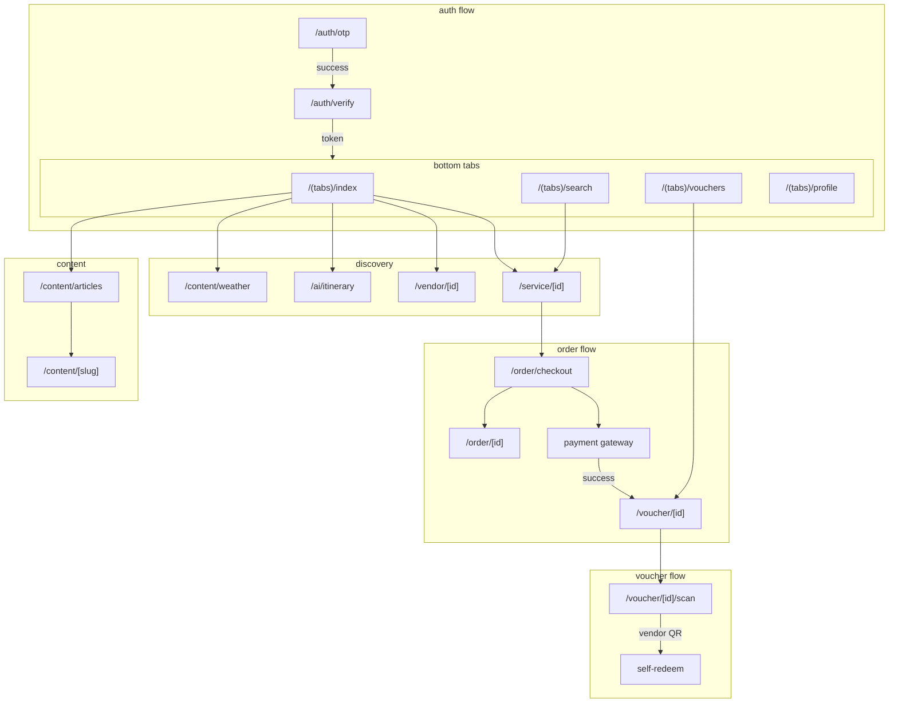

# Layout: Tourist App — Screen Flow

**App:** Tourist (Mobile / Expo)
**File:** `apps/mobile/`
**Phase:** 2+
**Last updated:** 2026-04-09

---

## Apps Overview

| App | Framework | Route Structure | Role |
|-----|-----------|----------------|------|
| Tourist (mobile) | Expo Router (file-based) | `app/` + `app/(tabs)/` | B2C — khách du lịch |
| Vendor | Expo Router (file-based) | `app/(tabs)/` | B2B — nhà cung cấp |
| Admin | Next.js Pages Router | `src/app/dashboard/` | Platform ops |

---

## Tourist App: Screen Registry

| Screen | Route | Purpose | Status |
|--------|-------|---------|--------|
| Home | `app/(tabs)/index.tsx` | Discovery: categories, services, banners | ✅ Implemented |
| Search | `app/(tabs)/search.tsx` | Keyword + filter search | ✅ Implemented |
| Vouchers | `app/(tabs)/vouchers.tsx` | My purchased vouchers | ✅ Implemented |
| Profile | `app/(tabs)/profile.tsx` | Account settings | ✅ Implemented |
| Auth (OTP) | `app/auth/otp.tsx` | Phone OTP login | ✅ Implemented |
| Auth Verify | `app/auth/verify.tsx` | OTP verification | ✅ Implemented |
| Service Detail | `app/service/[id].tsx` | Service info + book CTA | ✅ Implemented |
| Vendor Detail | `app/vendor/[id].tsx` | Vendor profile + all services | ✅ Implemented |
| Checkout | `app/order/checkout.tsx` | Order → payment selection | ✅ Implemented |
| Order Detail | `app/order/[id].tsx` | Order status | ✅ Implemented |
| Voucher Detail | `app/voucher/[id].tsx` | Voucher + QR display | ✅ Implemented |
| Voucher Scan | `app/voucher/[id]/scan.tsx` | Self-redeem (scan vendor QR) | ✅ Implemented |
| AI Itinerary | `app/ai/itinerary.tsx` | AI trip planner | ✅ Implemented |
| Weather | `app/content/weather.tsx` | Weather forecast | ✅ Implemented |
| Content Articles | `app/content/articles.tsx` | News/events hub | ✅ Implemented |
| Content Article | `app/content/[slug].tsx` | Article detail | ✅ Implemented |

---

## Tourist App: Navigation Architecture



---

## Screen Hierarchy

```
/
├── auth/
│   ├── otp.tsx          (entry: no token)
│   └── verify.tsx       (entry: after OTP sent)
└── (tabs)/              (entry: token exists)
    ├── index.tsx        (Home — discovery hub)
    ├── search.tsx       (keyword + filter)
    ├── vouchers.tsx     (my vouchers list)
    └── profile.tsx      (account settings)
    ├── service/[id].tsx     (from Home/Search)
    ├── vendor/[id].tsx      (from Home/SvcDetail)
    ├── order/
    │   ├── checkout.tsx     (from SvcDetail)
    │   └── [id].tsx        (order detail)
    ├── voucher/[id].tsx    (from Vouchers)
    │   └── scan.tsx        (self-redeem)
    ├── ai/itinerary.tsx    (AI planner)
    └── content/
        ├── articles.tsx    (news/events)
        └── [slug].tsx      (article detail)
```

---

## Key Navigation Decisions

1. **Auth gate at root:** `app/index.tsx` redirects to `/auth/otp` if no token, else `/tabs`
2. **Bottom tabs:** 4 tabs (Home, Search, Vouchers, Profile) — persistent, no unmount
3. **Service → Vendor:** Service detail links to vendor detail (bidirectional)
4. **Checkout → Voucher:** After payment success, redirects to voucher detail (not order detail)
5. **QR redemption:** Two paths — vendor scans tourist QR (server-side) OR tourist scans vendor QR (self-redeem via `/voucher/[id]/scan`)

---

## Home Screen Details

→ See: `.haki/screens/tourist-home.md`

---

## Data Entities per Screen

| Entity | Screens | Source |
|--------|---------|--------|
| `Service` | Home, Search, ServiceDetail, Checkout | `GET /services` |
| `Vendor` | Home, VendorDetail | `GET /vendors/:id` |
| `Category` | Home (chips) | Static (CATEGORIES array) |
| `Banner` | Home | Static (BANNERS array) |
| `Order` | Checkout, OrderDetail | `POST /orders`, `GET /orders/:id` |
| `Voucher` | Vouchers, VoucherDetail, Scan | `GET /vouchers` |
| `Content` | Articles, Article | `GET /content` |
| `Weather` | Weather | `GET /weather` |

---

## Add New Screen

To add a new tourist screen:

1. Create file in `apps/mobile/app/` following Expo Router conventions
2. Use `import { colors, spacing, typography } from '../../lib/theme'` for design tokens
3. Use `import { router } from 'expo-router'` for navigation
4. Use `import { useQuery } from '@tanstack/react-query'` for data fetching
5. Add entry to this layout doc (route + purpose + status)
6. Add screen doc to `.haki/screens/<name>.md`
