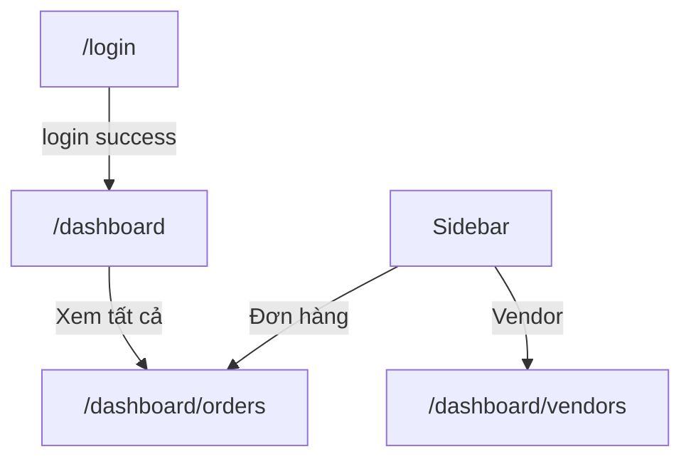

# Screen: Admin Dashboard

**App:** Admin (Web — Next.js)
**File:** `apps/admin/src/app/dashboard/page.tsx`
**Phase:** 5 (Settlement, Notifications & Dashboards)
**Status:** Implemented ✅

---

## 1. Tổng quan

**Mục đích:** Admin xem tổng quan nền tảng — 4 stat cards (tổng đơn hàng, doanh thu hôm nay, vendor hoạt động, voucher hôm nay), và bảng đơn hàng gần đây.

**Ai dùng:** Admin đã đăng nhập

**Entry point:** `/dashboard` — route mặc định sau login.

**Route chain:**
```
/dashboard/page.tsx  ← THIS SCREEN
  → /dashboard/orders/page.tsx  (Xem tất cả)
```

---

## 2. Wireframe

```
┌──────────────────────────────────────────────────────────────────┐
│  ┌──────┐                                                         │
│  │ [S]  │  S-Loco Admin                        👤 Admin  [Logout] │  ← sidebar (desktop) / topbar (mobile)
│  └──────┘                                                         │
├──────────────────────────────────────────────────────────────────┤
│                                                                   │
│  Tổng quan                                    Số liệu hoạt động  │
│                                              nền tảng S-Loco       │
│  ┌────────────┐ ┌────────────┐ ┌────────────┐ ┌────────────┐    │
│  │ 🛒           │ │ 💰           │ │ 🏪           │ │ 🎟️          │    │
│  │ Tổng đơn    │ │ Doanh thu    │ │ Vendor hoạt │ │ Voucher     │    │
│  │ hàng        │ │ hôm nay      │ │ động        │ │ hôm nay     │    │
│  │  1.234      │ │ 15.000.000₫ │ │  45         │ │  89         │    │
│  └────────────┘ └────────────┘ └────────────┘ └────────────┘    │
│                                                                   │
│  ┌──────────────────────────────────────────────────────────┐   │
│  │  Đơn hàng gần đây                        [Xem tất cả →] │   │
│  ├──────────────────────────────────────────────────────────┤   │
│  │  Mã đơn    Khách hàng    Vendor     Tổng tiền  Trạng    │   │
│  │  #a1b2c3   abc12345      xyz98765    150.000₫   Đã TT   │   │
│  │  #d4e5f6   def67890      qrs13579    200.000₫   Chờ TT  │   │
│  └──────────────────────────────────────────────────────────┘   │
│                                                                   │
└──────────────────────────────────────────────────────────────────┘
```

---

## 3. Navigation Flow



---

## 4. Stat Cards

| Card | Icon | Data path | Accent Color | Stat Name |
|------|------|-----------|-------------|-----------|
| Tổng đơn hàng | 🛒 | `stats.totalOrders` | `bg-secondary-container` | Total orders |
| Doanh thu hôm nay | 💰 | `stats.todayRevenue ?? stats.totalRevenue` | `bg-primary-fixed` | Revenue today |
| Vendor hoạt động | 🏪 | `stats.activeVendors` | `bg-emerald-50 text-emerald-700` | Active vendors |
| Voucher hôm nay | 🎟️ | `stats.vouchersToday ?? stats.todayVouchers` | `bg-tertiary-fixed` | Vouchers today |

**Format:** `Number(n).toLocaleString('vi-VN')` + optional `₫`

---

## 5. Recent Orders Table

**Source:** `dashboardApi.adminOrders(1, 10)` — page 1, limit 10

**Desktop table columns:** Mã đơn | Khách hàng | Vendor | Tổng tiền | Trạng thái | Ngày

**Mobile:** Condensed cards showing ID + status + date + amount

**Order status badges:**
| Status | Label | Style |
|--------|-------|-------|
| `paid` | Đã TT | `bg-primary-fixed/30 text-primary` |
| `created` | Chờ TT | `bg-tertiary-fixed/50 text-tertiary` |
| `cancelled` | Đã hủy | `bg-error/10 text-error` |
| `refunded` | Hoàn tiền | `bg-outline-variant/20 text-outline` |
| `partially_refunded` | Hoàn một phần | `bg-blue-50 text-blue-700` |

---

## 6. API Integration

### Admin Stats

**Endpoint:** `GET /admin/stats` (via `dashboardApi.adminStats()`)
**Query key:** `['admin-dashboard']`

### Recent Orders

**Endpoint:** `GET /orders` (via `dashboardApi.adminOrders(page, limit)`)
**Query key:** `['admin-dashboard-orders']`

---

## 7. Design Tokens (CSS/Tailwind)

| Token | Value | Usage |
|-------|-------|-------|
| `primary` | `#005E97` | Link color, stat accent |
| `secondary-container` | `#B8D4F0` | Orders card accent |
| `primary-fixed` | `#90E0EF` | Revenue card accent |
| `tertiary-fixed` | `#E0DFFF` | Voucher card accent |
| `surface` | `#F4F7FB` | Page background |
| `surface-low` | `#EDF1F8` | Table header bg |
| `surface-high` | `#DEE4EF` | Input bg |
| `surface-highest` | `#D6DDEA` | Input focus |
| `on-surface` | `#161B2E` | Primary text |
| `on-surface-variant` | `#3B4460` | Secondary text |
| `outline-variant` | `rgba(181,190,212,0.15)` | Borders |
| `error` | `#BA1A1A` | Error |

### Typography

| Style | Class | Usage |
|-------|-------|-------|
| `font-display font-bold text-2xl` | Page title |
| `text-sm text-on-surface-variant` | Subtitle, table text |
| `font-display font-bold text-2xl` | Stat values |
| `text-xs font-semibold uppercase tracking-wider text-on-surface-variant` | Table headers |
| `font-mono text-xs font-medium text-primary` | Order IDs |

---

## 8. Gaps

| Issue | Severity | Notes |
|-------|----------|-------|
| No date range picker | 🔴 UX | Can't filter stats by custom period |
| "Xem tất cả" doesn't pass filter | ⚠️ UX | Goes to `/orders` with no default filter |
| Revenue display ambiguous | ⚠️ UX | `todayRevenue ?? totalRevenue` — unclear which is shown |
| No chart/visualization | ⚠️ Missing | Revenue shown as raw number only |
| No settlement summary | ⚠️ Missing | No pending settlements shown on dashboard |
| No user growth stats | ⚠️ Missing | Tourist/vendor registration numbers not shown |
| `totalOrders` — no null guard | ⚠️ UX | If `totalOrders` is 0, still shows `0` not "—" |

---

## 9. Implementation Log

| Date | Change |
|------|--------|
| 2026-04-09 | Screen layout doc created |
