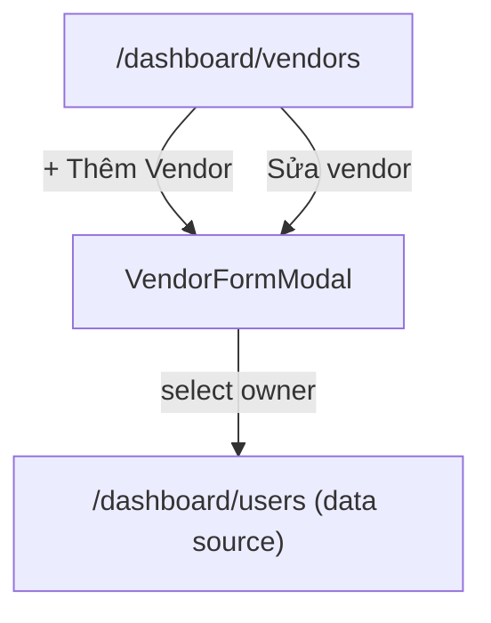

# Screen: Admin Vendors

**App:** Admin (Web — Next.js)
**File:** `apps/admin/src/app/dashboard/vendors/page.tsx`
**Phase:** 2 (Vendor & Service Management)
**Status:** Implemented ✅

---

## 1. Tổng quan

**Mục đích:** Admin duyệt, tạo, sửa, tạm dừng vendor. Xem thông tin liên hệ, hoa hồng, trạng thái.

**Ai dùng:** Admin đã đăng nhập

**Entry point:** Sidebar "Vendor".

**Route chain:**
```
/dashboard/vendors/page.tsx  ← THIS SCREEN
  ↔ VendorFormModal (inline overlay)
```

---

## 2. Wireframe

```
┌──────────────────────────────────────────────────────────────────┐
│  Quản lý Vendor                           Duyệt, quản lý và giám  │
│                                               sát vendor          │
│  ┌────────────────────┐  ┌──────────────────┐                   │
│  │ Tất cả trạng thái▼│  │  [+ Thêm Vendor] │                   │
│  └────────────────────┘  └──────────────────┘                   │
│                                                                   │
│  ┌────────────┐ ┌────────────┐ ┌────────────┐                  │
│  │ Tổng: 12   │ │ Hoạt động: 8│ │ Chờ duyệt: 4│                  │
│  └────────────┘ └────────────┘ └────────────┘                  │
│                                                                   │
│  ┌──────────────────────────────────────────────────────────┐   │
│  │  Vendor         Liên hệ      Hoa hồng  Trạng thái  Thao tác │ │
│  ├──────────────────────────────────────────────────────────┤   │
│  │  Hải Sản        09xxxxxxxx   8%        [Hoạt động] [Sửa][Tạm dừng] │
│  │  Hương Biển    hai@...               [Chờ duyệt] [Sửa][Duyệt]  │
│  └──────────────────────────────────────────────────────────┘   │
│                                                                   │
└──────────────────────────────────────────────────────────────────┘

Vendor Form Modal (overlay):
┌──────────────────────────────────────┐
│  Thêm Vendor mới                    ✕ │
│  ──────────────────────────────────── │
│  Chủ cửa hàng: [Chọn owner ▼]       │
│  Tên Cửa Hàng: [_______________]     │
│  Slug:          [_______________]     │
│  Hoa Hồng (%): [8.00____________]   │
│  SĐT:           [_______________]    │
│  Địa chỉ:       [_______________]    │
│  Email:         [_______________]    │
│  Mô tả:         [_______________]    │
│                     [Hủy]  [Lưu]      │
└──────────────────────────────────────┘
```

---

## 3. Navigation Flow



---

## 4. Filter Status

| Option | Value |
|--------|-------|
| Tất cả trạng thái | `''` |
| Chờ duyệt | `pending` |
| Đang hoạt động | `active` |
| Tạm dừng | `suspended` |

### Status Badges

| Status | Label | Style |
|--------|-------|-------|
| `active` | Hoạt động | `bg-primary-fixed/30 text-primary` |
| `pending` | Chờ duyệt | `bg-tertiary-fixed/50 text-tertiary` |
| `suspended` | Tạm dừng | `bg-error/10 text-error` |

---

## 5. Mutations

| Mutation | API call | Side effect |
|----------|----------|-------------|
| Approve | `vendorApi.approve(v.id)` | Invalidate `['admin-vendors']` |
| Suspend | `vendorApi.suspend(v.id)` | Invalidate `['admin-vendors']` |
| Create | `vendorApi.create(formData)` | Invalidate `['admin-vendors']` |
| Update | `vendorApi.update(vendor.id, data)` | Invalidate `['admin-vendors']` |

---

## 6. Vendor Form Fields

| Field | Required | Notes |
|-------|----------|-------|
| `owner_id` | Yes (create only) | Select from `userApi.list({ role: 'vendor_owner' })` |
| `name` | Yes | Auto-generates slug on change |
| `slug` | Yes (create only) | Auto-generated from name, disabled on edit |
| `commission_rate` | Yes | Default `8.00` |
| `phone` | No | — |
| `email` | No | — |
| `address` | No | — |
| `description` | No | — |

### Slug Generation

```typescript
const slug = name
  .toLowerCase()
  .normalize('NFD')
  .replace(/[\u0300-\u036f]/g, '')  // strip diacritics
  .replace(/[^a-z0-9]/g, '-')
  .replace(/-+/g, '-')
  .replace(/^-|-$/g, '')
```

---

## 7. API Integration

### List Vendors

**Endpoint:** `GET /vendors`
**Query params:** `{ status?: string, page?: number }`
**Query key:** `['admin-vendors', statusFilter, page]`

### Vendor Owners (for form)

**Endpoint:** `GET /users` (via `userApi.list`)
**Query key:** `['admin-users-vendor-owners']`
**Filter:** `role: 'vendor_owner'`, `limit: 100`

### Approve / Suspend

**Endpoint:** `PATCH /vendors/:id/approve` and `PATCH /vendors/:id/suspend`

---

## 8. Design Tokens

Same design system as other admin screens. Modal uses `bg-black/50` backdrop with `z-50`.

| Token | Value | Usage |
|-------|-------|-------|
| `primary` | `#005E97` | Primary buttons, active badge |
| `tertiary` | `#3F3D99` | Pending badge |
| `error` | `#BA1A1A` | Suspend button, suspended badge |
| `surface` | `#F4F7FB` | Page bg |
| `surface-high` | `#DEE4EF` | Input bg |
| `primary-fixed/20` | light blue | Commission rate input bg |

---

## 9. Gaps

| Issue | Severity | Notes |
|-------|----------|-------|
| No vendor detail page | 🔴 Broken | Can't view full vendor info after creation |
| Slug auto-generate doesn't update on edit | ⚠️ UX | If name changed in edit mode, slug not updated (slug is disabled but stale) |
| No vendor service list | 🔴 Missing | Can't view/edit vendor's services from admin |
| Commission rate not editable on existing vendor | 🔴 Bug | Rate shown but form uses `vendor.commissionRate` only on create |
| No "reject" vendor action | ⚠️ UX | Pending vendors can only be approved or ignored |
| No pagination on vendors list | ⚠️ UX | All vendors loaded (limit not passed) |
| Vendor owners API may not filter correctly | ⚠️ Risk | `userApi.list({ role: 'vendor_owner' })` depends on API supporting role filter |

---

## 10. Implementation Log

| Date | Change |
|------|--------|
| 2026-04-09 | Screen layout doc created |
