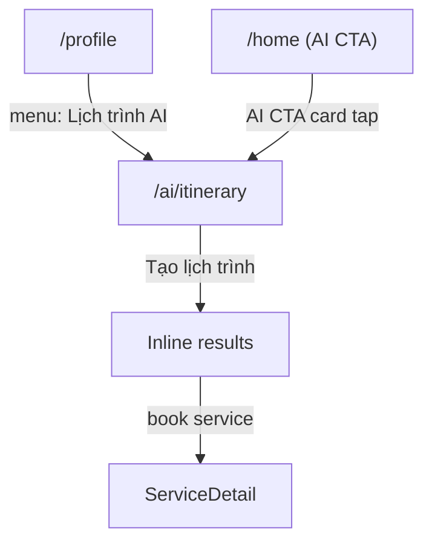

# Screen: AI Itinerary (Lịch trình AI)

**App:** Tourist (Mobile)
**File:** `apps/mobile/app/ai/itinerary.tsx`
**Phase:** 6 (AI, Combos, Content & Reviews)
**Status:** Implemented ✅

---

## 1. Tổng quan

**Mục đích:** Tourist điền form (số ngày, ngân sách, loại nhóm, sở thích) → gọi AI generate lịch trình cá nhân hóa tại Sầm Sơn → hiển thị kết quả inline.

**Ai dùng:** Tourist đã đăng nhập

**Entry point:** Từ Profile (menu "Lịch trình AI"), hoặc Home (AI CTA card).

**Route chain:**
```
/(tabs)/profile.tsx
  → /ai/itinerary.tsx  ← THIS SCREEN
```

---

## 2. Wireframe

```
┌──────────────────────────────────────┐
│  ╔════════════════════════════════╗  │  ← primary gradient, rounded bottom
│  ║            🤖                   ║  │
│  ║      Lịch trình AI              ║  │
│  ║  Để AI S-Loco thiết kế hành    ║  │
│  ║  trình hoàn hảo cho bạn tại     ║  │
│  ║  Sầm Sơn                        ║  │
│  ╚════════════════════════════════╝  │
│                                        │
│  ── Số ngày ──                      │
│  [ 1 ] [ 2✓ ] [ 3 ] [ 4 ] [ 5 ]   │  ← stepper chips
│                                        │
│  ── Ngân sách ──                     │
│  [ 500K✓ ] [ 1M ] [ 2M ] [ 5M ]  │  ← budget chips
│                                        │
│  ── Đi cùng ──                       │
│  [Cặp đôi💑✓] [Gia đình👨‍👩‍👧]       │  ← group chips, wrap
│  [Bạn bè👯] [Một mình🎒]            │
│                                        │
│  ── Sở thích ──                     │
│  [🏖️ Biển✓] [🍜 Ẩm thực✓]         │  ← pref chips, wrap
│  [💆 Spa✓] [🛍️ Mua sắm]             │
│  [🎠 Giải trí] [🛺 Xe điện]        │
│                                        │
│  [     Tạo lịch trình ✨     ]     │  ← primary CTA, disabled while pending
│                                        │
│  ── Kết quả (nếu có) ──            │
│  ┌─────────────────────────────────┐ │
│  │  Ngày 1                          │ │
│  │  08:00  🥤 Bữa sáng             │ │
│  │  09:30  🏖️ Biển Sầm Sơn        │ │
│  │  12:00  🍜 Trưa: Ẩm thực...     │ │
│  └─────────────────────────────────┘ │
│  ┌─────────────────────────────────┐ │
│  │  Tổng ước tính   1.200.000₫  │ │  ← primaryContainer bg
│  └─────────────────────────────────┘ │
└──────────────────────────────────────┘
```

---

## 3. Navigation Flow



---

## 4. Form State

| Field | Type | Default | Options |
|-------|------|---------|---------|
| `days` | `number` | `2` | 1, 2, 3, 4, 5 |
| `budget` | `number` | `2000000` | 500K, 1M, 2M, 5M |
| `groupType` | `string` | `'couple'` | couple, family, friends, solo |
| `prefs` | `string[]` | `['biển', 'ẩm thực']` | biển, ẩm thực, spa-massage, mua-sắm, giải-trí, xe-điện |

---

## 5. API Integration

### Generate Itinerary

**Endpoint:** `POST /api/v1/itinerary`
**Mutation:** `useMutation` from `@tanstack/react-query`
**Payload:** `{ days, budget, preferences, group_type }`
**Response:** `{ itinerary: { days: [{ day, activities: [{ time, title, location?, estimated_cost? }] }], total_estimated_cost? } }`

**On success:** `setResult(itinerary)` → inline expand below CTA

---

## 6. Component Inventory

### `ItineraryScreen`

**Sections:**
1. **Hero** — primary gradient, rounded bottom (32px), emoji 🤖 + title + subtitle
2. **Form** — 4 fields: stepper, budget chips, group chips, preference grid
3. **CTA** — `TouchableOpacity`, disabled + opacity 0.6 when `mutation.isPending`, shows ActivityIndicator
4. **Error** — `mutation.isError` → red bodySm text, centered
5. **Results** — conditional render when `result` is set

**Results rendering:**
- `resultsTitle` → headlineMd
- `dayCard` per day — surfaceContainerLowest, borderRadius 16, primary day title
- `activityRow` per activity — flex row: time (labelMd, outline, 48px minW) + activityInfo (flex 1)
- `totalRow` — primaryContainer bg, white titleMd + white headlineMd

### Preference Toggle

```typescript
function togglePref(val: string) {
  setPrefs((p) => p.includes(val) ? p.filter(x => x !== val) : [...p, val])
}
```

---

## 7. Design Tokens

| Token | Hex | Usage |
|-------|-----|-------|
| `primary` | `#005E97` | Hero bg (gradient start), stepperActive bg, prefActive bg, CTA bg, day title |
| `primaryContainer` | `#0077B6` | currentCard bg, forecastCard bg, totalRow bg |
| `primaryFixed` | `#90E0EF` | Menu icon bg |
| `surface` | `#F4F7FB` | Container bg |
| `surfaceContainer` | `#E6EBF4` | Stepper/budget inactive bg |
| `surfaceContainerLowest` | `#FFFFFF` | dayCard bg |
| `onSurfaceVariant` | `#3B4460` | Inactive chip text |
| `outline` | `#6B7694` | activityTime, forecastLow |
| `error` | `#BA1A1A` | errorText |
| `white` | `#FFFFFF` | Hero text, active chip text, stats values |

### Typography

| Style | Font | Size | Weight | Usage |
|-------|------|------|--------|-------|
| `headlineMd` | Plus Jakarta Sans | 28px | 600 | Hero title, results title |
| `titleMd` | Be Vietnam Pro | 16px | 600 | Stepper text, stats value, day title |
| `titleSm` | Be Vietnam Pro | 14px | 500 | Budget text |
| `bodyMd` | Be Vietnam Pro | 14px | 400 | Hero subtitle, activity title |
| `bodySm` | Be Vietnam Pro | 12px | 400 | Group text |
| `labelLg` | Be Vietnam Pro | 14px | 500 | Field label |
| `labelMd` | Be Vietnam Pro | 12px | 500 | activityTime |

---

## 8. Gaps

| Issue | Severity | Notes |
|-------|----------|-------|
| "Book" not wired | 🔴 Broken | Activities map to real services but no CTA to book. Need: `router.push('/service/${serviceId}')` per activity |
| No budget reset on group change | ⚠️ UX | Changing group type doesn't suggest new budget range |
| API error not detailed | ⚠️ UX | Shows generic "Đã xảy ra lỗi" — no specific message |
| No "share" itinerary | ⚠️ Missing | Can't share generated itinerary |
| No "regenerate" button | ⚠️ UX | Must change inputs and re-tap CTA |
| Results not persisted | ⚠️ Missing | On screen re-focus, results disappear — no save |
| Loading state while generating | ⚠️ UX | No inline skeleton for results, CTA just shows spinner |

---

## 9. Implementation Log

| Date | Change |
|------|--------|
| 2026-04-09 | Screen layout doc created |
