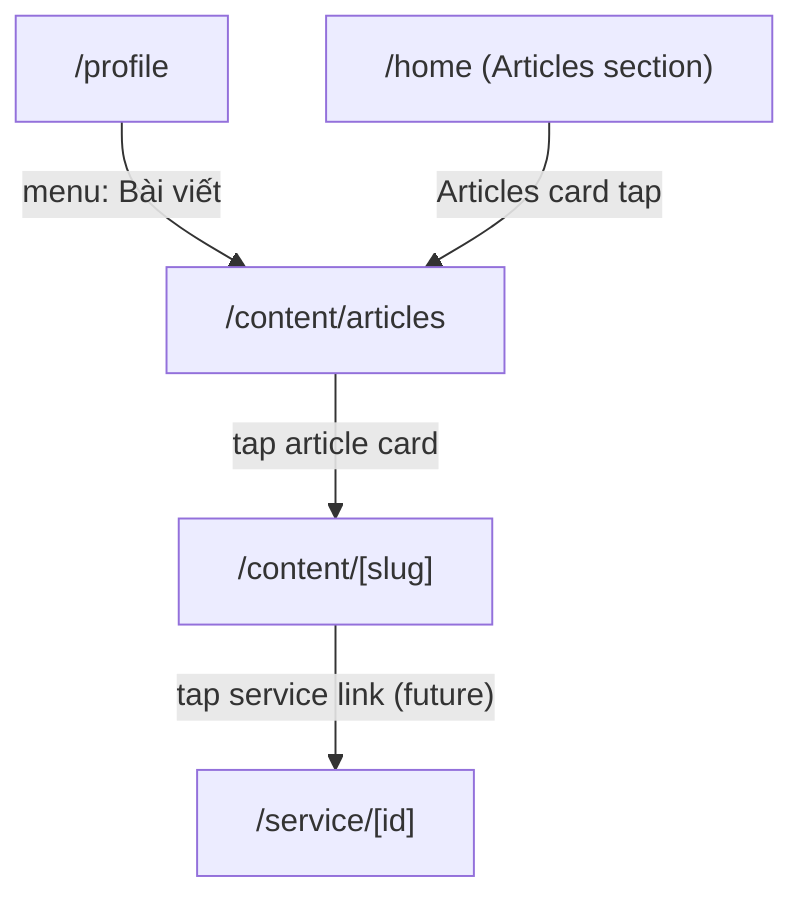

# Screen: Articles (Bài viết & Tin tức)

**App:** Tourist (Mobile)
**Files:**
- List: `apps/mobile/app/content/articles.tsx`
- Detail: `apps/mobile/app/content/[slug].tsx`
**Phase:** 6 (AI, Combos, Content & Reviews)
**Status:** Implemented ✅

---

## 1. Tổng quan

**Mục đích:** Tourist đọc tin tức, sự kiện, hướng dẫn về Sầm Sơn. Hai màn hình: danh sách (filter theo category) + chi tiết (full article content).

**Ai dùng:** Tourist (không cần login)

**Entry point:** Từ Profile (menu "Bài viết"), hoặc Home (Articles section).

**Route chain:**
```
/content/articles.tsx  ← THIS SCREEN (LIST)
  → /content/[slug].tsx  ← THIS SCREEN (DETAIL)
```

---

## 2. Wireframe — List

```
┌──────────────────────────────────────┐
│  Bài viết                              │  ← headlineMd
├──────────────────────────────────────┤
│  [Tất cả✓] [Tin tức] [Sự kiện] [Hướng dẫn] │  ← horizontal scroll, tab chips
│                                        │
│  ┌──────────────────────────────────┐ │
│  │  [        IMAGE 160px          ] │ │  ← cardImage, full width
│  │  [ Tin tức ]                    │ │  ← primaryFixed chip
│  │  Tiêu đề bài viết (2 dòng)     │ │
│  │  Mô tả ngắn (2 dòng)           │ │
│  │  09/04/2026                     │ │
│  └──────────────────────────────────┘ │
│  ┌──────────────────────────────────┐ │
│  │  [        IMAGE 160px          ] │ │
│  │  [ Sự kiện ]                    │ │
│  │  ...                            │ │
│  └──────────────────────────────────┘ │
│                                        │
│  [padding: 100px bottom]              │
└──────────────────────────────────────┘

Empty state:
┌──────────────────────────────────────┐
│              📰                        │
│        Chưa có bài viết               │
└──────────────────────────────────────┘
```

---

## 3. Wireframe — Detail

```
┌──────────────────────────────────────┐
│  [        HERO IMAGE 220px         ] │  ← full width, no rounding
│                                        │
│  [ Tin tức ]                    │  ← primaryFixed chip, flex-start
│                                        │
│  Tiêu đề bài viết dài               │  ← headlineMd
│  Tác giả · 09 tháng 4 năm 2026   │  ← bodySm, outline
│                                        │
│  Nội dung bài viết đầy đủ...        │  ← bodyMd, onSurfaceVariant, lineHeight 24
│  Có thể chứa đoạn văn dài,         │
│  danh sách, v.v.                    │
└──────────────────────────────────────┘
```

---

## 4. Navigation Flow



---

## 5. Filter Categories

| Key | Label | Notes |
|-----|-------|-------|
| `all` | Tất cả | category = null |
| `news` | Tin tức | news content |
| `event` | Sự kiện | events |
| `guide` | Hướng dẫn | how-to guides |

**Active tab:** `category === null` for "all", else matches filter value.

---

## 6. Component Inventory

### `ArticlesScreen` (list)

**State:** `category: string | null` (default: `null`)

**Query:** `['articles', category]` → `contentApi.articles({ category })`

**Sections:**
1. Header — "Bài viết" title
2. Category tabs — FlatList horizontal, 4 tabs
3. Articles list — FlatList vertical
4. Empty state — 📰 emoji + "Chưa có bài viết"
5. Footer — 100px spacer (above tab bar)

**Article card (`renderItem`):**
- Full-width image (160px height)
- `cardContent`: primaryFixed chip + title (2-line clamp) + excerpt (2-line clamp) + date
- `onPress={() => router.push(`/content/${item.slug}`)}`

### `ArticleDetailScreen` (detail)

**Params:** `slug: string` from `useLocalSearchParams`

**Query:** `['article', slug]` → `contentApi.article(slug)`

**States:**
- Loading → ActivityIndicator centered
- Error/not found → `<ErrorState onRetry />`
- Success → ScrollView with hero + content

**Sections:**
1. Hero image — 220px height, full width
2. Category chip — primaryFixed, self flex-start
3. Title — headlineMd
4. Meta — author + formatted date (vi-VN locale)
5. Body — `article.content ?? article.excerpt` (fallback)

---

## 7. Design Tokens

### List Screen

| Token | Hex | Usage |
|-------|-----|-------|
| `surface` | `#F4F7FB` | Container bg |
| `primaryContainer` | `#0077B6` | Active tab bg |
| `surfaceContainer` | `#E6EBF4` | Inactive tab bg |
| `primaryFixed` | `#90E0EF` | Category chip bg |
| `primary` | `#005E97` | ActivityIndicator, active text |
| `surfaceContainerLowest` | `#FFFFFF` | Card bg |
| `surfaceContainer` | `#E6EBF4` | Tab inactive bg |
| `onSurfaceVariant` | `#3B4460` | Body/excerpt text |
| `outline` | `#6B7694` | Date text |
| `onSurface` | `#161B2E` | Title text |
| `onSecondaryContainer` | `#1E3A5F` | Chip text |

### Detail Screen

| Token | Hex | Usage |
|-------|-----|-------|
| `surface` | `#F4F7FB` | Container bg |
| `surfaceContainerLowest` | `#FFFFFF` | Info card bg |
| `primaryFixed` | `#90E0EF` | Category chip |
| `primary` | `#005E97` | Chip text |
| `onSurface` | `#161B2E` | Title |
| `onSurfaceVariant` | `#3B4460` | Body text |
| `outline` | `#6B7694` | Meta/date |

---

## 8. API Integration

### List Articles

**Endpoint:** `GET /content/articles`
**Query key:** `['articles', category]`
**Response:** `{ items: ArticleItem[] }`

### Get Article

**Endpoint:** `GET /content/articles/:slug`
**Query key:** `['article', slug]`
**Response:** `{ article: { id, slug, title, image_url?, excerpt?, content?, category?, author?, published_at? } }`

---

## 9. Gaps

| Issue | Severity | Notes |
|-------|----------|-------|
| Rich text not rendered | 🔴 Broken | `article.content` is plain text — no HTML/markdown rendering. Links, lists, images in content ignored |
| No share button | ⚠️ UX | Can't share article URL |
| No related articles | ⚠️ UX | Detail screen doesn't show related/similar articles |
| No image zoom | ⚠️ UX | Hero image not tappable for zoom |
| Article search | ⚠️ Missing | No keyword search on articles |
| No bookmark/save | ⚠️ Missing | Can't save article for later |
| Service deep links in content | ⚠️ Missing | Content with inline service mentions not tappable |

---

## 10. Implementation Log

| Date | Change |
|------|--------|
| 2026-04-09 | Screen layout doc created |
