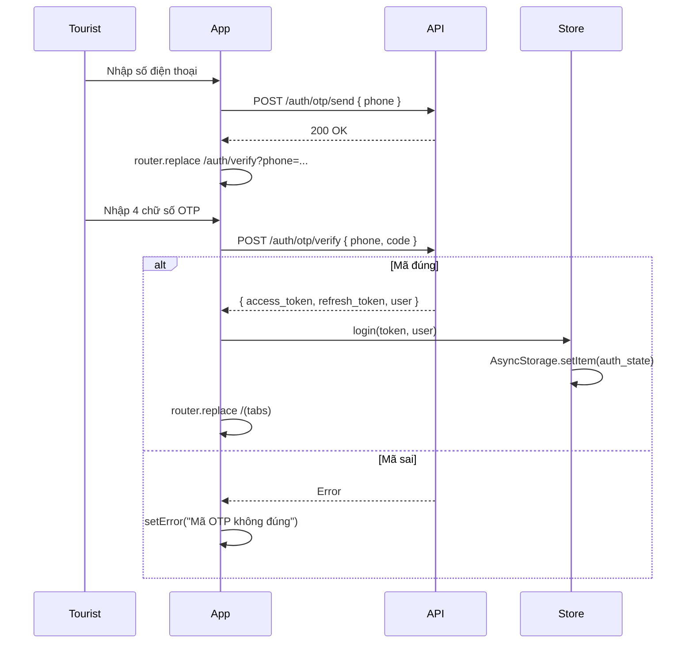

# Screen: Tourist Auth (OTP Login Flow)

**App:** Tourist (Mobile)
**Files:**
- Entry: `apps/mobile/app/auth/otp.tsx`
- Verify: `apps/mobile/app/auth/verify.tsx`
- Store: `apps/mobile/src/stores/auth-store.ts`
**Phase:** 1 (Foundation & Auth)
**Status:** Implemented ✅

---

## 1. Tổng quan

**Mục đích:** Xác thực tourist qua OTP SMS. Flow 2 bước: (1) nhập số điện thoại → gửi OTP, (2) nhập mã 4 chữ số → nhận JWT → redirect vào app.

**Ai dùng:** Khách du lịch chưa đăng nhập

**Entry point:** Root `app/index.tsx` redirect → `/auth/otp` khi chưa có token.

**Route chain:**
```
/app/index.tsx (redirect)
  → /app/auth/otp.tsx      ← Phone entry
  → /app/auth/verify.tsx   ← OTP verification
  → /app/(tabs)/           ← On success
```

---

## 2. Wireframe

### `/auth/otp.tsx` — Phone Entry

```
┌──────────────────────────────────────┐
│                                      │
│              🌊                      │
│                                      │
│     Chào mừng đến S-Loco           │
│                                      │
│  Nhập số điện thoại để nhận       │
│  mã đăng nhập qua SMS               │
│                                      │
│  Số điện thoại                      │
│  ┌──────────────────────────────┐   │
│  │ 0912345678                   │   │
│  └──────────────────────────────┘   │
│                                      │
│  ┌──────────────────────────────┐   │
│  │      Nhận mã OTP             │   │
│  └──────────────────────────────┘   │
│                                      │
│  Bằng cách tiếp tục, bạn đồng ý     │
│  với Điều khoản sử dụng của S-Loco. │
└──────────────────────────────────────┘
```

### `/auth/verify.tsx` — OTP Verification

```
┌──────────────────────────────────────┐
│                                      │
│        Nhập mã OTP                  │
│                                      │
│  Mã 4 chữ số đã được gửi đến       │
│  0912***789                          │
│                                      │
│     [  ] [  ] [  ] [  ]            │
│                                      │
│  "Vui lòng nhập đủ 4 chữ số"       │
│                                      │
│  ┌──────────────────────────────┐   │
│  │         Xác minh             │   │
│  └──────────────────────────────┘   │
│                                      │
│  Không nhận được mã? Gửi lại mã   │
└──────────────────────────────────────┘
```

---

## 3. Auth Flow



---

## 4. Phone Validation

```
Regex: /^(0|\+84)\d{9,10}$/
Valid: 0912345678, +84912345678, 0123456789
Invalid: 123456, 091234567890, abc
Error: "Số điện thoại không hợp lệ (VD: 0912345678)"
```

---

## 5. OTP Input Behavior

**Digits:** 4 separate `TextInput` cells, 60×64px each, `keyboardType="number-pad"`, `maxLength=1`

| Action | Behavior |
|--------|---------|
| Type digit | Auto-advance to next input |
| Backspace on empty | Move to previous input |
| Paste | Supported (take first 4 digits) |
| Fill all 4 | Verify button activates |
| Wrong OTP | All inputs turn red (`borderColor: error`) |
| Resend countdown | 60 seconds between resends |

---

## 6. Auth Store (`auth-store.ts`)

**Storage:** AsyncStorage key = `auth_state`, persisted as JSON `{ token, user }`

**State:**
```typescript
interface AuthState {
  token: string | null
  user: UserProfile | null     // { id, phone, full_name?, email?, role }
  isLoading: boolean
  isHydrated: boolean          // false until AsyncStorage read
}
```

**Actions:**
| Action | Behavior |
|--------|---------|
| `hydrate()` | On app start: read AsyncStorage → restore token + user |
| `login(token, user)` | Store token, persist to AsyncStorage, set state |
| `logout()` | Clear token, remove from AsyncStorage, reset state |
| `setUser(user)` | Update user in state + AsyncStorage |

**Hydration guard:** `app/index.tsx` checks `isHydrated` — shows `null` until ready, then redirects.

---

## 7. Component Inventory

### `OtpScreen` (`auth/otp.tsx`)

**Props:** none
**State:** `phone: string`, `loading: boolean`, `error: string`
**Validation:** regex on submit (not on change)
**Success:** `router.replace({ pathname: '/auth/verify', params: { phone } })`

### `VerifyScreen` (`auth/verify.tsx`)

**Props:** none
**Params:** `phone: string` (from `useLocalSearchParams`)
**State:**
- `code: [string, string, string, string]` — 4 OTP digits
- `loading: boolean`
- `error: string`
- `countdown: number` — resend cooldown (seconds)
- `inputs: RefObject<(TextInput | null)[]>` — refs for auto-advance

**Behavior:**
- On verify success: `login(token, user)` → `router.replace('/(tabs)')`
- On verify fail: show error, inputs turn red
- On resend: call `sendOtp()`, reset countdown to 60s

### Auth Gate (`app/index.tsx`)

```typescript
if (!isHydrated) return null        // wait for AsyncStorage
if (!token) return <Redirect href="/auth/otp" />
return <Redirect href="/(tabs)" />
```

---

## 8. API Integration

### Send OTP

**Endpoint:** `POST /auth/otp/send`
**Params:** `{ phone: string }`
**Response:** `{ message: string }`

### Verify OTP

**Endpoint:** `POST /auth/otp/verify`
**Params:** `{ phone: string, code: string, full_name?: string, email?: string }`
**Response:**
```typescript
{
  access_token: string
  refresh_token: string
  user: UserProfile   // { id, phone, full_name?, email?, role, created_at? }
}
```

---

## 9. Gaps

| Issue | Notes |
|-------|-------|
| Terms link not tappable | Footer text has `<Text style={link}>` but no `onPress` |
| `+84` prefix handling | Regex accepts `+84`, but API may need normalization |
| Demo/dev OTP | No magic code for development (e.g., `123456`) |
| Rate limiting | No UI feedback if API rate-limits OTP sends |
| Biometric auth | Not in v1 scope |

---

## 10. Implementation Log

| Date | Change |
|------|--------|
| 2026-04-09 | Auth screen layout doc created |
