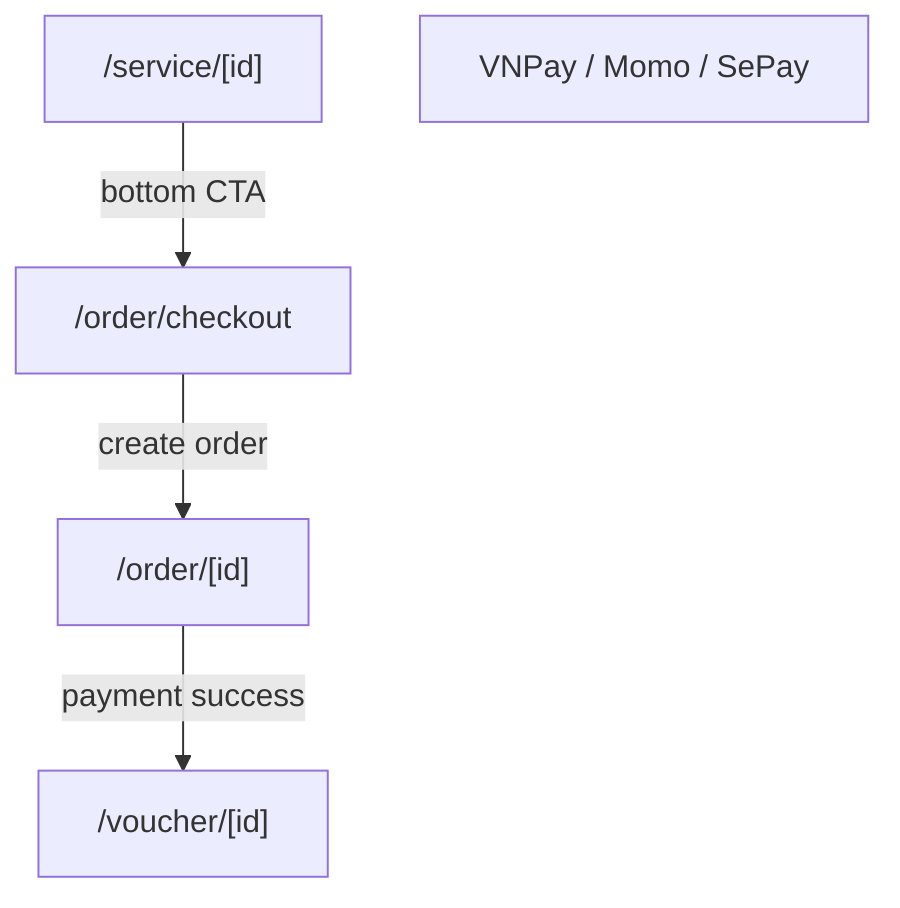

# Screen: Tourist Checkout

**App:** Tourist (Mobile)
**File:** `apps/mobile/app/order/checkout.tsx`
**Phase:** 3 (Orders, Vouchers & QR)
**Status:** Implemented ✅ — mock payment flow

---

## 1. Tổng quan

**Mục đích:** Xem lại đơn hàng, chọn cổng thanh toán, tạo đơn → redirect đến Order Detail (với mock payment, chưa redirect thực đến VNPay/Momo/SePay).

**Ai dùng:** Tourist đã đăng nhập, có item trong cart

**Entry point:** Từ Service Detail (bottom CTA "Thêm vào đơn").

**Route chain:**
```
/app/order/checkout.tsx  ← THIS SCREEN
  → /app/order/[id].tsx   (after order created)
```

---

## 2. Wireframe

```
┌──────────────────────────────────────┐
│  "Thanh toán"                        │
├──────────────────────────────────────┤
│  ── Đơn hàng của bạn ──            │
│  ┌─────────────────────────────────┐ │
│  │ Tên dịch vụ A         150.000₫│ │
│  │ x2                                  │ │
│  │ ───────────────────────────────│ │
│  │ Tên dịch vụ B         100.000₫│ │
│  │ x1                                  │ │
│  └─────────────────────────────────┘ │
│                                        │
│  ── Phương thức thanh toán ──      │
│  ┌─────────────────────────────────┐ │
│  │ [💳][VNPay           ][✓]      │ │
│  │ [📱][MoMo                      ]│ │
│  │ [🏦][SePay                     ]│ │
│  └─────────────────────────────────┘ │
│                                        │
│  ┌─────────────────────────────────┐ │
│  │ Tổng cộng           400.000₫  │ │
│  └─────────────────────────────────┘ │
│                                        │
│  [padding: 120px bottom]             │
├──────────────────────────────────────┤
│  [  Thanh toán 400.000₫  ]  ← sticky │
└──────────────────────────────────────┘
```

---

## 3. Navigation Flow



---

## 4. Payment Gateways

| Gateway | Icon | Key |
|---------|------|-----|
| VNPay | 💳 | `vnpay` |
| MoMo | 📱 | `momo` |
| SePay | 🏦 | `sepay` |

**Note:** Gateway selector is UI-only. The `gateway` state is set on selection but NOT passed to the API. All gateways currently redirect to the same mock flow.

---

## 5. Order Creation Flow

```typescript
useMutation({
  mutationFn: () => ordersApi.create(
    items.map(i => ({ service_id: i.service.id, quantity: i.quantity })),
    note || undefined
  ),
  onSuccess: (res) => {
    const orderId = res?.order?.id
    clear()           // clear cart
    qc.invalidateQueries({ queryKey: ['orders'] })
    router.replace(`/order/${orderId}`)
  }
})
```

**Behavior:**
1. `handlePlaceOrder()` → validates `items.length > 0`
2. Calls `ordersApi.create()` → creates order on backend
3. Clears cart (`clear()`)
4. Invalidates orders cache
5. Redirects to `/order/[id]`

---

## 6. Component Inventory

### `CheckoutScreen` (`order/checkout.tsx`)

**State:**
- `gateway: string` — selected payment gateway key (default: `vnpay`)
- `note: string` — order note (state exists, **NOT rendered in UI** ⚠️)
- Mutation state from `useMutation`

**Sections:**
1. Order Summary — list of cart items with qty + price
2. Gateway selector — radio-style chips
3. Total — sum of all items
4. Place Order CTA — sticky bottom bar

**Empty cart:** Shows 🛒 emoji + "Giỏ hàng trống" (but Place Order is still shown with disabled state)

### `useOrderStore` integration

```typescript
const { items, total, clear } = useOrderStore()
// items: CartItem[]  { service: ServiceItem, quantity: number }
// total(): number  sum of (discount_price ?? original_price) × qty
```

---

## 7. API Integration

### Create Order

**Endpoint:** `POST /orders`
**Body:** `{ items: { service_id: string, quantity: number }[], note?: string }`
**Response:** `{ order: OrderDetail }`

### Order Detail

**Endpoint:** `GET /orders/:id`
**Called after create:** just to verify (`ordersApi.detail(orderId)`)

---

## 8. Gaps

| Issue | Severity | Notes |
|-------|----------|-------|
| Payment gateway NOT wired | 🔴 Critical | Gateway selection is cosmetic only — no redirect to VNPay/Momo/SePay |
| Note input not rendered | 🔴 Missing | `note` state exists but no `<TextInput>` in JSX |
| No order note editing | 🔴 Missing | Cannot add note to order |
| Total without commission display | ⚠️ UX | Should show: subtotal, S-Loco fee (0), total = item sum |
| No promo/coupon field | ⚠️ Not in scope | — |
| Back navigation | ⚠️ UX | No explicit back — native gesture only |

---

## 9. Implementation Log

| Date | Change |
|------|--------|
| 2026-04-09 | Screen layout doc created |
