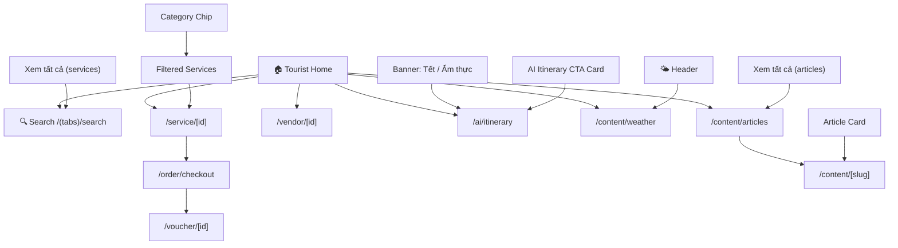

# Screen: Tourist Home (Trang chủ)

**App:** Tourist (Mobile)
**File:** `apps/mobile/app/(tabs)/index.tsx`
**Phase:** 2 (Discovery)
**Status:** Implemented ✅

---

## 1. Tổng quan

**Mục đích:** Trang chủ cho khách du lịch đã đăng nhập — hiển thị danh mục dịch vụ, dịch vụ nổi bật, khuyến mãi, AI itinerary CTA, tin tức/sự kiện. Người dùng discover → book.

**Ai dùng:** Tourist đã đăng nhập (role: `tourist`, đăng nhập qua OTP phone)

**Khi nào truy cập:** Tab đầu tiên trong bottom tab navigation — luôn visible sau khi login thành công.

**Route chain:**
```
/app/index.tsx (root redirect)
  → /app/(tabs)/index.tsx  ← THIS SCREEN
  → /app/(tabs)/search.tsx
  → /app/service/[id].tsx
  → /app/vendor/[id].tsx
  → /app/order/checkout.tsx
  → /app/ai/itinerary.tsx
  → /app/content/weather.tsx
  → /app/content/articles.tsx
  → /app/content/[slug].tsx
```

---

## 2. Wireframe

```
┌──────────────────────────────────────┐
│  HEADER (floating, glass blur)       │
│  [Xin chào! 👋]      [🌤️ weather]   │
│  [S-Loco]                            │
├──────────────────────────────────────┤
│ ┌──────────────────────────────────┐ │
│ │ HERO (Ocean Blue gradient)        │ │
│ │ Tagline: "Khám phá Sầm Sơn"      │ │
│ │ Title: "S-Loco" (36px bold)      │ │
│ │ Sub: "Ẩm thực · Lưu trú · Giải  │ │
│ │       trí"                        │ │
│ └──────────────────────────────────┘ │
│                                      │
│  BANNERS (horizontal scroll)         │
│  ┌─────────────┐ ┌─────────────┐     │
│  │ 🎆 Tết 2026│ │ 🍽️ Ẩm thực│     │
│  │ Ưu đãi 30%│ │ Top 10 NH   │     │
│  └─────────────┘ └─────────────┘     │
│                                      │
│  CATEGORIES (horizontal chips)       │
│  [🍜] [🏨] [💆] [🛺] [🎠] [🛍️]      │
│                                      │
│  AI ITINERARY CTA (blue card)        │
│  ┌──────────────────────────────────┐ │
│  │ 🤖 Lên lịch trình          →    │ │
│  │    AI gợi ý lịch trình cho bạn │ │
│  └──────────────────────────────────┘ │
│                                      │
│  "Tin tức & Sự kiện"  [Xem tất cả]│
│  ┌──────────┐ ┌──────────┐ ┌───────┐ │
│  │ [img]    │ │ [img]    │ │ [img] │ │
│  │ 📰 Tin   │ │ 📰 Sự    │ │ 📰   │ │
│  │    tức  │ │    kiện  │ │ Guide │ │
│  └──────────┘ └──────────┘ └───────┘ │
│                                      │
│  "Dành cho bạn"        [Xem tất cả]│
│  ┌──────────────┐ ┌──────────────┐   │
│  │ [image]     │ │ [image]     │   │
│  │ Service A   │ │ Service B   │   │
│  │ Vendor name │ │ Vendor name │   │
│  │ 150.000₫ ★4.5│ │ 200.000₫   │   │
│  └──────────────┘ └──────────────┘   │
│  ┌──────────────┐ ┌──────────────┐   │
│  │ ...          │ │ ...          │   │
│  └──────────────┘ └──────────────┘   │
│                                      │
├──────────────────────────────────────┤
│  TAB BAR (glass blur)                │
│  [🏠 Trang chủ] [🔍] [🎫] [👤]      │
└──────────────────────────────────────┘
```

**Breakpoints:** Mobile-first (375px), max 428px (large phones). Single column content with 2-column service grid.

---

## 3. Navigation Flow



**Entry points:**
- `/app/index.tsx` → redirect (token ? `/tabs` : `/auth/otp`)

**Exit points:**
- Tap banner → `/ai/itinerary`
- Tap AI CTA card → `/ai/itinerary`
- Tap category chip → filter + scroll to grid
- Tap article card → `/content/[slug]`
- Tap "Xem tất cả" (articles) → `/content/articles`
- Tap "Xem tất cả" (services) → `/search`
- Tap weather icon → `/content/weather`
- Tap service card → `/service/[id]`
- Tab bar → switch context (no unmount)

---

## 4. Design Tokens

### Colors

| Token | Hex | Usage |
|-------|-----|-------|
| `primary` | `#005E97` | Hero bg, price text, section link |
| `primaryContainer` | `#0077B6` | AI CTA bg, active chip |
| `primaryFixed` | `#90E0EF` | Weather btn bg, article chip bg |
| `secondaryContainer` | `#B8D4F0` | Category chip bg (inactive) |
| `surface` | `#F4F7FB` | Screen background |
| `surfaceContainerLowest` | `#FFFFFF` | Card background |
| `onSurface` | `#161B2E` | Primary text |
| `onSurfaceVariant` | `#3B4460` | Secondary text |
| `outline` | `#6B7694` | Strikethrough price |
| `error` | `#BA1A1A` | Discounted price |
| `tertiaryContainer` | `#5856D6` | Discount badge bg |
| `white` | `#FFFFFF` | Hero text, badge text, AI CTA text |

### Typography

| Style | Font | Size | Weight | Usage |
|-------|------|------|--------|-------|
| `headlineMd` | Plus Jakarta Sans | 28px | 600 | Header title |
| `titleLg` | Be Vietnam Pro | 22px | 600 | Section heading |
| `titleMd` | Be Vietnam Pro | 16px | 600 | Service name |
| `titleSm` | Be Vietnam Pro | 14px | 600 | AI CTA title, banner title |
| `bodySm` | Be Vietnam Pro | 12px | 400 | Vendor name, sub text |
| `labelMd` | Be Vietnam Pro | 12px | 500 | Hero tagline |
| `labelSm` | Be Vietnam Pro | 11px | 500 | Article chip |
| Web hero title | — | 36px | 700 | Hero "S-Loco" (inline) |

### Spacing

| Token | Value | Usage |
|-------|-------|-------|
| `xs` | 4px | Icon gaps |
| `sm` | 8px | Chip padding, category gap |
| `md` | 12px | Card padding, inner gap |
| `base` | 16px | Screen padding, header padding |
| `lg` | 24px | Section spacing |
| `xl` | 32px | Major section breaks |

### Breakpoints

- Mobile: 320–428px (primary target)
- No desktop layout (React Native)

---

## 5. Component Inventory

### `HomeScreen` (`app/(tabs)/index.tsx`)

**Props:** none (screen component)
**State:**
- `category: string | null` — active category filter (slug)
- Query: `['services', category]` → `servicesApi.list()`
- Query: `['home-articles']` → `contentApi.articles({ limit: 3 })`

**Sections order:**
1. Hero (static)
2. Banners (static, horizontal scroll)
3. Categories (horizontal chips)
4. AI Itinerary CTA (fetched or static)
5. Articles (horizontal scroll, max 3, conditional on `articles.length > 0`)
6. Services heading + 2-column grid

### `CategoryChip` (`src/components/category-chip.tsx`)

**Props:**
```typescript
interface Props {
  label: string
  icon?: string
  active?: boolean
  onPress?: () => void
}
```
**States:**
- Default: `backgroundColor: secondaryContainer (#B8D4F0)`, text dark blue
- Active: `backgroundColor: primaryContainer (#0077B6)`, text white
- Press: `activeOpacity: 0.7`

### `ServiceCard` (`src/components/service-card.tsx`)

**Props:**
```typescript
interface Props {
  item: ServiceItem
  onPress?: () => void
}
```
**States:**
- Default: card with image + content
- Has discount: strikethrough original price + `-XX%` badge
- No image: placeholder with 📍 emoji
- Rating: ★ star + score (if `rating != null`)

### AI Itinerary CTA

**Inline** in `HomeScreen`, not a separate component.
**Style:** `backgroundColor: primaryContainer`, `borderRadius: 16`, white text
**Interaction:** `TouchableOpacity` → navigate to `/ai/itinerary`

### Articles Horizontal Scroll

**Inline** in `HomeScreen`.
- Fetches `contentApi.articles({ limit: 3 })`
- Shows 3 cards in horizontal `ScrollView`
- Conditional: only renders if `articles.length > 0`
- Each card: 160px wide, image + category chip + title
- Category chip: `primaryFixed` bg, `primary` text

### `LoadingSkeleton` (`src/components/loading-skeleton.tsx`)

**Purpose:** Skeleton while `isLoading: true`
**Count:** 4 skeleton cards (2 per row × 2 rows)

### Tab Bar (`(tabs)/_layout.tsx`)

**Icons:** 🏠 🔍 🎫 👤
**Active indicator:** `primaryFixed (#90E0EF)` circle behind icon
**Style:** Glass blur (`rgba(244,247,251,0.85)`), no top border

---

## 6. API Integration

### Services

**Endpoint:** `GET /services`
**Query key:** `['services', category]`
**Params:** `{ category?: string, limit: 20 }`
**Client:** TanStack Query v5

### Articles

**Endpoint:** `GET /content/articles`
**Query key:** `['home-articles']`
**Params:** `{ limit: 3 }`
**Response:** `{ items: ArticleItem[], total, page, limit }`
**Note:** Only shown if `articles.length > 0`

---

## 7. Implementation Log

| Date | Change |
|------|--------|
| 2026-04-09 | Initial layout doc created |
| 2026-04-09 | Added AI Itinerary CTA card (floating, not banner-only) |
| 2026-04-09 | Added Articles horizontal scroll section (max 3 items) |
