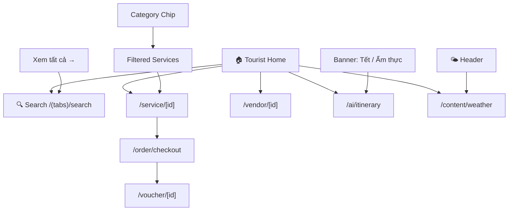

# Screen: Tourist Home (Trang chủ)

**App:** Tourist (Mobile)
**File:** `apps/mobile/app/(tabs)/index.tsx`
**Phase:** 2 (Discovery)
**Status:** Implemented ✅

---

## 1. Tổng quan

**Mục đích:** Trang chủ cho khách du lịch đã đăng nhập — hiển thị danh mục dịch vụ, dịch vụ nổi bật, khuyến mãi, và AI itinerary. Người dùng có thể tìm kiếm và duyệt dịch vụ để discover → book.

**Ai dùng:** Tourist đã đăng nhập (role: `tourist`, đăng nhập qua OTP phone)

**Khi nào truy cập:** Tab đầu tiên trong bottom tab navigation — luôn visible sau khi login thành công.

**Route chain:**
```
/app/index.tsx (root redirect)
  → /app/(tabs)/index.tsx  ← THIS SCREEN
  → /app/(tabs)/search.tsx
  → /app/service/[id].tsx
  → /app/vendor/[id].tsx
  → /app/order/checkout.tsx
  → /app/ai/itinerary.tsx
  → /app/content/weather.tsx
```

---

## 2. Wireframe

```
┌──────────────────────────────────────┐
│  HEADER (floating, glass blur)       │
│  [Xin chào! 👋]      [🌤️ weather]    │
│  [S-Loco]                            │
├──────────────────────────────────────┤
│ ┌──────────────────────────────────┐ │
│ │ HERO (Ocean Blue gradient)       │ │
│ │ Tagline: "Khám phá Sầm Sơn"      │ │
│ │ Title: "S-Loco" (36px bold)      │ │
│ │ Sub: "Ẩm thực · Lưu trú · Giải  │ │
│ │       trí"                       │ │
│ └──────────────────────────────────┘ │
│                                      │
│  BANNERS (horizontal scroll)         │
│  ┌─────────────┐ ┌─────────────┐     │
│  │ 🎆 Tết 2026│ │ 🍽️ Ẩm thực │     │
│  │ Ưu đãi 30% │ │ Top 10 NH   │     │
│  └─────────────┘ └─────────────┘     │
│                                      │
│  CATEGORIES (horizontal chips)       │
│  [🍜] [🏨] [💆] [🛺] [🎠] [🛍️]      │
│                                      │
│  "Dành cho bạn"   [Xem tất cả →]    │
│                                      │
│  ┌──────────────┐ ┌──────────────┐  │
│  │ [image]      │ │ [image]      │  │
│  │ Service A    │ │ Service B    │  │
│  │ Vendor name  │ │ Vendor name  │  │
│  │ 150.000₫  ★4.5│ │ 200.000₫    │  │
│  └──────────────┘ └──────────────┘  │
│  ┌──────────────┐ ┌──────────────┐  │
│  │ ...          │ │ ...          │  │
│  └──────────────┘ └──────────────┘  │
│                                      │
├──────────────────────────────────────┤
│  TAB BAR (glass blur)                │
│  [🏠 Trang chủ] [🔍] [🎫] [👤]       │
└──────────────────────────────────────┘
```

**Breakpoints:** Mobile-first (375px), max 428px (large phones). Single column content with 2-column service grid.

---

## 3. Navigation Flow



**Entry points:**
- `/app/index.tsx` → redirect (token ? `/tabs` : `/auth/otp`)

**Exit points:**
- Tap banner → `/ai/itinerary`
- Tap category chip → filter + scroll to grid
- Tap "Xem tất cả" → `/search`
- Tap weather icon → `/content/weather`
- Tap service card → `/service/[id]`
- Tab bar → switch context (no unmount)

---

## 4. Design Tokens

### Colors

| Token | Hex | Usage |
|-------|-----|-------|
| `primary` | `#005E97` | Hero background, CTA, price |
| `primaryContainer` | `#0077B6` | Active category chip |
| `primaryFixed` | `#90E0EF` | Weather button bg |
| `secondaryContainer` | `#B8D4F0` | Category chip bg (inactive) |
| `surface` | `#F4F7FB` | Screen background |
| `surfaceContainerLowest` | `#FFFFFF` | Card background |
| `onSurface` | `#161B2E` | Primary text |
| `onSurfaceVariant` | `#3B4460` | Secondary text, vendor name |
| `outline` | `#6B7694` | Strikethrough price |
| `error` | `#BA1A1A` | Discounted price |
| `tertiaryContainer` | `#5856D6` | Discount badge bg |
| `white` | `#FFFFFF` | Hero text, badge text |

### Typography

| Style | Font | Size | Weight | Usage |
|-------|------|------|--------|-------|
| `headlineMd` | Plus Jakarta Sans | 28px | 600 | Header title |
| `titleLg` | Be Vietnam Pro | 22px | 600 | Section heading |
| `titleMd` | Be Vietnam Pro | 16px | 600 | Service name |
| `bodySm` | Be Vietnam Pro | 12px | 400 | Vendor name, sub text |
| `labelMd` | Be Vietnam Pro | 12px | 500 | Hero tagline |
| Web hero title | — | 36px | 700 | Hero "S-Loco" (inline style) |

### Spacing

| Token | Value | Usage |
|-------|-------|-------|
| `xs` | 4px | Icon gaps |
| `sm` | 8px | Chip padding, category gap |
| `md` | 12px | Card padding, inner gap |
| `base` | 16px | Screen padding, header padding |
| `lg` | 24px | Section spacing |
| `xl` | 32px | Major section breaks, hero padding |

### Breakpoints

- Mobile: 320–428px (primary target)
- No desktop layout (React Native)

---

## 5. Component Inventory

### `HomeScreen` (`/(tabs)/index.tsx`)

**Props:** none (screen component)
**State:**
- `category: string | null` — active category filter (slug)
- Query state from `useQuery(['services', category])`

**Behavior:**
- On mount: fetch services (no filter)
- On category chip tap: toggle filter (tap active → null)
- FlatList with 2-column grid, skeleton loading

### `CategoryChip` (`src/components/category-chip.tsx`)

**Props:**

```typescript
interface Props {
  label: string       // Category display name
  icon?: string       // Emoji icon
  active?: boolean    // Is currently selected
  onPress?: () => void
}
```

**States:**
- Default: `backgroundColor: secondaryContainer (#B8D4F0)`, text dark blue
- Active: `backgroundColor: primaryContainer (#0077B6)`, text white
- Press: `activeOpacity: 0.7`

### `ServiceCard` (`src/components/service-card.tsx`)

**Props:**

```typescript
interface Props {
  item: ServiceItem    // { id, name, vendor_name, images, original_price, discount_price, discount_percent, rating }
  onPress?: () => void
}
```

**States:**
- Default: card with image + content
- Has discount: shows strikethrough original price + `-XX%` badge (tertiaryContainer bg, white text)
- No image: placeholder with 📍 emoji
- Rating: ★ star + score (shown if `rating != null`)

**Data flow:** `servicesApi.list({ category, limit: 20 })` → TanStack Query → rendered by FlatList

### `LoadingSkeleton` (`src/components/loading-skeleton.tsx`)

**Purpose:** Skeleton placeholder while `isLoading: true`
**Count:** 4 skeleton cards (2 per row × 2 rows)

### Tab Bar (`(tabs)/_layout.tsx`)

**Icons:** 🏠 🔍 🎫 👤
**Active indicator:** `primaryFixed (#90E0EF)` circle behind icon
**Style:** Glass blur (`rgba(244,247,251,0.85)`), no top border

---

## 6. API Integration

**Endpoint:** `GET /services`
**Query key:** `['services', category]`
**Params:** `{ category?: string, limit: 20 }`
**Query:** TanStack Query v5 (`@tanstack/react-query`)
**Error handling:** Shows `ErrorState` component, retry via `refetch()`

---

## 7. Gaps vs. Spec

| Spec Requirement | Implemented? |
|-----------------|-------------|
| Search bar (mục 3) | ⚠️ No inline search bar — only "Xem tất cả →" link to `/search` tab |
| AI itinerary button | ⚠️ Only via banner tap — no persistent CTA button |
| Promotions section | ✅ Banners section (horizontal scroll) |
| News/events | ❌ No news/events section on home screen |
| Weather display | ✅ Only icon in header (tap → full page) |

**Note:** Search is on dedicated `/search` tab, not inline on home. Review whether spec needs inline search bar on hero or keep tab-based.
