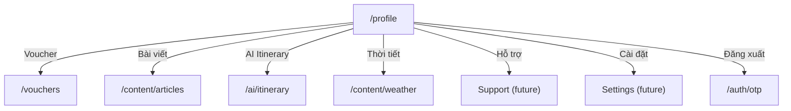

# Screen: Profile (Tài khoản)

**App:** Tourist (Mobile)
**File:** `apps/mobile/app/(tabs)/profile.tsx`
**Phase:** 1 (Foundation & Auth)
**Status:** Implemented ✅

---

## 1. Tổng quan

**Mục đích:** Màn hình tài khoản — hiển thị thông tin user, menu điều hướng đến các tính năng, đăng xuất.

**Ai dùng:** Tourist đã đăng nhập

**Entry point:** Tab "Tài khoản" ở bottom tab bar.

**Route chain:**
```
/(tabs)/profile.tsx  ← THIS SCREEN
  → /(tabs)/vouchers.tsx  (Voucher của tôi)
  → /content/articles.tsx  (Bài viết)
  → /ai/itinerary.tsx  (Lịch trình AI)
  → /content/weather.tsx  (Thời tiết)
  → /auth/otp.tsx  (Đăng xuất → redirect)
```

---

## 2. Wireframe

```
┌──────────────────────────────────────┐
│  Tài khoản                            │  ← headlineMd
│                                        │
│  ┌──────────────────────────────────┐ │
│  │  ┌────┐                          │ │
│  │  │ A  │  Nguyễn Văn A            │ │  ← avatar circle + name + phone
│  │  └────┘  09xxxxxxxxx             │ │
│  │           [🌊 Du khách]         │ │  ← primaryFixed chip
│  └──────────────────────────────────┘ │
│                                        │
│  ┌──────────────────────────────────┐ │
│  │  🎫  Voucher của tôi        ›  │ │
│  ├──────────────────────────────────┤ │
│  │  📰  Bài viết                ›  │ │
│  ├──────────────────────────────────┤ │
│  │  🤖  Lịch trình AI          ›  │ │
│  ├──────────────────────────────────┤ │
│  │  🌤️  Thời tiết              ›  │ │
│  ├──────────────────────────────────┤ │
│  │  💬  Hỗ trợ                ›  │ │
│  ├──────────────────────────────────┤ │
│  │  ⚙️  Cài đặt                ›  │ │
│  └──────────────────────────────────┘ │
│                                        │
│  [      Đăng xuất      ]             │  ← error bg (8% opacity), red text
└──────────────────────────────────────┘
```

---

## 3. Navigation Flow



---

## 4. Menu Items

| Key | Icon | Label | Action | Status |
|-----|------|-------|--------|--------|
| `vouchers` | 🎫 | Voucher của tôi | `router.push('/(tabs)/vouchers')` | ✅ wired |
| `articles` | 📰 | Bài viết | `router.push('/content/articles')` | ✅ wired |
| `ai` | 🤖 | Lịch trình AI | `router.push('/ai/itinerary')` | ✅ wired |
| `weather` | 🌤️ | Thời tiết | `router.push('/content/weather')` | ✅ wired |
| `support` | 💬 | Hỗ trợ | `() => {}` | ⚠️ empty |
| `settings` | ⚙️ | Cài đặt | `() => {}` | ⚠️ empty |

---

## 5. Avatar Logic

```typescript
const avatarChar = (user?.full_name ?? user?.phone ?? '?')[0]?.toUpperCase() ?? '?'
// Shows first char of full_name, fallback to first char of phone, else '?'

const displayName = user?.full_name || user?.phone || 'Người dùng S-Loco'
const displayPhone = user?.phone ?? user?.email ?? ''
const roleLabel = user?.role === 'tourist' ? '🌊 Du khách' : 'Người dùng'
```

---

## 6. Logout Flow

```typescript
async function handleLogout() {
  try {
    await authApi.logout()    // call backend logout
  } catch {
    /* ignore API errors */
  }
  await logout()               // clear auth store (AsyncStorage)
  router.replace('/auth/otp')  // redirect to login screen
}
```

**Note:** `router.replace` (not push) prevents back-stack navigation after logout.

---

## 7. Component Inventory

### `ProfileScreen`

**Data:** `useAuthStore()` — `{ user, logout }`

**Sections:**
1. Header — "Tài khoản" title
2. Profile card — avatar + info + role badge
3. Menu card — 6 menu rows with separators
4. Logout button — error-colored, full width
5. Bottom spacer — `spacing.xl` (32px)

### Menu Row

- **Icon** — 40×40px, primaryFixed bg, radius 12, centered emoji
- **Label** — bodyLg, flex 1
- **Chevron** — outline color, fontSize 18, `›`
- **Separator** — 1px, outlineVariant, marginHorizontal spacing.base

---

## 8. Design Tokens

| Token | Hex | Usage |
|-------|-----|-------|
| `primaryContainer` | `#0077B6` | Avatar circle bg |
| `primaryFixed` | `#90E0EF` | Menu icon bg, role badge bg |
| `surface` | `#F4F7FB` | Container bg |
| `surfaceContainerLowest` | `#FFFFFF` | Card bg |
| `onSurface` | `#161B2E` | Title, name, label text |
| `onSurfaceVariant` | `#3B4460` | Phone/email text |
| `outline` | `#6B7694` | Chevron icon |
| `outlineVariant` | `rgba(181,190,212,0.15)` | Menu separator |
| `primary` | `#005E97` | Role text |
| `error` | `#BA1A1A` | Logout text |
| `white` | `#FFFFFF` | Avatar text |

### Typography

| Style | Font | Size | Weight | Usage |
|-------|------|------|--------|-------|
| `headlineMd` | Plus Jakarta Sans | 28px | 600 | Title |
| `titleMd` | Be Vietnam Pro | 16px | 600 | Name |
| `bodyLg` | Be Vietnam Pro | 16px | 400 | Menu label |
| `bodySm` | Be Vietnam Pro | 12px | 400 | Phone/email |
| `labelSm` | Be Vietnam Pro | 11px | 500 | Role badge |

---

## 9. Gaps

| Issue | Severity | Notes |
|-------|----------|-------|
| Support screen not built | 🔴 Broken | Menu item has empty `onPress` — needs `/support` route |
| Settings screen not built | 🔴 Broken | Menu item has empty `onPress` — needs `/settings` route |
| No edit profile | ⚠️ Missing | Can't edit full_name, avatar, phone |
| No order history link | ⚠️ UX | "Đơn hàng của tôi" missing from menu |
| Logout swallows API errors | ⚠️ UX | `catch {}` silently ignores logout failures |
| Role badge hardcoded label | ⚠️ UX | Shows Vietnamese label but role from API might be different |
| No notification badge on menu | ⚠️ UX | Voucher/Hỗ trợ items have no unread badge |

---

## 10. Implementation Log

| Date | Change |
|------|--------|
| 2026-04-09 | Screen layout doc created |
