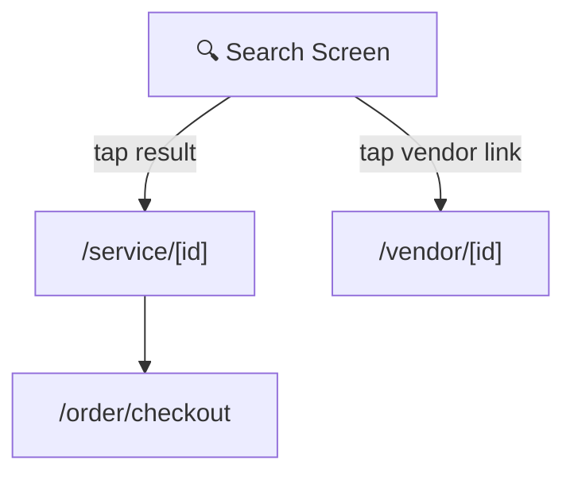

# Screen: Tourist Search (Tìm kiếm)

**App:** Tourist (Mobile)
**File:** `apps/mobile/app/(tabs)/search.tsx`
**Phase:** 2 (Discovery)
**Status:** Implemented ✅

---

## 1. Tổng quan

**Mục đích:** Tìm kiếm và lọc dịch vụ/vendor. Hỗ trợ keyword search, filter theo category và price range. Kết quả hiển thị dạng grid.

**Ai dùng:** Tourist đã đăng nhập (accessible qua tab, nhưng không yêu cầu login riêng cho screen này)

**Khi nào truy cập:** Tab thứ 2 trong bottom tab navigation.

**Route chain:**
```
/(app)/(tabs)/search.tsx  ← THIS SCREEN
  → /app/service/[id].tsx
  → /app/vendor/[id].tsx
```

---

## 2. Wireframe

```
┌──────────────────────────────────────┐
│  HEADER                               │
│  "Tìm kiếm"                          │
│  ┌────────────────────────┐ ┌──────┐ │
│  │ 🔍 Tìm dịch vụ...   │ │ Tìm  │ │
│  └────────────────────────┘ └──────┘ │
├──────────────────────────────────────┤
│  CATEGORIES (horizontal chips)        │
│  [🍜] [🏨] [💆] [🛺] [🎠] [🛍️]    │
│                                        │
│  PRICE RANGE (horizontal chips)       │
│  [Tất cả] [Dưới 100K] [100K-300K]... │
│                                        │
│  ── NOT YET SEARCHED ──               │
│                                        │
│         🔍                            │
│   Khám phá Sầm Sơn                    │
│   Tìm nhà hàng, khách sạn...         │
│                                        │
│  ── AFTER SEARCH (no results) ──      │
│                                        │
│         🏝️                            │
│   Không tìm thấy                     │
│   Thử từ khóa hoặc bộ lọc khác.      │
│                                        │
│  ── AFTER SEARCH (results) ──         │
│                                        │
│  20 kết quả                          │
│                                        │
│  ┌──────────────┐ ┌──────────────┐   │
│  │ [image]     │ │ [image]     │   │
│  │ Service A   │ │ Service B   │   │
│  │ Vendor name │ │ Vendor name │   │
│  │ 150.000₫ ★4.5│ │ 200.000₫  │   │
│  └──────────────┘ └──────────────┘   │
│  ┌──────────────┐ ┌──────────────┐   │
│  │ ...          │ │ ...          │   │
│  └──────────────┘ └──────────────┘   │
│                                        │
├──────────────────────────────────────┤
│  TAB BAR                              │
│  [🏠] [🔍 Tìm kiếm] [🎫] [👤]      │
└──────────────────────────────────────┘
```

**Breakpoints:** Mobile-first (375px), max 428px.

---

## 3. Navigation Flow



**Entry points:**
- Tab bar → `/search` tab (always accessible)

**Exit points:**
- Tap service card → `/service/[id]`
- Tap vendor name/link on card → `/vendor/[id]`
- Tab bar → switch context

---

## 4. Design Tokens

### Colors

| Token | Hex | Usage |
|-------|-----|-------|
| `primary` | `#005E97` | Search button bg |
| `primaryContainer` | `#0077B6` | Active price chip bg |
| `surface` | `#F4F7FB` | Screen background |
| `surfaceContainerHighest` | `#D6DDEA` | Search input bg |
| `surfaceContainer` | `#E6EBF4` | Inactive price chip bg |
| `onSurface` | `#161B2E` | Title, input text |
| `onSurfaceVariant` | `#3B4460` | Inactive chip label |
| `outline` | `#6B7694` | Result count text |
| `white` | `#FFFFFF` | Search button text, active chip label |

### Typography

| Style | Font | Size | Weight | Usage |
|-------|------|------|--------|-------|
| `headlineMd` | Plus Jakarta Sans | 28px | 600 | Screen title |
| `titleMd` | Be Vietnam Pro | 16px | 600 | Empty state title |
| `bodyMd` | Be Vietnam Pro | 14px | 400 | Empty state body |
| `bodySm` | Be Vietnam Pro | 12px | 400 | Result count |
| `labelMd` | Be Vietnam Pro | 12px | 500 | Chip label |
| `labelSm` | Be Vietnam Pro | 11px | 500 | Vendor name |
| Input placeholder | — | 15px | 400 | Search input |

---

## 5. Component Inventory

### `SearchScreen` (`(tabs)/search.tsx`)

**Props:** none (screen component)
**State:**
- `keyword: string` — search text input
- `category: string | null` — active category filter (slug)
- `priceIdx: number` — selected price range index
- `hasSearched: boolean` — whether user has triggered a search

**Filters:**
| Filter | Type | Options | Default |
|--------|------|---------|---------|
| Category | Chip (multi-select toggle) | 6 categories | `null` (all) |
| Price range | Chip (single-select) | Tất cả / Dưới 100K / 100K–300K / 300K–500K / Trên 500K | Index 0 (Tất cả) |
| Sort | ❌ Not in UI | — | Relevance (API default) |
| Rating filter | ❌ Not in UI | — | Not implemented |
| Vendors results | ❌ Not in UI | — | Services only |

**Behavior:**
- Search triggered by: `onSubmitEditing` (keyboard submit) OR tap "Tìm" button
- `hasSearched = false` initially → shows empty state (not loading)
- After search: shows results or empty/no-results state
- Category: toggle (tap active → deselects to `null`)
- Price: single-select (tap different → changes, no deselect)

**Note:** Price range filter chip exists in UI but `priceIdx` state is not yet wired to API call (`servicesApi.list()` does not receive price params).

### `ServiceCard` (`src/components/service-card.tsx`)

Reused from Home screen. Renders in single-column list (not 2-column grid here).

### `CategoryChip` (`src/components/category-chip.tsx`)

Reused from Home screen.

### Search Input

- `TextInput` with 🔍 icon prefix
- `placeholder: "Tìm dịch vụ, cửa hàng..."`
- `onSubmitEditing` + "Tìm" button → triggers `handleSearch()`
- `returnKeyType: "search"`

---

## 6. API Integration

**Endpoint:** `GET /services`
**Query key:** `['search', keyword, category, priceIdx]`
**Params:** `{ q?: string, category?: string, page: 1, limit: 20 }`
**Client:** TanStack Query v5 (`enabled: hasSearched`)

**Note:** `priceIdx` state exists but is NOT passed to API call. Price filtering is UI-only (visual only, no backend filter). Sort by rating/price not implemented in API.

---

## 7. Gaps vs. Spec

| Spec Requirement | Implemented? | Notes |
|-----------------|-------------|-------|
| Keyword search | ✅ | Via TextInput + onSubmit |
| Category filter | ✅ | 6 chips, toggle |
| Price range filter | ⚠️ | UI exists, NOT wired to API |
| Rating filter | ❌ | Not in UI |
| Results: services | ✅ | Via `servicesApi.list()` |
| Results: vendors | ❌ | Only services shown |
| Sort: relevance | ✅ | API default |
| Sort: price | ❌ | Not in UI, not in API |
| Sort: rating | ❌ | Not in UI, not in API |

---

## 8. Implementation Log

| Date | Change |
|------|--------|
| 2026-04-09 | Screen layout doc created |
