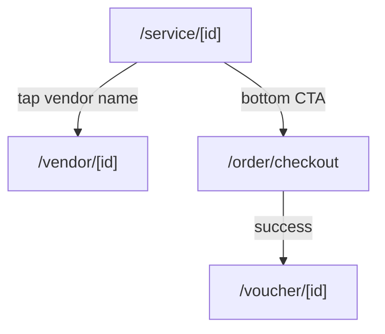

# Screen: Tourist Service Detail

**App:** Tourist (Mobile)
**File:** `apps/mobile/app/service/[id].tsx`
**Phase:** 2 (Discovery)
**Status:** Implemented ✅

---

## 1. Tổng quan

**Mục đích:** Chi tiết dịch vụ — hình ảnh, mô tả, giá, đánh giá. Cho phép chọn số lượng và thêm vào đơn hàng.

**Ai dùng:** Tourist đã đăng nhập

**Khi nào truy cập:** Từ Home (tap service card) hoặc Search (tap service card).

**Route chain:**
```
/app/service/[id].tsx  ← THIS SCREEN
  → /app/vendor/[id].tsx     (tap vendor name)
  → /app/order/checkout.tsx   (bottom CTA)
```

---

## 2. Wireframe

```
┌──────────────────────────────────────┐
│  IMAGE CAROUSEL (340×240 per image)   │
│  [←][img1][img2][img3][→]            │
│  • ○ ○ ●  (pagination dots)         │
├──────────────────────────────────────┤
│  INFO CARD (white, full width)        │
│  [CATEGORY chip]                     │
│  Tên dịch vụ dài (headlineMd)       │
│  🏪 Tên vendor  → tap → vendor detail │
│  ★ 4.5 (4.5 đánh giá)              │
│                                      │
│  💰 Giá gốc (strikethrough)         │
│  150.000₫                           │
│  [-XX%] Giá giảm  100.000₫ (red)  │
│                                      │
│  ⏱ 60 phút  (if duration exists)    │
│                                      │
│  ── Mô tả ──                        │
│  Description text here...             │
│                                      │
│  ── Đánh giá ──                     │
│  [🟢A] ★★★★★  09/04/2026          │
│  "Comment text..."                   │
├──────────────────────────────────────┤
│  BOTTOM BAR (sticky)                 │
│  [-][1][+]   [Thêm vào đơn (100K)] │
└──────────────────────────────────────┘
```

---

## 3. Navigation Flow



---

## 4. Design Tokens

### Colors

| Token | Hex | Usage |
|-------|-----|-------|
| `primary` | `#005E97` | CTA button, price, rating star |
| `primaryFixed` | `#90E0EF` | Category chip bg |
| `surface` | `#F4F7FB` | Screen background |
| `surfaceContainerLowest` | `#FFFFFF` | Info card, bottom bar |
| `surfaceContainerHigh` | `#DEE4EF` | Quantity button bg |
| `tertiaryContainer` | `#5856D6` | Discount badge bg |
| `error` | `#BA1A1A` | Discounted price text |
| `secondary` | `#3A5A8C` | Vendor name text |
| `outline` | `#6B7694` | Strikethrough price, date |
| `outlineVariant` | `rgba(181,190,212,0.15)` | Divider |
| `white` | `#FFFFFF` | Badge text, CTA text |

### Typography

| Style | Font | Size | Weight | Usage |
|-------|------|------|--------|-------|
| `headlineMd` | Plus Jakarta Sans | 28px | 600 | Service name, price |
| `titleLg` | Be Vietnam Pro | 22px | 600 | Section heading |
| `titleMd` | Be Vietnam Pro | 16px | 600 | Quantity, avatar text |
| `titleSm` | Be Vietnam Pro | 14px | 500 | Rating text |
| `bodyMd` | Be Vietnam Pro | 14px | 400 | Description, vendor name |
| `bodySm` | Be Vietnam Pro | 12px | 400 | Date, review count |
| `labelMd` | Be Vietnam Pro | 12px | 500 | Category chip |

---

## 5. Component Inventory

### `ServiceDetailScreen` (`service/[id].tsx`)

**Props:** none (params from `useLocalSearchParams`)
**Params:** `id: string` — service ID

**State:**
- `qty: number` — quantity selector (1–10, default 1)
- `selectedImg: number` — active carousel image index
- `service: ServiceDetail | undefined` — from API

**Image Carousel:**
- Horizontal `ScrollView` with `pagingEnabled`
- Each image: 340×240px
- Pagination dots: 6px default, 18px wide when active
- Only renders if `images.length > 1`

**Rating display:**
- ★ star (14px, amber `#F59E0B`)
- Rating score: `service.rating.toFixed(1)`
- Review count: `(N đánh giá)` if `review_count != null`

**Discount calculation:**
```typescript
hasDiscount = discount_price != null && discount_price < original_price
discountPct = Math.round(Number(discount_percent))
```

**Bottom CTA:**
- Quantity stepper: `[−][qty][+]` buttons, min 1, max 10
- CTA text: `Thêm vào đơn (formattedPrice × qty)`
- On press: `addItem(service, qty)` → navigate to `/order/checkout`

### `ReviewItemComponent` (`src/components/review-item.tsx`)

**Props:**
```typescript
interface Props {
  review: ReviewItem
  // { id, rating, comment?, user_name?, created_at?, vendor_id?, service_id? }
}
```

**Layout:** avatar (initials circle) + name + star row + date + optional comment

### Order Store (`stores/order-store.ts`)

```typescript
interface CartItem { service: ServiceItem; quantity: number }
interface OrderState {
  items: CartItem[]
  addItem(service, qty?)   // increment if exists, else push
  removeItem(serviceId)
  updateQuantity(serviceId, qty)  // remove if qty <= 0
  clear()
  total()  // sum of (discount_price ?? original_price) × qty
}
```

**Note:** Cart is persisted in-memory only (Zustand, not AsyncStorage). Survives navigation but not app restart.

---

## 6. API Integration

**Endpoint:** `GET /services/:id`
**Query key:** `['service', id]`
**Response:**
```typescript
{
  service: ServiceDetail   // extends ServiceItem + { options?, vendor?, reviews? }
}

interface ServiceDetail extends ServiceItem {
  options?: Record<string, unknown>
  vendor?: VendorCard
  reviews?: ReviewItem[]
}
```

---

## 7. Gaps

| Issue | Notes |
|-------|-------|
| Image carousel width | Hardcoded 340px — not responsive to screen width |
| Cart not persisted | Zustand in-memory only — lost on app restart |
| Vendor link | Only visible if `vendor_name` exists |
| No "add multiple service options" | Service options/variants not modeled |
| Reviews section header | "Mô tả" + "Đánh giá" rendered without section heading wrapper |
| Back navigation | No explicit back button — relies on native gesture |

---

## 8. Implementation Log

| Date | Change |
|------|--------|
| 2026-04-09 | Screen layout doc created |
