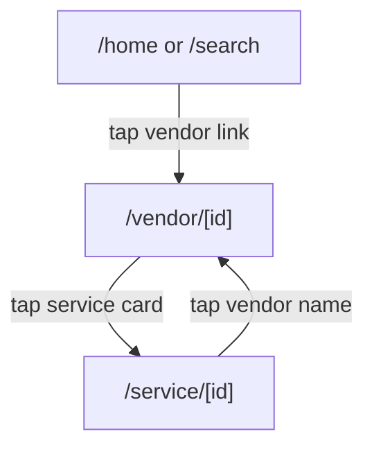

# Screen: Tourist Vendor Detail

**App:** Tourist (Mobile)
**File:** `apps/mobile/app/vendor/[id].tsx`
**Phase:** 2 (Discovery)
**Status:** Implemented ✅

---

## 1. Tổng quan

**Mục đích:** Hồ sơ vendor — hình ảnh, mô tả, địa chỉ, đánh giá, và danh sách tất cả dịch vụ của vendor.

**Ai dùng:** Tourist

**Entry point:** Từ Home (vendor link) hoặc Service Detail (vendor name tap).

**Route chain:**
```
/app/vendor/[id].tsx  ← THIS SCREEN
  → /app/service/[id].tsx  (tap service card — ⚠️ not wired)
```

---

## 2. Wireframe

```
┌──────────────────────────────────────┐
│  HERO IMAGE (220px, full width)       │
│  [vendor image or 🏪 placeholder]       │
│  ═══════════════════════════════  ← gradient overlay
│                                        │
│  INFO CARD (borderRadius 24 top)       │
│  Tên vendor (headlineMd)              │
│  📍 Địa chỉ cụ thể                    │
│                                        │
│  ★ 4.5 (120 đánh giá)  [CATEGORY]  │
│                                        │
│  Mô tả vendor...                      │
│                                        │
│  ── Dịch vụ (N) ──                  │
│                                        │
│  [service card → ⚠️ onPress = {} ] │
│  [service card → ⚠️ onPress = {} ] │
│  [service card → ⚠️ onPress = {} ] │
└──────────────────────────────────────┘
```

---

## 3. Navigation Flow



---

## 4. Design Tokens

### Colors

| Token | Hex | Usage |
|-------|-----|-------|
| `primary` | `#005E97` | Rating text |
| `primaryFixed` | `#90E0EF` | — |
| `secondaryContainer` | `#B8D4F0` | Category chip bg |
| `surface` | `#F4F7FB` | Screen background |
| `surfaceContainerLow` | `#EDF1F4` | Hero placeholder |
| `surfaceContainerLowest` | `#FFFFFF` | Info card |
| `onSecondaryContainer` | `#1E3A5F` | Category chip text |
| `onSurface` | `#161B2E` | Primary text |
| `onSurfaceVariant` | `#3B4460` | Address, description |
| `outline` | `#6B7694` | Review count |

### Typography

| Style | Font | Size | Weight | Usage |
|-------|------|------|--------|-------|
| `headlineMd` | Plus Jakarta Sans | 28px | 600 | Vendor name |
| `titleLg` | Be Vietnam Pro | 22px | 600 | Section heading |
| `titleMd` | Be Vietnam Pro | 16px | 600 | — |
| `titleSm` | Be Vietnam Pro | 14px | 500 | Rating text |
| `bodyMd` | Be Vietnam Pro | 14px | 400 | Address, description |
| `bodySm` | Be Vietnam Pro | 12px | 400 | Review count |
| `labelMd` | Be Vietnam Pro | 12px | 500 | Category chip |

---

## 5. Component Inventory

### `VendorDetailScreen` (`vendor/[id].tsx`)

**Params:** `id: string`
**Query key:** `['vendor', id]`

**Layout:** `FlatList` — header = vendor info, items = services list

**Header sections:**
1. Hero image (220px, full width) + gradient overlay
2. Info card (white, `borderTopRadius: 24`, `marginTop: -24`):
   - Vendor name
   - Address (📍 prefix, if exists)
   - Rating row: ★ score + review count + category chip
   - Description (if exists)
3. Services section title (if `services.length > 0`)

**List items:** `ServiceCard` components (reused from Home/Search)

### `ServiceCard` (shared component)

**onPress on this screen:** `onPress={() => {}}` — ⚠️ **empty function, no navigation**

---

## 6. API Integration

**Endpoint:** `GET /vendors/:slug`
**Query key:** `['vendor', id]`
**Response:**
```typescript
{
  vendor: VendorDetail
  services: ServiceItem[]
}

interface VendorDetail extends VendorCard {
  services?: ServiceItem[]
  reviews?: ReviewItem[]
}
```

**Note:** Route uses `id` param but API endpoint uses `:slug`. Ensure `vendorsApi.detail()` handles both or converts.

---

## 7. Gaps

| Issue | Severity | Notes |
|-------|----------|-------|
| Service card tap not wired | 🔴 Broken | `onPress={() => {}}` — tap does nothing. Need: `router.push('/service/${item.id}')` |
| No back button | ⚠️ UX | Relies on native back gesture |
| No business hours | ⚠️ Missing | `business_hours` exists in type but not rendered |
| No contact/phone | ⚠️ Missing | No tap-to-call or contact info |
| No reviews tab | ⚠️ Missing | Reviews exist in type but not shown on this screen |
| No CTA (book now) | ⚠️ UX | No persistent "Book" button at bottom |
| No gallery/images | ⚠️ UX | Only single hero image shown |

---

## 8. Implementation Log

| Date | Change |
|------|--------|
| 2026-04-09 | Screen layout doc created |
