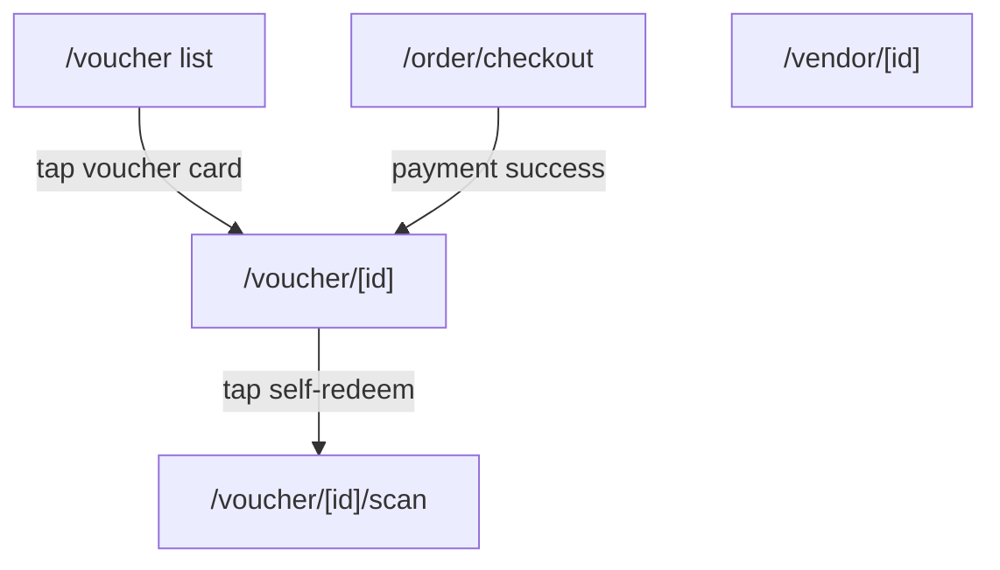

# Screen: Tourist Voucher Detail

**App:** Tourist (Mobile)
**Files:**
- Detail: `apps/mobile/app/voucher/[id].tsx`
- QR Display: `apps/mobile/src/components/qr-display.tsx`
**Phase:** 3 (Orders, Vouchers & QR)
**Status:** Implemented ✅

---

## 1. Tổng quan

**Mục đích:** Chi tiết voucher — hiển thị QR code để vendor quét, thông tin dịch vụ, và các hành động (self-redeem, cancel).

**Ai dùng:** Tourist đã mua voucher

**Entry point:** Từ Vouchers list (tap voucher card) hoặc từ Checkout (sau khi thanh toán thành công).

**Route chain:**
```
/app/voucher/[id].tsx  ← THIS SCREEN
  → /app/voucher/[id]/scan.tsx  (self-redeem)
```

---

## 2. Wireframe

```
┌──────────────────────────────────────┐
│                                          │
│        [STATUS BADGE: Đã thanh toán]    │
│                                          │
│  ┌──────────────────────────────────┐  │
│  │           QR CODE                 │  │
│  │      ┌─────────────┐            │  │
│  │      │  ┌───────┐  │            │  │
│  │      │  │ QR SVG │  │            │  │
│  │      │  └───────┘  │            │  │
│  │      └─────────────┘            │  │
│  │       ABC12345                  │  │
│  │  "Xuất trình mã QR cho nhân viên"│  │
│  └──────────────────────────────────┘  │
│                                          │
│  ┌──────────────────────────────────┐  │
│  │ Dịch vụ         Tên dịch vụ     │  │
│  │ ─────────────────────────────────── │
│  │ Cửa hàng       Tên vendor        │  │
│  │ ─────────────────────────────────── │
│  │ Số lượng       1                  │  │
│  │ ─────────────────────────────────── │
│  │ Tổng tiền      150.000₫          │  │
│  │ ─────────────────────────────────── │
│  │ Ngày mua       09/04/2026        │  │
│  └──────────────────────────────────┘  │
│                                          │
│  ┌──────────────────────────────────┐  │
│  │    📷 Tự đổi voucher            │  │  ← shown if paid
│  └──────────────────────────────────┘  │
│                                          │
│  [ Hủy voucher ]                        │  ← shown if created
└──────────────────────────────────────┘
```

---

## 3. Navigation Flow



---

## 4. Voucher QR Flow

```
QR Token = voucher.qr_token ?? voucher.qr_code ?? voucher.id

Tourist presents QR
        ↓
Vendor scans with their app
        ↓
API: POST /vouchers/redeem { qr_token, vendor_id }
        ↓
voucher.status = 'redeemed'
```

**QR Display:** renders `react-native-qrcode-svg`. Falls back to text code if SVG unavailable.

---

## 5. Action Buttons

| Condition | Button | Style |
|-----------|--------|-------|
| `status === 'paid'` | 📷 Tự đổi voucher | Primary (`primary` bg, white text) |
| `status === 'created'` | Hủy voucher | Error tint (`rgba(error, 0.08)` bg, error text) |
| Other statuses | No action button | — |

---

## 6. Status Labels

| Status | Label |
|--------|-------|
| `created` | Chờ thanh toán |
| `paid` | Đã thanh toán |
| `redeemed` | Đã đổi |
| `completed` | Hoàn thành |
| `refunded` | Đã hoàn tiền |
| `expired` | Hết hạn |
| `cancelled` | Đã hủy |

---

## 7. Component Inventory

### `VoucherDetailScreen` (`voucher/[id].tsx`)

**Params:** `id: string`
**Query key:** `['voucher', id]`

**Sections:**
1. Status badge — centered pill, `primaryFixed` bg
2. QR section — white card, centered QR SVG + code + hint text
3. Info card — rows: service, vendor, quantity, total, date (conditional)
4. Actions — self-redeem + cancel (conditional)

### `QRDisplay` (`src/components/qr-display.tsx`)

**Props:**
```typescript
interface Props {
  qrData: string       // qr_token or qr_code or id
  size?: number         // default 200
  voucherCode?: string // display code, shown below QR
}
```

**Rendering:**
- Primary: `react-native-qrcode-svg` SVG (200×200px white bg)
- Fallback: gray box with "QR không khả dụng" + truncated data text
- Lazy require to avoid crash if module missing

---

## 8. API Integration

**Endpoint:** `GET /vouchers/:id`
**Query key:** `['voucher', id]`
**Response:**
```typescript
{
  voucher: VoucherDetail
  // extends VoucherItem + { qr_url?, qr_code?, redeemed_at?, completed_at?, cancel_reason? }
}
```

---

## 9. Gaps

| Issue | Notes |
|-------|-------|
| Cancel not wired | UI button exists (`canCancel`) but `onPress` is empty — no API call |
| Vendor address/location | Not shown in info card — only vendor name |
| QR refresh | No mechanism to refresh/regenerate QR token |
| Voucher expiry date | Not displayed — unclear when voucher expires |
| Share voucher | No share button |
| Deep link to voucher | Not configured for external sharing |

---

## 10. Implementation Log

| Date | Change |
|------|--------|
| 2026-04-09 | Screen layout doc created |
