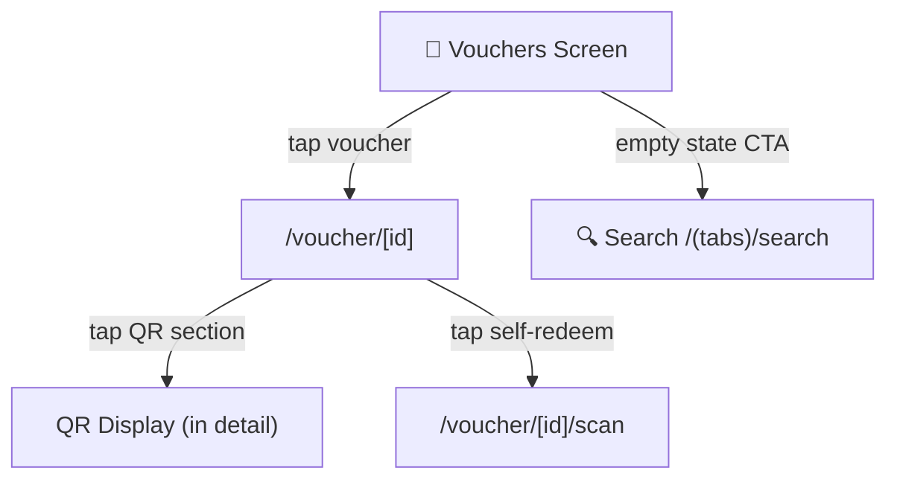

# Screen: Tourist Vouchers (Voucher của tôi)

**App:** Tourist (Mobile)
**File:** `apps/mobile/app/(tabs)/vouchers.tsx`
**Phase:** 3 (Orders, Vouchers & QR)
**Status:** Implemented ✅

---

## 1. Tổng quan

**Mục đích:** Danh sách voucher đã mua của tourist, lọc theo trạng thái. Mỗi voucher hiển thị trạng thái, số tiền, ngày mua. Tap → chi tiết voucher + QR code.

**Ai dùng:** Tourist đã đăng nhập

**Khi nào truy cập:** Tab thứ 3 trong bottom tab navigation.

**Route chain:**
```
/(app)/(tabs)/vouchers.tsx  ← THIS SCREEN
  → /app/voucher/[id].tsx
  → /app/voucher/[id]/scan.tsx  (self-redeem)
```

---

## 2. Wireframe

```
┌──────────────────────────────────────┐
│  HEADER                               │
│  "Voucher của tôi"                    │
│  "Xuất trình QR khi sử dụng dịch vụ"│
├──────────────────────────────────────┤
│  STATUS TABS (horizontal scroll)      │
│  [Tất cả] [Chờ TT] [Đã TT] [Đã SD] [Hoàn thành]
│                                        │
│  ── EMPTY STATE ──                   │
│         🎫                            │
│   Chưa có voucher                     │
│   Mua dịch vụ để nhận voucher...     │
│   ┌─────────────────────────────┐    │
│   │  Khám phá dịch vụ           │    │
│   └─────────────────────────────┘    │
│                                        │
│  ── HAS ITEMS ──                     │
│                                        │
│  ┌─────────────────────────────────┐ │
│  │ [🎫] Tên dịch vụ      [STATUS] │ │
│  │        Tên vendor              │ │
│  │ ─────────────────────────────  │ │
│  │ 150.000₫          09/04/2026  │ │
│  └─────────────────────────────────┘ │
│  ┌─────────────────────────────────┐ │
│  │ [🎫] Tên dịch vụ      [STATUS] │ │
│  │ ...                             │ │
│  └─────────────────────────────────┘ │
│                                        │
├──────────────────────────────────────┤
│  TAB BAR                              │
│  [🏠] [🔍] [🎫 Voucher] [👤]      │
└──────────────────────────────────────┘
```

---

## 3. Navigation Flow



---

## 4. Design Tokens

### Colors

| Token | Hex | Usage |
|-------|-----|-------|
| `primary` | `#005E97` | Amount text, CTA button |
| `primaryContainer` | `#0077B6` | Active tab bg |
| `primaryFixed` | `#90E0EF` | Voucher icon bg |
| `surface` | `#F4F7FB` | Screen bg |
| `surfaceContainerLowest` | `#FFFFFF` | Card bg |
| `surfaceContainer` | `#E6EBF4` | Inactive tab bg |
| `onSurface` | `#161B2E` | Primary text |
| `onSurfaceVariant` | `#3B4460` | Secondary text, inactive tab label |
| `outlineVariant` | `rgba(181,190,212,0.15)` | Card footer divider |
| `white` | `#FFFFFF` | Active tab label |

**Status badge colors:**

| Status | Bg | Text |
|--------|-----|------|
| `created` | `#FEF9C3` | `#854D0E` |
| `paid` | `#B8D4F0` | `#1E3A5F` |
| `redeemed` | `#90E0EF` | `#005E97` |
| `completed` | `#D1FAE5` | `#065F46` |
| `settled` | `#D1FAE5` | `#065F46` |
| `refunded` | `#FEE2E2` | `#991B1B` |
| `expired` | `#DEE4EF` | `#3B4460` |
| `cancelled` | `#DEE4EF` | `#3B4460` |

### Typography

| Style | Font | Size | Weight | Usage |
|-------|------|------|--------|-------|
| `headlineMd` | Plus Jakarta Sans | 28px | 600 | Screen title |
| `titleMd` | Be Vietnam Pro | 16px | 600 | Service name |
| `bodyMd` | Be Vietnam Pro | 14px | 400 | Subtitle, empty state body |
| `bodySm` | Be Vietnam Pro | 12px | 400 | Vendor name, date |
| `labelMd` | Be Vietnam Pro | 12px | 500 | Tab label |

---

## 5. Component Inventory

### `VouchersScreen` (`(tabs)/vouchers.tsx`)

**Props:** none
**State:**
- `activeTab: string` — current status filter tab key
- `items: VoucherItem[]` — fetched voucher list

**Filter tabs:**

| Tab Key | Label | API status param |
|---------|-------|-----------------|
| `all` | Tất cả | `undefined` |
| `created` | Chờ thanh toán | `created` |
| `paid` | Đã thanh toán | `paid` |
| `redeemed` | Đã sử dụng | `redeemed` |
| `completed` | Hoàn thành | `completed` |

**States:**
- Loading: 3 skeleton cards
- Empty: 🎫 emoji + CTA "Khám phá dịch vụ" → `/search`
- Error: `ErrorState` component + retry
- Has items: FlatList of `VoucherCard` components

### `VoucherCard` (`src/components/voucher-card.tsx`)

**Props:**
```typescript
interface Props {
  item: VoucherItem   // { id, status, service_name, vendor_name, total_amount, created_at }
  onPress?: () => void
}
```

**Card structure:**
- Icon 🎫 in `primaryFixed` circle (44×44px, 12px radius)
- Service name (`titleMd`) + vendor name (`bodySm`)
- Status badge (pill, color-coded per status)
- Footer: divider + amount (₫ formatted) + date

**Status → Badge mapping:** see Status badge colors table above.

**Interaction:** `TouchableOpacity` → `onPress` → navigate to `/voucher/${item.id}`

### Empty State

- Emoji: 🎫 (48px)
- Title: "Chưa có voucher"
- Body: "Mua dịch vụ để nhận voucher và xuất trình QR khi sử dụng."
- CTA button: "Khám phá dịch vụ" → primary button → `/search`

---

## 6. API Integration

**Endpoint:** `GET /vouchers`
**Query key:** `['vouchers', statusParam]`
**Params:** `{ status?: string, page: 1 }`
**Response:** `{ items: VoucherItem[], total, page, limit }`

**`VoucherItem` fields used on this screen:**
```typescript
interface VoucherItem {
  id: string
  status: string
  service_name?: string
  vendor_name?: string
  total_amount?: number
  created_at?: string
  qr_token?: string
}
```

---

## 7. Voucher State Machine

```
CREATED → PAID → REDEEMED → COMPLETED → SETTLED
   ↓        ↓        ↓           ↓           ↓
 refunded  refunded  refunded   refunded    (terminal)
   ↓        ↓        ↓           ↓
 expired  expired   expired    expired
   ↓
cancelled (any state, admin only)
```

**Screen's filter tabs cover:** `created`, `paid`, `redeemed`, `completed`
**NOT covered by tabs:** `settled`, `refunded`, `expired`, `cancelled`

---

## 8. Gaps

| Issue | Notes |
|-------|-------|
| `settled` / `refunded` tabs missing | Only 5 tabs shown; settled/refunded vouchers not directly accessible |
| Voucher count per tab | No badge showing count on each tab |
| Pull-to-refresh | Not implemented — user must navigate away and back |
| Sort options | No sort (default = newest first assumed) |

---

## 9. Implementation Log

| Date | Change |
|------|--------|
| 2026-04-09 | Screen layout doc created |
