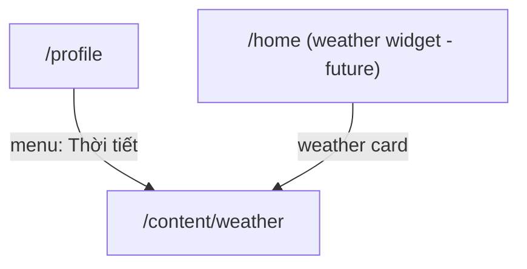

# Screen: Weather (Thời tiết)

**App:** Tourist (Mobile)
**File:** `apps/mobile/app/content/weather.tsx`
**Phase:** 6 (AI, Combos, Content & Reviews)
**Status:** Implemented ✅

---

## 1. Tổng quan

**Mục đích:** Tourist xem thời tiết hiện tại và dự báo 5 ngày tại Sầm Sơn, Thanh Hóa.

**Ai dùng:** Tourist (không cần login)

**Entry point:** Từ Profile (menu "Thời tiết").

**Route chain:**
```
/(tabs)/profile.tsx
  → /content/weather.tsx  ← THIS SCREEN
```

---

## 2. Wireframe

```
┌──────────────────────────────────────┐
│  ┌────────────────────────────────┐  │  ← primaryContainer bg, radius 20
│  │  Sầm Sơn, Thanh Hóa            │  │  ← bodySm, rgba white
│  │                                │  │
│  │   ⛅          28°C             │  │  ← emoji 72px + large temp
│  │            Trời nhiều mây      │  │
│  │                                │  │
│  │   Độ ẩm       Gió             │  │
│  │   85%          12 km/h         │  │  ← stats, white, divider between
│  └────────────────────────────────┘  │
│                                        │
│  ── Dự báo 5 ngày ──                │
│  ┌──────────────────────────────────┐ │
│  │ CN 12/04    ⛅    31°   24°    │ │  ← forecastRow
│  ├──────────────────────────────────┤ │
│  │ T2 13/04    ☀️    33°   25°    │ │
│  ├──────────────────────────────────┤ │
│  │ T3 14/04    🌧️    27°   23°    │ │
│  └──────────────────────────────────┘ │
│                                        │
│  Dữ liệu thời tiết chỉ mang tính    │  ← labelSm, outline, centered
│  chất tham khảo.                     │
└──────────────────────────────────────┘
```

---

## 3. Navigation Flow



---

## 4. Weather Icon Mapping

```typescript
const WEATHER_ICONS: Record<string, string> = {
  sunny:        '☀️',
  cloudy:       '☁️',
  rain:         '🌧️',
  storm:        '⛈️',
  partly_cloudy: '⛅',
  night:        '🌙',
}

function getWeatherIcon(condition: string | undefined): string {
  const c = (condition ?? '').toLowerCase()
  if (c.includes('nắng') || c.includes('sunny')) return '☀️'
  if (c.includes('mưa') || c.includes('rain')) return '🌧️'
  if (c.includes('bão') || c.includes('storm')) return '⛈️'
  if (c.includes('âm') || c.includes('night')) return '🌙'
  if (c.includes('nhiều mây') || c.includes('cloudy')) return '☁️'
  return '⛅'
}
```

---

## 5. API Integration

### Get Weather

**Endpoint:** `GET /content/weather`
**Query key:** `['weather']`
**Response:**
```typescript
{
  weather: {
    temperature?: number
    condition?: string
    humidity?: number
    wind_speed?: number
    forecast?: ForecastDay[]
  }
}

interface ForecastDay {
  day?: string
  condition?: string
  high?: number
  low?: number
}
```

---

## 6. Component Inventory

### `WeatherScreen`

**States:**
1. **Loading** — `isLoading` → ActivityIndicator centered
2. **Error** — `error || !weather` → `<ErrorState onRetry={refetch} />`
3. **Data** — show current card + forecast list

**Sections:**
1. **Current card** — primaryContainer bg, city + main row (icon + temp/condition) + stats row
2. **Forecast section** — sectionTitle + forecastList (map over `forecast`)
3. **Disclaimer** — centered labelSm, outline color

### Current Card

- **City** — `Sầm Sơn, Thanh Hóa`, bodySm, rgba white
- **Main** — flex row: emoji 72px + text group (48px bold temp + bodyMd condition)
- **Stats** — flex row: 2× stat (label + value), divider between

### Forecast Row

- **Container** — surfaceContainerLowest, radius 12, flex row
- **Day label** — `flex: 1`, bodyMd — falls back to formatted date string
- **Icon** — 22px emoji
- **High** — titleMd, minWidth 40, right aligned
- **Low** — bodySm, outline, minWidth 40, right aligned

---

## 7. Design Tokens

| Token | Hex | Usage |
|-------|-----|-------|
| `primaryContainer` | `#0077B6` | currentCard bg |
| `surface` | `#F4F7FB` | Screen container bg |
| `surfaceContainerLowest` | `#FFFFFF` | Forecast row bg |
| `onSurfaceVariant` | `#3B4460` | Body text |
| `outline` | `#6B7694` | Label text, low temp |
| `onSurface` | `#161B2E` | Title text |
| `white` | `#FFFFFF` | All text on primaryContainer card |

### Typography

| Style | Font | Size | Weight | Usage |
|-------|------|------|--------|-------|
| `headlineMd` | Plus Jakarta Sans | 28px | 600 | — |
| `titleLg` | Be Vietnam Pro | 22px | 600 | sectionTitle |
| `titleMd` | Be Vietnam Pro | 16px | 600 | stat value, forecast high |
| `bodyMd` | Be Vietnam Pro | 14px | 400 | condition, forecast day label |
| `bodySm` | Be Vietnam Pro | 12px | 400 | city, stat label, disclaimer |
| `labelSm` | Be Vietnam Pro | 11px | 500 | disclaimer |

---

## 8. Gaps

| Issue | Severity | Notes |
|-------|----------|-------|
| Hardcoded location | 🔴 Broken | City always shows "Sầm Sơn, Thanh Hóa" — no dynamic location |
| No pull-to-refresh | ⚠️ UX | Can't manually refresh weather data |
| No hourly forecast | ⚠️ Missing | Only 5-day, no hourly breakdown |
| No UV index / air quality | ⚠️ Missing | Additional weather metrics not shown |
| No weather alerts | ⚠️ Missing | No storm/rain warnings displayed |
| No caching strategy | ⚠️ UX | Query refetches on every mount — should cache 15-30 min |
| No widget on home | ⚠️ Missing | Weather not accessible from home screen |

---

## 9. Implementation Log

| Date | Change |
|------|--------|
| 2026-04-09 | Screen layout doc created |
