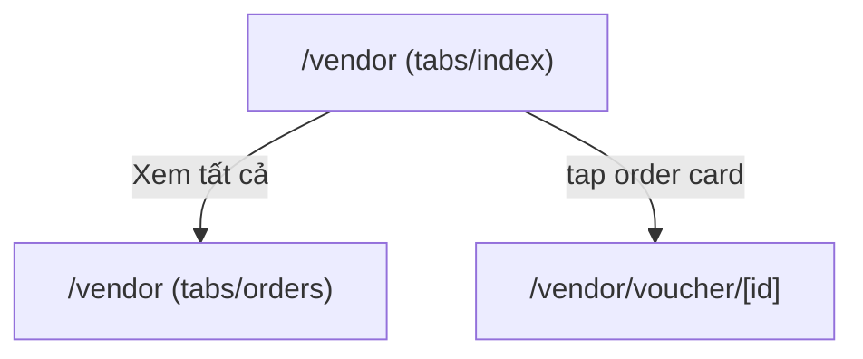

# Screen: Vendor Dashboard

**App:** Vendor (Mobile)
**File:** `apps/vendor/app/(tabs)/index.tsx`
**Phase:** 5 (Settlement, Notifications & Dashboards)
**Status:** Implemented ✅

---

## 1. Tổng quan

**Mục đích:** Vendor xem dashboard tổng quan — greeting, 4 stat cards (đơn hàng hôm nay, doanh thu hôm nay, chờ giải ngân, đã thanh toán), tổng doanh thu, và đơn hàng gần đây.

**Ai dùng:** Vendor đã đăng nhập

**Entry point:** Tab đầu tiên trong bottom tab bar.

**Route chain:**
```
/(tabs)/index.tsx  ← THIS SCREEN
  → /(tabs)/orders.tsx  (Xem tất cả)
  → /voucher/[id].tsx  (tap order card)
```

---

## 2. Wireframe

```
┌──────────────────────────────────────┐
│  ┌──────────────────────────────────┐│  ← primaryContainer bg, rounded bottom
│  │  Chào buổi sáng                 ││
│  │  Tên Cửa Hàng              🏪  ││
│  └──────────────────────────────────┘│
│                                        │
│  ┌────────────┐  ┌────────────┐      │
│  │ 🛒          │  │ 💰          │      │
│  │ Đơn hôm nay│  │ Doanh thu   │      │
│  │    12      │  │ 1.200.000₫ │      │
│  └────────────┘  └────────────┘      │
│                                        │
│  ┌────────────┐  ┌────────────┐      │
│  │ ⏳          │  │ ✅          │      │
│  │ Chờ giải   │  │ Đã thanh    │      │
│  │ ngân        │  │ toán        │      │
│  │  500.000₫  │  │ 2.000.000₫ │      │
│  └────────────┘  └────────────┘      │
│                                        │
│  ┌──────────────────────────────────┐ │
│  │  📊 Tổng doanh thu              │ │
│  │  15.000.000₫                     │ │
│  └──────────────────────────────────┘ │
│                                        │
│  ── Đơn hàng gần đây ──             │
│  [Xem tất cả ›]                     │
│  ┌──────────────────────────────────┐ │
│  │ 🛒 Dịch vụ A    Khách hàng A   │ │
│  │ paid          150.000₫         │ │
│  └──────────────────────────────────┘ │
│  ┌──────────────────────────────────┐ │
│  │ ...                              │ │
│  └──────────────────────────────────┘ │
└──────────────────────────────────────┘
```

---

## 3. Navigation Flow



---

## 4. Stats Cards

| Card | Icon | Data path | Accent Color |
|------|------|-----------|-------------|
| Đơn hàng hôm nay | 🛒 | `today.orders` | `#005E97` |
| Doanh thu hôm nay | 💰 | `today.revenue` | `#2E7D32` |
| Chờ giải ngân | ⏳ | `settlement.pending` | `#E65100` |
| Đã thanh toán | ✅ | `settlement.settled` | `#2E7D32` |

---

## 5. Component Inventory

### `DashboardScreen`

**Data:** `dashboardApi.vendor()` → `DashData`

**Sections:**
1. **Header** — primaryContainer bg, greeting by time-of-day + vendor name + badge
2. **Stats grid** — 2×2 RevenueCard grid
3. **Total revenue** — primary bg card, large value
4. **Recent orders section** — header with "Xem tất cả" link + up to 5 OrderCard

### `RevenueCard` (shared component)

**Props:** `label`, `value`, `icon`, `accentColor`

### `OrderCard` (shared component)

**Props:** `voucher`, `onPress`
**Navigation:** `router.push('/voucher/${item.id}')`

---

## 6. API Integration

### Vendor Dashboard

**Endpoint:** `GET /vendors/dashboard` (via `dashboardApi.vendor()`)
**Response:**
```typescript
{
  today: { orders?: number; revenue?: number }
  total: { revenue?: number }
  settlement: { pending?: number; settled?: number }
  recentOrders: Voucher[]
}
```

**Format:** All monetary values formatted with `toLocaleString('vi-VN') + '₫'`

---

## 7. Design Tokens

| Token | Hex | Usage |
|-------|-----|-------|
| `primaryContainer` | `#0077B6` | Header bg |
| `primary` | `#005E97` | Orders card accent, view all, total card bg |
| `surface` | `#F4F7FB` | Screen bg |
| `surfaceContainerLowest` | `#FFFFFF` | Card bg |
| `onSurface` | `#161B2E` | Text |
| `onSurfaceVariant` | `#3B4460` | Secondary text |

### Typography

| Style | Size | Weight | Usage |
|-------|------|--------|-------|
| 28 | 700 | Vendor name |
| 14 | 500 | Greeting |
| 18 | 700 | Section title |
| 22 | 700 | Total value |

---

## 8. Gaps

| Issue | Severity | Notes |
|-------|----------|-------|
| No date range selector | 🔴 UX | Can't view stats for different periods |
| "Xem tất cả" → orders with filter | ⚠️ UX | "Xem tất cả" pushes to `/orders` but no filter param passed |
| Settlement info not deep-linked | ⚠️ UX | No link to earnings/settlement detail from dashboard |
| No error banner on partial load | ⚠️ UX | `recentOrders` error shows ErrorState but stats may have loaded |
| No revenue chart | ⚠️ Missing | No visual chart, just raw numbers |
| No notification badge | ⚠️ UX | Tab bar shows no badge for new orders |

---

## 9. Implementation Log

| Date | Change |
|------|--------|
| 2026-04-09 | Screen layout doc created |
