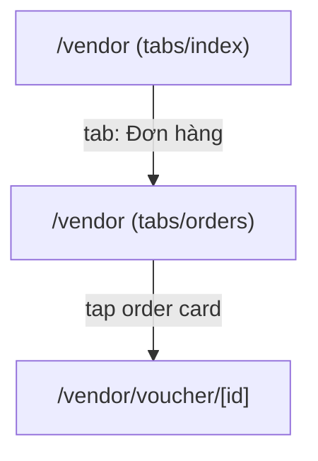

# Screen: Vendor Orders

**App:** Vendor (Mobile)
**File:** `apps/vendor/app/(tabs)/orders.tsx`
**Phase:** 3 (Orders, Vouchers & QR)
**Status:** Implemented ✅

---

## 1. Tổng quan

**Mục đích:** Vendor xem danh sách voucher theo filter status — paid (chờ đổi), redeemed (đã đổi), completed (hoàn thành). Hỗ trợ pull-to-refresh và infinite scroll.

**Ai dùng:** Vendor đã đăng nhập

**Entry point:** Tab "Đơn hàng" trong bottom tab bar.

**Route chain:**
```
/(tabs)/orders.tsx  ← THIS SCREEN
  → /voucher/[id].tsx  (tap order/voucher card)
```

---

## 2. Wireframe

```
┌──────────────────────────────────────┐
│  Đơn hàng                              │  ← header title
│                                        │
│  [Tất cả] [Chờ đổi✓] [Đã đổi] [Hoàn thành] │  ← horizontal scroll tabs
│                                        │
│  ┌──────────────────────────────────┐ │
│  │ 🛒 Dịch vụ Massage Thư Giãn   │ │  ← OrderCard
│  │ Khách hàng: Nguyễn Văn B       │ │
│  │ paid           150.000₫        │ │
│  └──────────────────────────────────┘ │
│  ┌──────────────────────────────────┐ │
│  │ ...                              │ │
│  └──────────────────────────────────┘ │
│                                        │
│  [padding: 24px bottom]              │
└──────────────────────────────────────┘

Empty state:
┌──────────────────────────────────────┐
│              📋                        │
│        Không có đơn hàng               │
└──────────────────────────────────────┘
```

---

## 3. Navigation Flow



---

## 4. Filter Tabs

| Key | Label | API status filter |
|-----|-------|-------------------|
| `''` (empty) | Tất cả | no filter |
| `paid` | Chờ đổi | `paid` |
| `redeemed` | Đã đổi | `redeemed` |
| `completed` | Hoàn thành | `completed,settled` |

**STATUS_LIST_MAP:**
```typescript
const STATUS_LIST_MAP = {
  paid: ['paid'],
  redeemed: ['redeemed'],
  completed: ['completed', 'settled'],
}
```

---

## 5. Data Fetching

### Pagination

- **Limit:** 20 items per page
- **Trigger:** `onEndReached` (threshold: 0.5)
- **Reset:** On filter change, `setPage(1)` + `load(true)`
- **State:** `hasMore` flag, spinner in footer when loading next page

### Pull-to-Refresh

- `RefreshControl` on FlatList
- Triggers `setPage(1)` + `load(true)`

---

## 6. Component Inventory

### `OrdersScreen`

**State:** `filter`, `vouchers`, `loading`, `refreshing`, `error`, `page`, `hasMore`

**Screens (3 states):**
1. **Loading (initial)** — ActivityIndicator centered (vouchers.length === 0)
2. **Error (initial)** — `<ErrorState onRetry={load(true)} />`
3. **Empty** — 📋 emoji + "Không có đơn hàng"
4. **Data** — FlatList with refresh + pagination

**Filter tabs:** Horizontal ScrollView, 4 chips, active = primary bg + white text

### `OrderCard` (shared component)

**onPress:** `router.push('/voucher/${item.id}')`

---

## 7. API Integration

### List Vouchers

**Endpoint:** `GET /vouchers`
**Query params:** `{ status?: string, page?: number, limit?: number }`

**Response:** `{ data: { items: Voucher[] } }` or `{ data: { data: { items: Voucher[] } } }`

**Note:** Response unwrapping has a fallback: tries `res.data.data?.items ?? res.data.data?.data ?? []`

---

## 8. Design Tokens

| Token | Hex | Usage |
|-------|-----|-------|
| `primary` | `#005E97` | Active tab bg, loading indicators |
| `surface` | `#F4F7FB` | Screen bg |
| `surfaceContainerLowest` | `#FFFFFF` | Tab inactive bg, card bg |
| `onSurface` | `#161B2E` | Title, card text |
| `onSurfaceVariant` | `#3B4460` | Tab inactive text |
| `outline` | `#6B7694` | Empty state text |

### Typography

| Style | Size | Weight | Usage |
|-------|------|--------|-------|
| 24 | 700 | Title |
| 13 | 500 | Tab text |
| 15 | — | Empty text |

---

## 9. Gaps

| Issue | Severity | Notes |
|-------|----------|-------|
| No order ID/code search | 🔴 Missing | Can't search by voucher code |
| No date range filter | 🔴 Missing | Can't filter by date |
| No sort options | ⚠️ UX | Defaults to backend order (likely by created_at desc) |
| Tab count badges | ⚠️ UX | No red badge with count per tab (e.g., "Chờ đổi (3)") |
| Completed = completed+settled | ⚠️ UX | "Hoàn thành" tab shows both completed AND settled — may confuse vendors |
| No "scan" quick action on this screen | ⚠️ UX | QR scan is a separate tab — no FAB or shortcut here |
| Duplicate response unwrapping | ⚠️ Bug risk | `res.data.data?.items ?? res.data.data?.data ?? []` suggests inconsistent API response shape |

---

## 10. Implementation Log

| Date | Change |
|------|--------|
| 2026-04-09 | Screen layout doc created |
