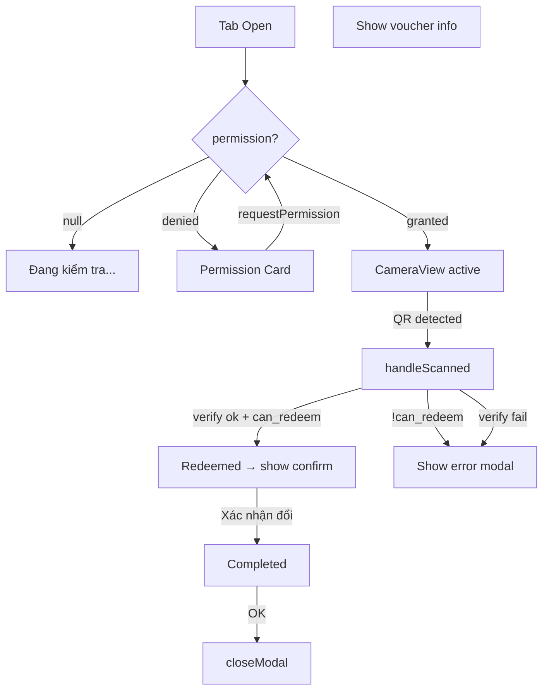

# Screen: Vendor QR Scan (Voucher Redeem)

**App:** Vendor (Mobile)
**Files:**
- Screen: `apps/vendor/app/(tabs)/scan.tsx`
- Components: `apps/vendor/src/components/qr-scanner.tsx`
**Phase:** 3 (Orders, Vouchers & QR)
**Status:** Implemented ✅

---

## 1. Tổng quan

**Mục đích:** Vendor quét QR của tourist để xác minh và đổi voucher (paid → redeemed). Sau khi quét thành công, vendor có thể xác nhận hoàn thành (redeemed → completed).

**Ai dùng:** Vendor đã đăng nhập

**Entry point:** Tab "Quét" (scan) trong bottom tab bar.

**Route chain:**
```
/(tabs)/scan.tsx  ← THIS SCREEN
  → ScanResultModal (bottom sheet)
    → /voucher/[id].tsx (future: after confirm)
```

---

## 2. Wireframe

```
┌──────────────────────────────────────┐
│  ┌──────────────────────────────────┐│
│  │      CAMERA VIEW (full screen)   ││
│  │  ┌────────────────────────────┐ ││
│  │  │ ┌──┐              ┌──┐     │ │││  ← white corner markers
│  │  │ │  │              │  │     │ │││
│  │  │ └──┘              └──┘     │ │││
│  │  │                            │ │││
│  │  │ ┌──┐              ┌──┐     │ │││
│  │  │ │  │              │  │     │ │││
│  │  │ └──┘              └──┘     │ │││
│  │  └────────────────────────────┘ ││
│  │  "Đưa mã QR vào khung hình"   │││
│  └──────────────────────────────────┘│
└──────────────────────────────────────┘

OR (no permission):

┌──────────────────────────────────────┐
│              📷                        │
│  Cần quyền truy cập camera           │
│  S-Loco cần quyền camera để quét    │
│  mã QR trên voucher của khách.      │
│     [ Cho phép truy cập ]           │
└──────────────────────────────────────┘

Result Modal (bottom sheet):

┌──────────────────────────────────────┐
│  ──── (drag handle) ────             │
│                                        │
│       Thông tin Voucher               │
│                                        │
│  Dịch vụ       Dịch vụ A            │
│  Khách hàng    Nguyễn Văn B         │
│  Giá trị       150.000₫             │
│  Trạng thái    [Chờ đổi] ← orange  │
│                                        │
│  [    Xác nhận đổi voucher    ]     │  ← primary, only if paid
│  [          Hủy           ]          │
└──────────────────────────────────────┘

Error Modal:

┌──────────────────────────────────────┐
│  ──── (drag handle) ────             │
│              ❌                        │
│     Voucher không hợp lệ              │
│     Đã được đổi rồi. Không thể đổi. │
│        [    Đóng    ]                 │
└──────────────────────────────────────┘
```

---

## 3. Permission Flow



---

## 4. Scan Flow (2-Step)

### Step 1: Verify (QRSN-04)

**Call:** `voucherApi.verify(token)`
**Purpose:** Validate QR token without redeeming
**On fail:** `setScanError(msg)` → show error modal
**On `!can_redeem`:** Show status-specific error ("Đã được đổi rồi", "Đã hết hạn", etc.)

### Step 2: Redeem

**Call:** `voucherApi.redeem(token)`
**Triggered:** After successful verify + modal opens
**On ok:** `setScannedVoucher(voucher)` → show voucher info modal
**On fail:** `setScanError(msg)` → show error modal

### Step 3: Complete (optional)

**Call:** `voucherApi.complete(voucherId)`
**Triggered:** User taps "Xác nhận đổi voucher" in modal (only if `status === 'paid'`)
**On ok:** Show success Alert → `closeModal()`

---

## 5. Debounce / Re-trigger Guard

```typescript
// 3-second cooldown after scan before scanner re-arms
setTimeout(() => {
  setScanned(false)
  lastScanned.current = null
}, 3000)

// Also: deduplicate same token within same session
if (data === lastScanned.current) return
```

---

## 6. Component Inventory

### `ScanScreen` (`scan.tsx`)

**State:** `modalVisible`, `scannedVoucher`, `scanError`, `loading`, `completing`, `active`

**Children:**
- `<QrScanner>` — camera + overlay
- `<ScanResultModal>` — bottom sheet modal

### `QrScanner` (`qr-scanner.tsx`)

**Props:** `onScanned: (token: string) => void`, `active?: boolean`

**Internal state:** `permission`, `scanned`, `lastScanned`

**3 render states:**
1. **Loading permission** — centered text
2. **Permission denied** — 📷 emoji + description + "Cho phép truy cập" button
3. **Camera active** — CameraView fullscreen + corner overlay + hint text

**Corner markers:** 4 absolute positioned white corners, 28×28px, 3px border, 12px radius

### `ScanResultModal`

**Props:** `visible`, `voucher`, `loading`, `error`, `onConfirm`, `onClose`

**3 states:**
1. **Loading** — "Đang xử lý voucher..."
2. **Error** — ❌ emoji + error title + error message + "Đóng" button
3. **Voucher data** — title + 4 field rows + optional confirm button

**Voucher field rows:** service_name, customer_name, final_amount (formatted), status badge

**Status badge colors:**
- `paid` → `#FFF3E0` bg + `#E65100` text ("Chờ đổi")
- `redeemed` → `#E8F5E9` bg + `#2E7D32` text ("Đã đổi")
- `completed` → `#ECEFF1` bg + `#546E7A` text

**Action buttons:**
- Confirm: primary bg, only shown when `status === 'paid'`
- Cancel/Close: text button

---

## 7. API Integration

### Verify Voucher

**Endpoint:** `POST /vouchers/verify`
**Body:** `{ token: string }` (QR token = signed JWT)
**Response:** `{ voucher: VerifiedVoucher }`

### Redeem Voucher

**Endpoint:** `POST /vouchers/redeem`
**Body:** `{ token: string }`
**Response:** `{ voucher: ScannedVoucher }`

### Complete Voucher

**Endpoint:** `POST /vouchers/:id/complete`
**Body:** (empty)
**Response:** `{ voucher: ScannedVoucher }`

---

## 8. Design Tokens

| Token | Hex | Usage |
|-------|-----|-------|
| `#000` | black | Container bg |
| `#FFFFFF` | white | Scan frame corners, hint text |
| `primary` | `#005E97` | Confirm btn, close btn |
| `primaryContainer` | `#0077B6` | — |
| `surface` | `#F4F7FB` | Modal bg |
| `surfaceContainerLowest` | `#FFFFFF` | Modal sheet bg |
| `error` | `#BA1A1A` | Error title |
| `#E65100` | orange | paid status badge |
| `#2E7D32` | green | redeemed/completed status badge |

---

## 9. Gaps

| Issue | Severity | Notes |
|-------|----------|-------|
| No "book" from results | 🔴 Broken | After completing, no navigation to voucher detail or back to scan |
| QR format assumption | 🔴 Unclear | Token used directly — no JWT parsing/extraction before calling API |
| Modal resets active state | ⚠️ UX | `closeModal()` sets `active = true` but scanner may not re-arm if permission was already granted |
| No "manual code entry" | ⚠️ UX | If camera fails, vendor has no fallback to enter code manually |
| Success alert dismisses modal | ⚠️ UX | Alert + closeModal but no explicit "redeemed" state shown in modal before alert |
| No sound/haptic feedback | ⚠️ UX | No vibration on successful scan |
| No "scan history" | ⚠️ Missing | Can't review recently scanned vouchers |

---

## 10. Implementation Log

| Date | Change |
|------|--------|
| 2026-04-09 | Screen layout doc created |
