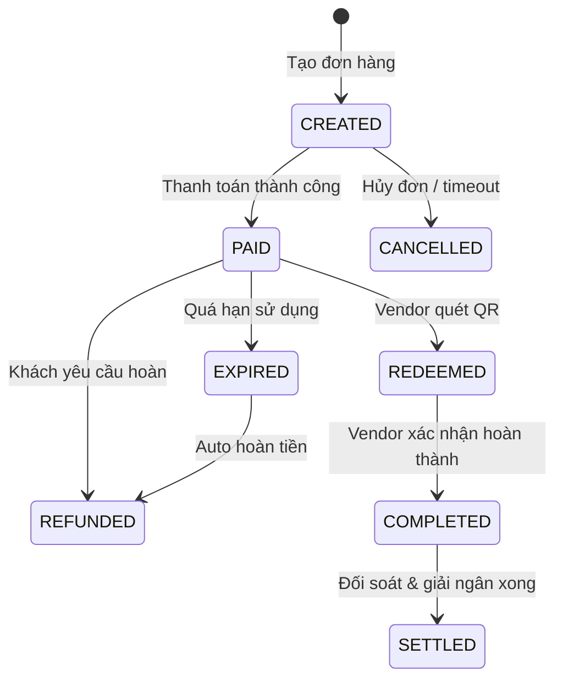

# Database Design – S-Local

> Entity-Relationship, schema conventions, indexing, and partitioning

---

## 1. Design Conventions

| Convention | Chi tiết |
|---|---|
| **Primary Key** | UUID v7 (`id`) — thời gian sắp xếp tự nhiên, phân tán không xung đột |
| **Timestamps** | `created_at`, `updated_at` (trigger auto-update), `deleted_at` (soft delete) |
| **Soft Delete** | Tất cả entity dùng `deleted_at IS NULL` filter mặc định |
| **Naming** | `snake_case` cho table & column |
| **Enums** | PostgreSQL native ENUM type cho trạng thái cố định |
| **JSONB** | Chỉ dùng cho flexible metadata, không cho dữ liệu cần query thường xuyên |
| **Foreign Keys** | Luôn tạo FK constraint, `ON DELETE RESTRICT` mặc định |

---

## 2. Entity-Relationship Diagram

```mermaid
erDiagram
    users {
        uuid id PK
        varchar phone UK
        varchar email
        varchar password_hash
        enum role "tourist | vendor_owner | admin"
        varchar full_name
        varchar avatar_url
        boolean is_verified
        timestamp created_at
        timestamp updated_at
        timestamp deleted_at
    }

    vendors {
        uuid id PK
        uuid owner_id FK
        varchar name
        varchar slug UK
        text description
        varchar phone
        varchar address
        decimal latitude
        decimal longitude
        jsonb business_hours
        varchar logo_url
        varchar cover_url
        enum status "pending | active | suspended | rejected"
        decimal commission_rate "phần trăm hoa hồng"
        enum settlement_type "immediate | periodic"
        int settlement_period_days "mặc định 3"
        decimal rating_avg
        int review_count
        timestamp created_at
        timestamp updated_at
        timestamp deleted_at
    }

    service_categories {
        uuid id PK
        varchar name
        varchar slug UK
        varchar icon_url
        int sort_order
        timestamp created_at
    }

    services {
        uuid id PK
        uuid vendor_id FK
        uuid category_id FK
        varchar name
        text description
        decimal price
        decimal discount_price
        varchar unit "lượt | giờ | ngày | phần"
        int max_quantity "tồn kho / slot"
        jsonb images "array of URLs"
        jsonb options "tùy chọn động"
        boolean is_active
        decimal rating_avg
        int review_count
        timestamp created_at
        timestamp updated_at
        timestamp deleted_at
    }

    combos {
        uuid id PK
        uuid vendor_id FK
        varchar name
        text description
        decimal original_price
        decimal combo_price
        varchar cover_url
        boolean is_active
        timestamp valid_from
        timestamp valid_until
        timestamp created_at
        timestamp updated_at
    }

    combo_items {
        uuid id PK
        uuid combo_id FK
        uuid service_id FK
        int quantity
    }

    orders {
        uuid id PK
        varchar order_number UK "SL-20250101-XXXX"
        uuid customer_id FK
        uuid vendor_id FK
        decimal subtotal
        decimal discount_amount
        decimal total_amount
        enum status "created | paid | partially_redeemed | completed | cancelled | refunded"
        jsonb metadata
        timestamp created_at
        timestamp updated_at
    }

    order_items {
        uuid id PK
        uuid order_id FK
        uuid service_id FK
        uuid combo_id FK "nullable"
        varchar service_name "snapshot lúc đặt"
        decimal unit_price
        int quantity
        decimal total_price
    }

    vouchers {
        uuid id PK
        varchar voucher_code UK "VCH-XXXXX"
        uuid order_id FK
        uuid order_item_id FK
        uuid customer_id FK
        uuid vendor_id FK
        uuid service_id FK
        enum status "created | paid | redeemed | completed | settled | cancelled | expired | refunded"
        varchar qr_token UK "signed token for QR"
        timestamp redeemed_at
        timestamp completed_at
        timestamp expired_at
        timestamp created_at
        timestamp updated_at
    }

    payments {
        uuid id PK
        uuid order_id FK
        varchar transaction_id UK "mã giao dịch cổng"
        varchar idempotency_key UK
        enum gateway "vnpay | momo | sepay"
        enum status "pending | success | failed | refunded"
        decimal amount
        varchar currency "VND"
        jsonb gateway_response
        timestamp paid_at
        timestamp created_at
    }

    refunds {
        uuid id PK
        uuid payment_id FK
        uuid order_id FK
        decimal amount
        varchar reason
        enum status "pending | approved | processed | rejected"
        jsonb gateway_response
        timestamp processed_at
        timestamp created_at
    }

    settlements {
        uuid id PK
        uuid vendor_id FK
        enum status "pending | processing | completed | failed"
        decimal total_amount "tổng doanh thu voucher"
        decimal commission_amount
        decimal vendor_amount "total - commission"
        int voucher_count
        jsonb voucher_ids "danh sách voucher trong batch"
        timestamp period_start
        timestamp period_end
        timestamp completed_at
        timestamp created_at
    }

    reviews {
        uuid id PK
        uuid customer_id FK
        uuid vendor_id FK
        uuid service_id FK
        uuid order_id FK
        int rating "1-5"
        text comment
        jsonb images
        boolean is_visible
        timestamp created_at
        timestamp updated_at
        timestamp deleted_at
    }

    news {
        uuid id PK
        uuid author_id FK
        varchar title
        varchar slug UK
        text content "rich text / HTML"
        varchar cover_url
        enum category "news | event | guide | announcement"
        boolean is_published
        timestamp published_at
        timestamp created_at
        timestamp updated_at
        timestamp deleted_at
    }

    events {
        uuid id PK
        varchar title
        text description
        varchar location
        varchar cover_url
        timestamp start_date
        timestamp end_date
        boolean is_active
        timestamp created_at
        timestamp updated_at
    }

    weather_cache {
        uuid id PK
        date forecast_date
        decimal temp_min
        decimal temp_max
        varchar condition
        jsonb raw_data
        timestamp fetched_at
    }

    ai_itineraries {
        uuid id PK
        uuid customer_id FK
        int duration_days
        decimal budget
        jsonb preferences "sở thích"
        jsonb generated_plan "lịch trình AI tạo"
        enum status "generating | ready | expired"
        timestamp created_at
    }

    itinerary_items {
        uuid id PK
        uuid itinerary_id FK
        uuid service_id FK "nullable — có thể không map được"
        int day_number
        int sort_order
        varchar time_slot "sáng | chiều | tối"
        varchar activity_name
        text notes
    }

    notifications {
        uuid id PK
        uuid user_id FK
        enum type "order | voucher | settlement | system | promo"
        varchar title
        text body
        jsonb data "deep link payload"
        boolean is_read
        timestamp read_at
        timestamp created_at
    }

    %% Relationships
    users ||--o{ vendors : "owns"
    users ||--o{ orders : "places"
    users ||--o{ reviews : "writes"
    users ||--o{ ai_itineraries : "requests"
    users ||--o{ notifications : "receives"
    vendors ||--o{ services : "offers"
    vendors ||--o{ combos : "creates"
    vendors ||--o{ orders : "receives"
    vendors ||--o{ settlements : "earns"
    vendors ||--o{ reviews : "about"
    service_categories ||--o{ services : "contains"
    services ||--o{ combo_items : "included_in"
    services ||--o{ order_items : "ordered_as"
    services ||--o{ vouchers : "for"
    services ||--o{ reviews : "about"
    services ||--o{ itinerary_items : "suggested"
    combos ||--o{ combo_items : "contains"
    orders ||--o{ order_items : "has"
    orders ||--o{ vouchers : "generates"
    orders ||--o{ payments : "paid_by"
    orders ||--o{ refunds : "refunded_by"
    payments ||--o{ refunds : "reversed_by"
    ai_itineraries ||--o{ itinerary_items : "includes"
```



---

## 3. Voucher State Machine

Voucher là entity trung tâm của hệ thống. Lifecycle phức tạp cần quản lý chặt.



**Constraint:** Chỉ cho phép chuyển trạng thái theo hướng mũi tên. Validate bằng DB trigger hoặc application-level guard.

---

## 4. Indexing Strategy

### 4.1. Covering Indexes

```sql
-- Tìm kiếm dịch vụ theo vendor + category + active
CREATE INDEX idx_services_vendor_category 
    ON services (vendor_id, category_id) 
    WHERE deleted_at IS NULL AND is_active = true;

-- Tìm voucher theo customer 
CREATE INDEX idx_vouchers_customer_status 
    ON vouchers (customer_id, status) 
    WHERE status IN ('paid', 'redeemed');

-- Tìm voucher theo vendor (vendor app)
CREATE INDEX idx_vouchers_vendor_status 
    ON vouchers (vendor_id, status, created_at DESC);

-- Tìm đơn hàng theo customer
CREATE INDEX idx_orders_customer 
    ON orders (customer_id, created_at DESC);

-- Tìm settlement theo vendor
CREATE INDEX idx_settlements_vendor 
    ON settlements (vendor_id, status, created_at DESC);

-- Tìm review theo vendor + service
CREATE INDEX idx_reviews_vendor 
    ON reviews (vendor_id, rating, created_at DESC) 
    WHERE deleted_at IS NULL AND is_visible = true;

-- Tìm tin tức published
CREATE INDEX idx_news_published 
    ON news (published_at DESC) 
    WHERE deleted_at IS NULL AND is_published = true;
```

### 4.2. Unique Constraints

```sql
-- Phone number unique (OTP login)
ALTER TABLE users ADD CONSTRAINT uq_users_phone UNIQUE (phone) WHERE deleted_at IS NULL;

-- Voucher code unique globally
ALTER TABLE vouchers ADD CONSTRAINT uq_voucher_code UNIQUE (voucher_code);

-- QR token unique
ALTER TABLE vouchers ADD CONSTRAINT uq_qr_token UNIQUE (qr_token);

-- Order number unique
ALTER TABLE orders ADD CONSTRAINT uq_order_number UNIQUE (order_number);

-- Payment idempotency
ALTER TABLE payments ADD CONSTRAINT uq_idempotency_key UNIQUE (idempotency_key);
```

### 4.3. Geospatial (Phase 2)

```sql
-- PostGIS extension cho tìm vendor gần nhất
CREATE EXTENSION IF NOT EXISTS postgis;

ALTER TABLE vendors ADD COLUMN geom geometry(Point, 4326);

CREATE INDEX idx_vendors_geom ON vendors USING GIST (geom);

-- Query: tìm vendor trong bán kính 5km
-- SELECT * FROM vendors 
-- WHERE ST_DWithin(geom, ST_SetSRID(ST_MakePoint(lng, lat), 4326), 5000);
```

---

## 5. Data Partitioning Strategy

### 5.1. Hot / Cold Separation

| Table | Hot Data | Cold Data | Strategy |
|---|---|---|---|
| `vouchers` | status IN (paid, redeemed) | status IN (settled, cancelled, expired) | Partial index + archive table (quarterly) |
| `payments` | Gần 30 ngày | > 30 ngày | Range partition by `created_at` (monthly) |
| `notifications` | Chưa đọc + 7 ngày gần | > 7 ngày | TTL-based cleanup job |
| `weather_cache` | Hôm nay + 3 ngày tới | Quá khứ | Overwrite daily |

### 5.2. Table Partitioning (payments)

```sql
CREATE TABLE payments (
    id UUID NOT NULL,
    order_id UUID NOT NULL,
    amount DECIMAL(12,2) NOT NULL,
    created_at TIMESTAMP NOT NULL DEFAULT NOW(),
    -- ... other columns
) PARTITION BY RANGE (created_at);

CREATE TABLE payments_2025_q1 PARTITION OF payments
    FOR VALUES FROM ('2025-01-01') TO ('2025-04-01');

CREATE TABLE payments_2025_q2 PARTITION OF payments
    FOR VALUES FROM ('2025-04-01') TO ('2025-07-01');

-- Auto-create future partitions via pg_partman or cron job
```

---

## 6. Audit Trail

Tất cả table quan trọng (orders, vouchers, payments, settlements) cần audit trail.

```sql
CREATE TABLE audit_log (
    id BIGSERIAL PRIMARY KEY,
    table_name VARCHAR(64) NOT NULL,
    record_id UUID NOT NULL,
    action VARCHAR(16) NOT NULL, -- INSERT, UPDATE, DELETE
    old_data JSONB,
    new_data JSONB,
    changed_by UUID, -- user_id
    changed_at TIMESTAMP NOT NULL DEFAULT NOW()
);

CREATE INDEX idx_audit_table_record ON audit_log (table_name, record_id, changed_at DESC);

-- Generic trigger function
CREATE OR REPLACE FUNCTION audit_trigger_fn()
RETURNS TRIGGER AS $$
BEGIN
    INSERT INTO audit_log (table_name, record_id, action, old_data, new_data, changed_by)
    VALUES (
        TG_TABLE_NAME,
        COALESCE(NEW.id, OLD.id),
        TG_OP,
        CASE WHEN TG_OP != 'INSERT' THEN to_jsonb(OLD) END,
        CASE WHEN TG_OP != 'DELETE' THEN to_jsonb(NEW) END,
        current_setting('app.current_user_id', true)::UUID
    );
    RETURN COALESCE(NEW, OLD);
END;
$$ LANGUAGE plpgsql;
```
