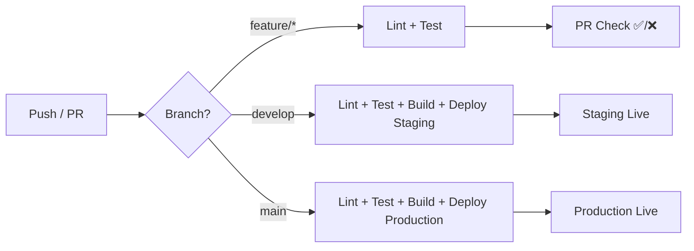

# Deployment Guide – S-Local

> CI/CD pipeline, environment strategy, and infrastructure setup

---

## 1. Environment Strategy

| Environment | URL | Purpose | Deploy Trigger |
|---|---|---|---|
| **Development** | `localhost:3000` | Local dev | Manual |
| **Staging** | `api-staging.s-local.vn` | Testing + QA | Push to `develop` |
| **Production** | `api.s-local.vn` | Live | Merge to `main` |

### 1.1. Environment Variables

```bash
# === App ===
NODE_ENV=production
PORT=3000
API_VERSION=v1

# === Database ===
DATABASE_URL=postgresql://...
DIRECT_URL=postgresql://...     # Direct connection (migrations)

# === Auth ===
JWT_ACCESS_SECRET=xxx
JWT_REFRESH_SECRET=xxx
JWT_ACCESS_TTL=900              # 15 phút
JWT_REFRESH_TTL=2592000         # 30 ngày

# === Payment Gateways ===
VNPAY_TMN_CODE=xxx
VNPAY_HASH_SECRET=xxx
VNPAY_URL=https://sandbox.vnpayment.vn/...
VNPAY_RETURN_URL=https://...

MOMO_PARTNER_CODE=xxx
MOMO_ACCESS_KEY=xxx
MOMO_SECRET_KEY=xxx

SEPAY_API_KEY=xxx

# === External Services ===
GEMINI_API_KEY=xxx
SMS_GATEWAY_API_KEY=xxx
SMS_GATEWAY_BRAND_NAME=S-Local

# === QR Security ===
QR_SIGNING_SECRET=xxx

# === Supabase ===
SUPABASE_URL=https://xxx.supabase.co
SUPABASE_ANON_KEY=xxx
SUPABASE_SERVICE_KEY=xxx

# === Redis ===
REDIS_URL=redis://...

# === Monitoring ===
SENTRY_DSN=https://...
LOG_LEVEL=info
```

---

## 2. CI/CD Pipeline

### 2.1. GitHub Actions Workflow



### 2.2. Pipeline Stages

```yaml
# .github/workflows/ci.yml (simplified)
name: CI/CD

on:
  push:
    branches: [main, develop]
  pull_request:
    branches: [main, develop]

jobs:
  lint-test:
    runs-on: ubuntu-latest
    steps:
      - uses: actions/checkout@v4
      - uses: oven-sh/setup-bun@v1
      - run: bun install --frozen-lockfile
      - run: bun run lint
      - run: bun run type-check
      - run: bun run test

  build:
    needs: lint-test
    if: github.ref == 'refs/heads/main' || github.ref == 'refs/heads/develop'
    runs-on: ubuntu-latest
    steps:
      - uses: actions/checkout@v4
      - uses: oven-sh/setup-bun@v1
      - run: bun install --frozen-lockfile
      - run: bun run build
      # Deploy step depends on hosting platform

  deploy-staging:
    needs: build
    if: github.ref == 'refs/heads/develop'
    # Deploy to staging

  deploy-production:
    needs: build
    if: github.ref == 'refs/heads/main'
    # Deploy to production
```

### 2.3. Deploy Checklist (Production)

- [ ] Tất cả tests pass
- [ ] Type-check pass
- [ ] Lint pass  
- [ ] Database migrations đã chạy trên staging và verify
- [ ] Environment variables đã cập nhật trên production
- [ ] Rollback plan đã chuẩn bị
- [ ] Changelog / release notes đã viết

---

## 3. Database Migrations

### 3.1. Migration Workflow

```bash
# Tạo migration mới
bun run db:generate       # Drizzle Kit generate from schema changes

# Chạy migration trên staging
DATABASE_URL=$STAGING_DB_URL bun run db:migrate

# Verify trên staging

# Chạy migration trên production  
DATABASE_URL=$PROD_DB_URL bun run db:migrate
```

### 3.2. Migration Rules

| Rule | Chi tiết |
|---|---|
| **Forward-only** | Không sửa migration đã chạy, tạo migration mới để fix |
| **Backward-compatible** | Migration mới phải tương thích code cũ (deploy song song) |
| **No data loss** | Column rename = add new + copy data + drop old (3 deploys) |
| **Tested** | Chạy trên staging trước, verify data integrity |

---

## 4. Project Structure

```
s-local/
├── apps/
│   ├── api/                    # Main backend API
│   │   ├── src/
│   │   │   ├── modules/        # Feature modules
│   │   │   │   ├── auth/
│   │   │   │   ├── vendor/
│   │   │   │   ├── service/
│   │   │   │   ├── order/
│   │   │   │   ├── voucher/
│   │   │   │   ├── payment/
│   │   │   │   ├── settlement/
│   │   │   │   ├── review/
│   │   │   │   ├── content/
│   │   │   │   ├── ai/
│   │   │   │   └── notification/
│   │   │   ├── common/         # Shared utilities
│   │   │   │   ├── middleware/
│   │   │   │   ├── guards/
│   │   │   │   ├── validators/
│   │   │   │   ├── errors/
│   │   │   │   └── utils/
│   │   │   ├── config/         # App configuration
│   │   │   ├── db/             # Drizzle schema + migrations
│   │   │   │   ├── schema/
│   │   │   │   ├── migrations/
│   │   │   │   └── seed/
│   │   │   ├── jobs/           # Background jobs (BullMQ)
│   │   │   └── app.ts          # Express app setup
│   │   ├── tests/
│   │   ├── package.json
│   │   └── tsconfig.json
│   │
│   ├── admin-web/              # Admin SPA (React)
│   ├── vendor-web/             # Vendor dashboard (React)
│   └── tourist-web/            # Tourist PWA (Next.js)
│
├── packages/
│   ├── shared-types/           # Shared TypeScript types
│   └── shared-utils/           # Shared utility functions
│
├── docs/
│   └── architecture/           # Architecture documents
│
├── .github/
│   └── workflows/              # CI/CD configs
│
├── turbo.json                  # Turborepo config
├── package.json                # Root package.json
└── bun.lockb
```

---

## 5. Hosting Options

### 5.1. Option A – VPS + Docker (Recommended Phase 1)

**Chi phí:** ~$20-40/tháng

```
VPS (4GB RAM, 2 CPU)
├── Docker Compose
│   ├── api (Node.js / Bun)
│   ├── redis (cache + queue)
│   ├── nginx (reverse proxy + SSL)
│   └── worker (BullMQ processor)
│
└── External Services
    ├── Supabase (PostgreSQL + Storage)
    └── Cloudflare (CDN + SSL + DDoS)
```

### 5.2. Option B – Serverless (Phase 2+)

**Chi phí:** Pay-per-use, ~$5-15/tháng ban đầu

```
Vercel / Railway
├── API (serverless functions)
├── Upstash Redis (serverless)
├── Supabase (PostgreSQL + Storage)
└── Cloudflare (CDN)
```

### 5.3. Option C – Full Cloud (Scale)

```
AWS / GCP
├── ECS Fargate (API containers)
├── ElastiCache Redis
├── RDS PostgreSQL 
├── S3 + CloudFront (CDN)
├── SQS (queue)
└── CloudWatch (monitoring)
```

---

## 6. Scaling Strategy

### Phase 1 (0-1K users): Single VPS

- 1 API instance
- 1 Worker instance  
- Supabase free tier
- Redis 256MB

### Phase 2 (1K-10K users): Horizontal scaling

- 2-3 API instances behind load balancer
- Separate worker instances
- Supabase Pro
- Redis 1GB
- CDN for static assets

### Phase 3 (10K+ users): Full cloud

- Auto-scaling container groups
- Read replicas for DB
- Dedicated Redis cluster
- Multi-region CDN
- Queue partitioning
