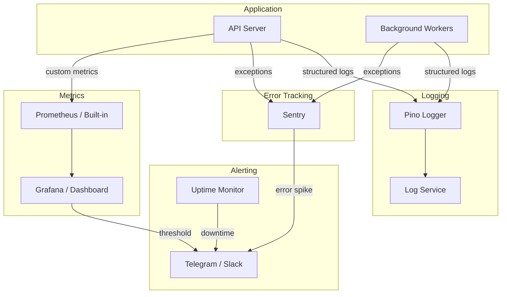

# Monitoring & Observability – S-Local

> Logging, metrics, alerting, and health checks

---

## 1. Observability Stack



---

## 2. Logging

### 2.1. Structured Logging (Pino)

```typescript
// Logger setup
import pino from 'pino';

const logger = pino({
  level: process.env.LOG_LEVEL || 'info',
  transport: process.env.NODE_ENV === 'development' 
    ? { target: 'pino-pretty' } 
    : undefined,
  redact: {
    paths: [
      'req.headers.authorization',
      'body.password',
      'body.otp',
      'phone',  // PII masking
    ],
    censor: '***REDACTED***'
  },
  serializers: {
    req: pino.stdSerializers.req,
    res: pino.stdSerializers.res,
    err: pino.stdSerializers.err,
  }
});
```

### 2.2. Log Format

```json
{
  "level": "info",
  "time": "2025-07-15T14:30:00.000Z",
  "request_id": "550e8400-...",
  "user_id": "uuid",
  "module": "voucher",
  "action": "redeem",
  "voucher_id": "uuid",
  "status": "success",
  "duration_ms": 45,
  "msg": "Voucher redeemed successfully"
}
```

### 2.3. Log Levels

| Level | Khi nào dùng |
|---|---|
| `fatal` | Ứng dụng crash, không thể recovery |
| `error` | Lỗi cần xử lý: payment fail, DB connection lost |
| `warn` | Bất thường nhưng ứng dụng vẫn chạy: rate limited, retry |
| `info` | Business events: order created, voucher redeemed, settlement completed |
| `debug` | Debug info: query params, cache hit/miss |

### 2.4. Critical Business Events to Log

| Event | Level | Data |
|---|---|---|
| OTP sent | info | phone (masked), ip |
| Login success/fail | info/warn | user_id, ip, device |
| Order created | info | order_id, amount, items |
| Payment received | info | payment_id, gateway, amount |
| Payment failed | error | payment_id, error_code, gateway_response |
| Voucher redeemed | info | voucher_id, vendor_id, customer_id |
| QR scan invalid | warn | qr_token (partial), vendor_id, reason |
| Settlement processed | info | settlement_id, vendor_id, amount |
| Refund processed | info | refund_id, amount, reason |
| Rate limit hit | warn | ip, endpoint, user_id |

---

## 3. Error Tracking (Sentry)

### 3.1. Configuration

```typescript
import * as Sentry from '@sentry/node';

Sentry.init({
  dsn: process.env.SENTRY_DSN,
  environment: process.env.NODE_ENV,
  tracesSampleRate: process.env.NODE_ENV === 'production' ? 0.1 : 1.0,
  integrations: [
    Sentry.expressIntegration(),
    Sentry.prismaIntegration(), // or drizzle
  ],
  beforeSend(event) {
    // Scrub PII
    if (event.user) {
      delete event.user.ip_address;
      if (event.user.email) event.user.email = '***';
    }
    return event;
  }
});
```

### 3.2. Alert Rules

| Condition | Severity | Action |
|---|---|---|
| Error rate > 5% (5 min window) | P1 - Critical | Telegram + Slack |
| Payment error rate > 1% | P1 - Critical | Telegram + Slack + Phone call |
| Unhandled exception | P2 - High | Telegram |
| API latency P95 > 2s (5 min) | P2 - High | Telegram |
| New error type (first seen) | P3 - Medium | Slack |

---

## 4. Health Checks

### 4.1. Endpoints

```typescript
// GET /health — Liveness probe
app.get('/health', (req, res) => {
  res.json({ status: 'ok', timestamp: Date.now() });
});

// GET /health/ready — Readiness probe
app.get('/health/ready', async (req, res) => {
  const checks = {
    database: await checkDatabase(),
    redis: await checkRedis(),
    queue: await checkQueue(),
  };
  
  const allHealthy = Object.values(checks).every(c => c.status === 'ok');
  
  res.status(allHealthy ? 200 : 503).json({
    status: allHealthy ? 'ready' : 'degraded',
    checks,
    timestamp: Date.now()
  });
});
```

### 4.2. External Uptime Monitoring

- **Tool:** UptimeRobot / BetterStack (free tier)
- **Monitored endpoints:**

| Endpoint | Interval | Alert After |
|---|---|---|
| `GET /health` | 1 min | 3 fails |
| `GET /health/ready` | 5 min | 2 fails |
| `GET /v1/categories` | 5 min | 3 fails |
| Admin Web | 5 min | 2 fails |
| Vendor Web | 5 min | 2 fails |

---

## 5. Key Metrics

### 5.1. Business Metrics (tracked in app)

| Metric | Type | Alert Threshold |
|---|---|---|
| Orders per hour | Gauge | < 1 during business hours |
| Vouchers redeemed per day | Counter | Monitor trend |
| Payment success rate | Percentage | < 95% |
| Average order value | Gauge | Track trend |
| QR scan failure rate | Percentage | > 10% |
| Settlement processing time | Histogram | > 24 hours |

### 5.2. Technical Metrics

| Metric | Type | Alert Threshold |
|---|---|---|
| API response time (P50/P95/P99) | Histogram | P95 > 2s |
| Error rate (5xx) | Percentage | > 1% |
| Database connection pool usage | Gauge | > 80% |
| Redis memory usage | Gauge | > 80% |
| Queue depth (pending jobs) | Gauge | > 1000 |
| Queue processing latency | Histogram | > 30s |
| CPU usage | Gauge | > 80% sustained |
| Memory usage | Gauge | > 85% |
| Disk usage | Gauge | > 85% |

---

## 6. On-Call & Incident Response

### 6.1. Severity Levels

| Level | Definition | Response Time | Example |
|---|---|---|---|
| **P1** | Service down, payments broken | 15 phút | API 5xx toàn bộ, payment gateway down |
| **P2** | Feature degraded, performance issue | 1 giờ | Voucher redeem chậm, SMS delay |
| **P3** | Minor issue, workaround exists | 4 giờ | Admin dashboard lỗi, notification delay |
| **P4** | Cosmetic, improvement | Next sprint | UI bug, log cleanup |

### 6.2. Incident Playbook

```
1. 🔴 DETECT — Alert kích hoạt
2. 🟡 TRIAGE — Xác định severity, scope
3. 🟠 MITIGATE — Rollback / hotfix / workaround
4. 🟢 RESOLVE — Fix root cause
5. 📝 POSTMORTEM — Viết báo cáo, action items
```

### 6.3. Notification Channels

| Channel | Khi nào | Ai nhận |
|---|---|---|
| Telegram Group | P1, P2 | Dev team + PM |
| Slack #incidents | P1, P2, P3 | Dev team |
| Email | P1 | All stakeholders |
| Phone call | P1 (> 30 min unresolved) | On-call engineer |

---

## 7. Dashboard Layout

### 7.1. Overview Dashboard

```
┌─────────────────┬─────────────────┬─────────────────┐
│ Orders Today    │ Revenue Today   │ Active Vouchers │
│     42          │  12,500,000 ₫   │     156         │
├─────────────────┴─────────────────┴─────────────────┤
│                  API Response Time (P50/P95)         │
│  ████████████████████░░░░  35ms / 180ms             │
├─────────────────┬─────────────────┬─────────────────┤
│ Payment Success │ QR Scan Rate   │ Error Rate      │
│     98.5%       │   34/hour      │    0.1%         │
├─────────────────┴─────────────────┴─────────────────┤
│              Recent Errors (last 1h)                 │
│  PaymentGatewayError (VNPay timeout) — 3 occurrences│
│  DatabaseConnectionError — 1 occurrence              │
└─────────────────────────────────────────────────────┘
```
