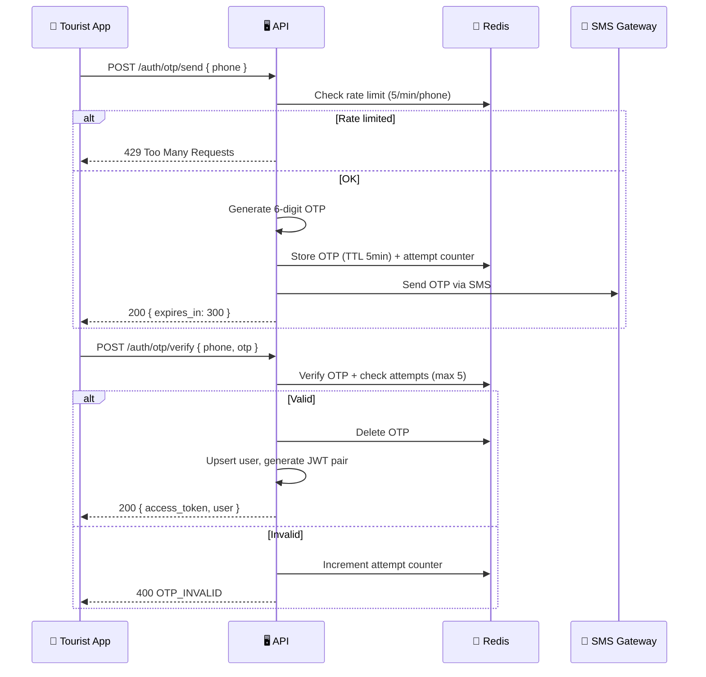

# Security Design – S-Loco

> Authentication, authorization, data protection, and payment security

---

## 1. Authentication

### 1.1. Auth Flow — Tourist (OTP)



### 1.2. Auth Flow — Vendor / Admin

- Email + Password (bcrypt, cost factor 12)
- Mật khẩu yêu cầu: min 8 chars, 1 uppercase, 1 number
- Account lockout: 5 failed attempts → lock 15 phút

### 1.3. JWT Structure

```json
// Access Token payload
{
  "sub": "user-uuid",
  "role": "tourist",          // tourist | vendor_owner | admin
  "vendor_id": "vendor-uuid", // chỉ có nếu role = vendor_owner
  "iat": 1706000000,
  "exp": 1706000900           // 15 phút
}

// Refresh Token — opaque string, stored in DB/Redis
// Linked to: user_id, device_id, ip_address
```

### 1.4. Token Refresh

- Refresh token là **one-time use** (rotation)
- Khi phát hiện refresh token bị reuse → revoke **tất cả** sessions của user (breach detection)
- Refresh token whitelist stored in Redis với TTL 30 ngày

---

## 2. Authorization (RBAC)

### 2.1. Role Matrix

| Resource | Tourist | Vendor Owner | Admin |
|---|:---:|:---:|:---:|
| View services/vendors | ✅ | ✅ | ✅ |
| Create order | ✅ | ❌ | ❌ |
| View own orders/vouchers | ✅ | ❌ | ✅ (all) |
| Scan QR / redeem voucher | ❌ | ✅ (own vendor) | ✅ |
| Complete voucher | ❌ | ✅ (own vendor) | ✅ |
| CRUD services | ❌ | ✅ (own vendor) | ✅ |
| CRUD combos | ❌ | ✅ (own vendor) | ✅ |
| View settlements | ❌ | ✅ (own vendor) | ✅ |
| Approve settlements | ❌ | ❌ | ✅ |
| Manage vendors | ❌ | ❌ | ✅ |
| Manage users | ❌ | ❌ | ✅ |
| CMS (news/events) | ❌ | ❌ | ✅ |
| Create review | ✅ | ❌ | ❌ |
| AI Itinerary | ✅ | ❌ | ❌ |

### 2.2. Resource Ownership

Vendor Owner chỉ có quyền truy cập data thuộc vendor mình:

```typescript
// Middleware pattern
async function ensureVendorOwnership(req, res, next) {
  const vendorId = req.params.vendorId;
  if (req.user.role === 'admin') return next();
  if (req.user.vendor_id !== vendorId) {
    throw new ForbiddenError('Bạn không có quyền truy cập vendor này');
  }
  next();
}
```

---

## 3. Data Protection

### 3.1. Data Classification

| Level | Dữ liệu | Biện pháp |
|---|---|---|
| **Bí mật** | Payment gateway keys, JWT secrets, DB credentials | Vault / env vars, never in code |
| **Nhạy cảm** | Phone number, email, password hash | Encrypted at rest, masked in logs |
| **Nội bộ** | Orders, vouchers, settlements | Auth required, role-based access |
| **Công khai** | Services, vendors, news, weather | Cacheable, no auth required |

### 3.2. Encryption

| Layer | Method | Chi tiết |
|---|---|---|
| **In Transit** | TLS 1.3 | HTTPS everywhere, HSTS header |
| **At Rest** | AES-256 | Supabase disk encryption (mặc định) |
| **Application** | bcrypt | Password hashing (cost 12) |
| **QR Token** | HMAC-SHA256 | Signed token chống giả mạo |
| **PII Fields** | Column encryption | Phone number, email (application-level) |

### 3.3. QR Token Security

```
QR Content = base64url(JSON.stringify({
  voucher_id: "uuid",
  voucher_code: "VCH-XXXXX",
  vendor_id: "uuid",
  exp: timestamp
})) + "." + HMAC_SHA256(payload, QR_SECRET)
```

- Chống replay: mỗi voucher chỉ redeem **1 lần**
- Chống giả mạo: HMAC-SHA256 signed bởi server secret
- TTL: QR token hết hạn theo voucher expiry date
- Vendor verify: phải match `vendor_id` trong token

---

## 4. Payment Security

### 4.1. Webhook Verification

```typescript
// VNPay IPN verification
function verifyVnpaySignature(params: Record<string, string>): boolean {
  const secureHash = params['vnp_SecureHash'];
  delete params['vnp_SecureHash'];
  delete params['vnp_SecureHashType'];
  
  const sortedParams = Object.keys(params).sort()
    .map(key => `${key}=${params[key]}`)
    .join('&');
    
  const expectedHash = hmacSHA512(VNPAY_HASH_SECRET, sortedParams);
  return secureHash === expectedHash;
}
```

### 4.2. Idempotency

- Mỗi payment request có `idempotency_key` duy nhất
- Nếu nhận duplicate webhook → check DB xem đã xử lý chưa
- Idempotency key = `payment_id` hoặc gateway `transaction_id`

### 4.3. Reconciliation

- Daily cron job: so sánh payment records với gateway reports
- Alert nếu phát hiện mismatch > 0 VND
- Monthly audit: Export cho kế toán

---

## 5. API Security

### 5.1. Input Validation

```typescript
// Zod schemas cho mọi endpoint
const createOrderSchema = z.object({
  vendor_id: z.string().uuid(),
  items: z.array(z.object({
    service_id: z.string().uuid(),
    quantity: z.number().int().min(1).max(20),
    options: z.record(z.string()).optional()
  })).min(1).max(50),
  payment_gateway: z.enum(['vnpay', 'momo', 'sepay']),
  note: z.string().max(500).optional()
});
```

### 5.2. Security Headers

```typescript
// Helmet middleware
app.use(helmet({
  contentSecurityPolicy: true,
  crossOriginEmbedderPolicy: true,
  crossOriginOpenerPolicy: true,
  crossOriginResourcePolicy: true,
  dnsPrefetchControl: true,
  frameguard: { action: 'deny' },
  hsts: { maxAge: 31536000, includeSubDomains: true },
  referrerPolicy: { policy: 'strict-origin-when-cross-origin' },
  xContentTypeOptions: true,
  xXssProtection: true,
}));
```

### 5.3. CORS Policy

```typescript
const corsOptions = {
  origin: [
    'https://admin.S-Loco.vn',
    'https://vendor.S-Loco.vn',
    /\.S-Loco\.vn$/
  ],
  credentials: true,
  methods: ['GET', 'POST', 'PATCH', 'DELETE'],
  allowedHeaders: ['Content-Type', 'Authorization', 'X-Request-ID'],
  maxAge: 86400
};
```

### 5.4. SQL Injection Prevention

- **ORM only:** Sử dụng Drizzle ORM, không raw SQL trừ migrations
- **Parameterized queries:** Nếu cần raw SQL, luôn dùng parameterized
- **Input validation:** Zod validate trước khi vào business logic

---

## 6. Secrets Management

| Secret | Storage | Rotation |
|---|---|---|
| JWT Access Secret | Env var (deploy platform) | 90 ngày |
| JWT Refresh Secret | Env var | 90 ngày |
| QR Signing Secret | Env var | 180 ngày |
| VNPay Hash Secret | Env var | Per integration |
| Momo Partner Key | Env var | Per integration |
| Database URL | Env var (Supabase) | Managed by platform |
| Gemini API Key | Env var | 90 ngày |
| SMS Gateway Key | Env var | 90 ngày |
| Supabase Service Key | Env var | Managed by platform |

### 6.1. Rotation Procedure

1. Generate secret mới
2. Deploy với cả secret cũ + mới (grace period 1 giờ)
3. Verify tất cả requests dùng secret mới thành công
4. Remove secret cũ

---

## 7. Compliance Checklist

| Item | Status | Note |
|---|---|---|
| HTTPS everywhere | ✅ Required | Cloudflare SSL |
| Password hashing (bcrypt) | ✅ Required | Cost factor 12 |
| Input validation all endpoints | ✅ Required | Zod schemas |
| Rate limiting | ✅ Required | Redis-based |
| Audit logging (payments, vouchers) | ✅ Required | DB audit_log table |
| PII masking in logs | ✅ Required | Phone → +84***567 |
| SQL injection prevention | ✅ Required | ORM + parameterized |
| XSS prevention | ✅ Required | Helmet + CSP |
| CSRF protection | ✅ Required | SameSite cookies |
| Dependency vulnerability scanning | 🔲 Phase 2 | Snyk / npm audit |
| Penetration testing | 🔲 Phase 3 | External audit |
