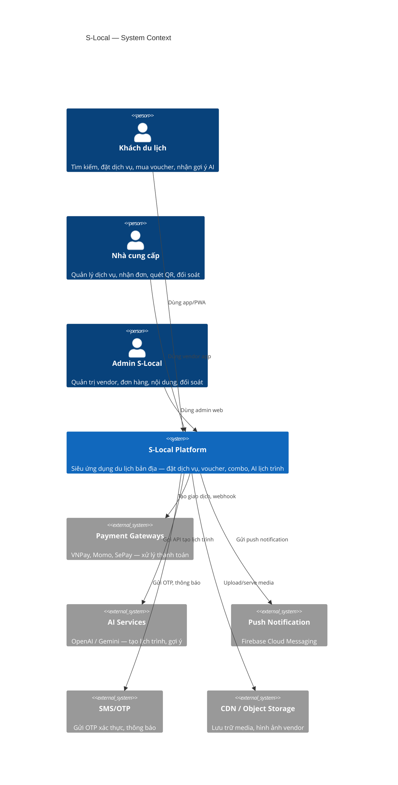
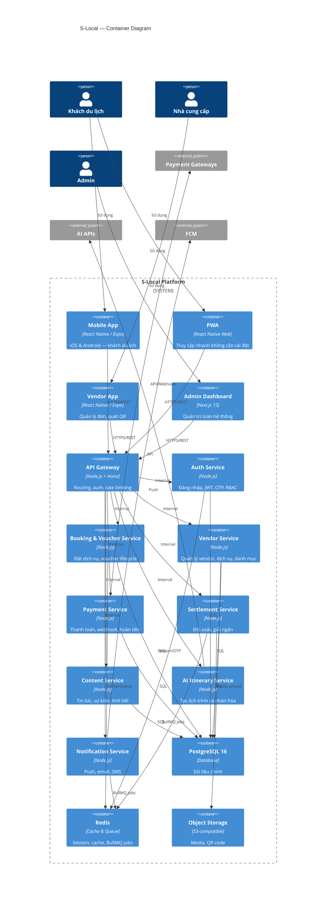
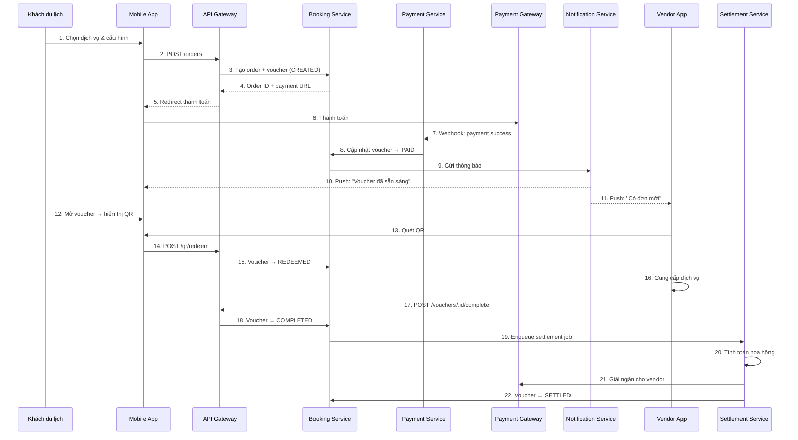
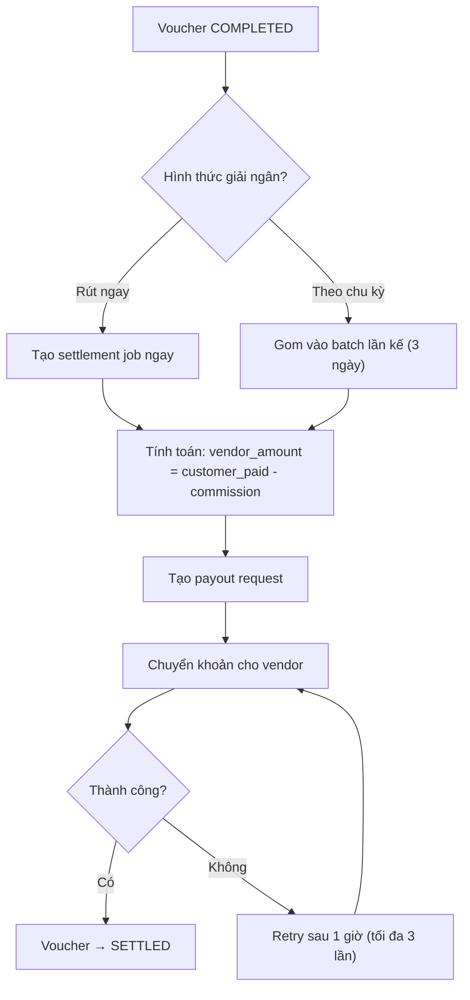
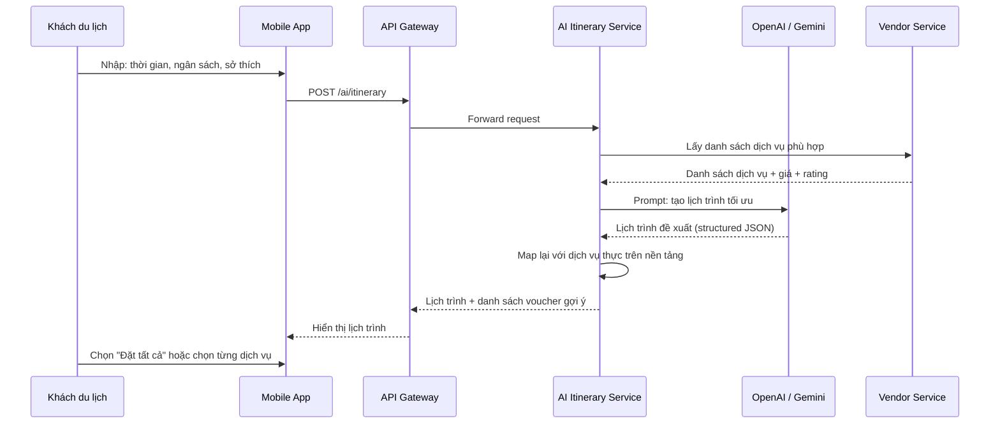

# System Architecture – S-Local

> Super-app du lịch bản địa tại Sầm Sơn

---

## 1. Context Diagram (C4 Level 1)

Hệ thống S-Local tương tác với 3 nhóm tác nhân chính và nhiều hệ thống bên ngoài.



---

## 2. Container Diagram (C4 Level 2)



---

## 3. Core Service Boundaries

| Service | Trách nhiệm | Dependencies |
|---|---|---|
| **Auth Service** | Đăng ký, đăng nhập (OTP/mật khẩu), JWT, refresh token, RBAC | Redis (OTP/session), DB (users) |
| **Booking & Voucher Service** | Tạo đơn hàng, quản lý voucher lifecycle (state machine), combo, QR code | DB, Redis (cache), Payment Service |
| **Vendor Service** | CRUD vendor, dịch vụ, danh mục, media, onboard, rating/review | DB, Object Storage |
| **Payment Service** | Tạo giao dịch, xử lý webhook, hoàn tiền, retry logic | Payment Gateways, DB |
| **Settlement Service** | Đối soát, tính toán hoa hồng, giải ngân (ngay / theo chu kỳ) | DB, Redis (BullMQ) |
| **Content Service** | CRUD tin tức, sự kiện, thời tiết cache | DB, External weather API |
| **AI Itinerary Service** | Nhận input (ngân sách, thời gian, sở thích), gọi AI, trả lịch trình | AI APIs, Vendor Service (danh sách dịch vụ) |
| **Notification Service** | Push notification, SMS, in-app notification | FCM, SMS provider, Redis (BullMQ) |

---

## 4. Data Flow: Voucher Purchase & Redemption



---

## 5. Data Flow: Vendor Settlement



---

## 6. Data Flow: AI Itinerary Generation



---

## 7. Integration Points

| Hệ thống | Giao thức | Mục đích | Ghi chú |
|---|---|---|---|
| **VNPay** | HTTPS (redirect + IPN callback) | Thanh toán thẻ, QR code ngân hàng | IPN phải verify `vnp_SecureHash` |
| **Momo** | HTTPS (redirect + webhook) | Ví Momo | Verify HMAC-SHA256 signature |
| **SePay** | HTTPS (QR cá nhân + webhook) | QR chuyển khoản cá nhân | Giám sát tài khoản ngân hàng |
| **OpenAI / Gemini** | HTTPS REST API | Tạo lịch trình AI | Rate limit, fallback giữa providers |
| **Firebase Cloud Messaging** | HTTPS + SDK | Push notification | Topic-based cho vendor, token-based cho khách |
| **SMS Provider** | HTTPS API | OTP xác thực, thông báo | Rate limit OTP: 5 req/phút/số |
| **Weather API** | HTTPS REST | Dữ liệu thời tiết Sầm Sơn | Cache 30 phút |

---

## 8. Monorepo Structure (đề xuất)

```
s-local/
├── apps/
│   ├── mobile/          # React Native / Expo (khách du lịch)
│   ├── vendor/          # React Native / Expo (vendor)
│   ├── admin/           # Next.js 15 (admin dashboard)
│   └── api/             # API server (Hono)
├── packages/
│   ├── shared/          # Types, utils, constants dùng chung
│   ├── db/              # Drizzle ORM schema, migrations
│   ├── validators/      # Zod schemas cho request/response
│   └── ui/              # Shared UI components (nếu cần)
├── services/
│   ├── auth/            # Auth Service logic
│   ├── booking/         # Booking & Voucher Service logic
│   ├── vendor/          # Vendor Service logic
│   ├── payment/         # Payment Service logic
│   ├── settlement/      # Settlement Service logic
│   ├── content/         # Content Service logic
│   ├── ai/              # AI Itinerary Service logic
│   └── notification/    # Notification Service logic
├── docs/                # Tài liệu này
├── docker-compose.yml
├── bun.lockb
└── package.json
```

---

## 9. Cross-cutting Concerns

| Concern | Approach |
|---|---|
| **Logging** | Structured JSON logs (pino), correlation ID per request |
| **Error Handling** | Centralized error handler, typed error codes, localized messages (vi/en) |
| **Caching** | Redis — session, OTP, voucher state, service listings (TTL-based) |
| **Idempotency** | Idempotency key cho payment/settlement requests |
| **Rate Limiting** | Token bucket tại API Gateway (Redis-backed) |
| **Health Checks** | `/health` endpoint per service — DB, Redis, external deps |
| **Correlation/Tracing** | `X-Request-ID` header propagated across services |
