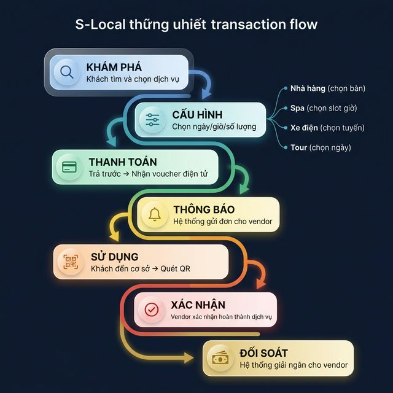
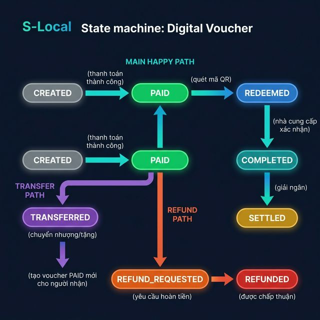

# TÀI LIỆU TỔNG QUAN DỰ ÁN

## S-Loco – Siêu ứng dụng du lịch bản địa tại Sầm Sơn

## 1. Giới thiệu dự án

**S-Loco** là nền tảng công nghệ tích hợp dưới dạng **native mobile app và web admin**, được xây dựng với mục tiêu **số hóa hệ sinh thái dịch vụ du lịch tại Sầm Sơn**. Dự án hướng đến việc kết nối khách du lịch với các nhà cung cấp dịch vụ địa phương như nhà hàng, khách sạn, xe điện, quán cà phê, địa điểm giải trí, spa, cửa hàng lưu niệm và các hoạt động trải nghiệm biển.

S-Loco không chỉ là một ứng dụng đặt dịch vụ, mà được định vị như một **“siêu ứng dụng bản địa”** – nơi khách du lịch và người dân địa phương có thể tìm kiếm thông tin, đặt dịch vụ, thanh toán, nhận ưu đãi và được gợi ý lịch trình phù hợp theo nhu cầu cá nhân.

---

## 2. Bối cảnh và bài toán thị trường

Thị trường du lịch địa phương tại Sầm Sơn vẫn tồn tại nhiều bất cập:

* Thông tin dịch vụ phân tán, thiếu đồng bộ và khó kiểm chứng
* Khách du lịch khó tiếp cận các nhà cung cấp uy tín
* Tình trạng giá cả thiếu minh bạch, chặt chém hoặc chất lượng không đồng đều
* Nhiều nhà cung cấp địa phương chưa có công cụ số để bán hàng và quản lý đơn hàng
* Khách hàng chưa có một nền tảng thống nhất để đặt nhiều dịch vụ trong cùng một hành trình

S-Loco ra đời để giải quyết các vấn đề trên bằng cách tạo ra một hệ sinh thái số minh bạch, có kiểm duyệt, có thanh toán và có khả năng mở rộng.

---

## 3. Tầm nhìn, sứ mệnh và định vị

### Tầm nhìn

Trở thành **nền tảng du lịch bản địa số 1 tại Sầm Sơn**, sau đó có thể mở rộng mô hình sang các địa phương du lịch khác.

### Sứ mệnh

Mang đến cho khách du lịch một trải nghiệm **thuận tiện – minh bạch – đáng tin cậy**, đồng thời giúp các vendor địa phương gia tăng doanh thu nhờ chuyển đổi số.

### Định vị

S-Loco được định vị là:

* **Siêu ứng dụng du lịch bản địa**
* **Nền tảng voucher và combo dịch vụ địa phương**
* **Trợ lý du lịch thông minh có AI**
* **Kênh phân phối và quảng bá số cho vendor tại Sầm Sơn**

---

## 4. Giá trị cốt lõi và lợi thế cạnh tranh

### 4.1. Chiến lược “Local-first”

Dự án tập trung khai thác hiểu biết sâu về thị trường địa phương, hành vi khách du lịch tại Sầm Sơn và đặc điểm vận hành của các vendor bản địa. Đây là lợi thế mà các nền tảng toàn quốc khó có được.

### 4.2. Kiểm duyệt và xác thực nhà cung cấp

Các vendor được khảo sát, kiểm tra chất lượng và chuẩn hóa trước khi xuất hiện trên nền tảng. Cơ chế này giúp tăng niềm tin với khách hàng và nâng chất lượng toàn hệ sinh thái.

### 4.3. Hệ sinh thái dịch vụ đa dạng

S-Loco không chỉ tập trung vào đặt phòng hay ăn uống, mà tích hợp nhiều nhóm dịch vụ trong cùng một ứng dụng: lưu trú, ẩm thực, di chuyển, giải trí, trải nghiệm, tin tức địa phương, thời tiết và lịch trình cá nhân hóa.

### 4.4. Khả năng tạo combo và đề xuất thông minh

Nền tảng có thể gợi ý sản phẩm tương tự mô hình Klook, đồng thời xây dựng combo “càng mua nhiều càng giảm”, tăng giá trị đơn hàng và trải nghiệm người dùng.

---

## 5. Khách hàng mục tiêu

### Khách hàng B2C

* Khách du lịch đến Sầm Sơn theo nhóm gia đình, cặp đôi, bạn bè
* Khách đi ngắn ngày hoặc cuối tuần
* Người dân địa phương có nhu cầu sử dụng dịch vụ ăn uống, giải trí, di chuyển

### Khách hàng B2B

* Nhà hàng, khách sạn, homestay, xe điện, quán cà phê, spa, khu vui chơi
* Đơn vị bán tour, đoàn khách, tổ chức sự kiện
* Các đối tác có nhu cầu quảng bá và bán voucher trên nền tảng

---

## 6. Mô hình sản phẩm và dịch vụ

### 6.1. Sản phẩm chính

Sản phẩm cốt lõi của S-Loco là **voucher giảm giá và ưu đãi dịch vụ địa phương**, bao gồm:

* Nhà nghỉ, khách sạn, homestay
* Nhà hàng, quán ăn, cà phê
* Xe điện, dịch vụ di chuyển
* Spa, massage, giải trí
* Cửa hàng lưu niệm
* Các hoạt động trải nghiệm biển như cano, tàu lượn, vui chơi ngoài trời

### 6.2. Combo sản phẩm

Khách hàng có thể mua các gói combo gồm nhiều dịch vụ trong cùng một chuyến đi. Cơ chế ưu đãi theo combo giúp tăng tỷ lệ chuyển đổi và giá trị giao dịch.

### 6.3. Tin tức và thông tin địa phương

Nền tảng cung cấp thêm chuyên mục:

* Tin tức, sự kiện, lễ hội địa phương
* Thông tin du lịch mới nhất
* Thời tiết, cảnh báo mưa bão
* Gợi ý địa điểm phù hợp theo thời điểm

### 6.4. AI tạo lịch trình

S-Loco tích hợp tính năng AI hỗ trợ cá nhân hóa hành trình dựa trên các thông tin đầu vào như:

* Thời gian lưu trú (check-in, check-out)
* Ngân sách tổng hoặc ngân sách theo người
* Ngân sách cho từng bữa ăn
* Loại hình trải nghiệm mong muốn
* Sở thích cá nhân như yên tĩnh, sôi động, gần biển, đi cùng gia đình hay nhóm bạn

AI sẽ đề xuất lịch trình phù hợp và gợi ý các dịch vụ tương ứng trên nền tảng.

---

## 7. Mô hình doanh thu

S-Loco có mô hình doanh thu đa nguồn, gồm:

### 7.1. Hoa hồng từ vendor

Nhà hàng, khách sạn và các nhà cung cấp dịch vụ chiết khấu cho nền tảng khoảng **8%–10%** trên mỗi giao dịch. Trong đó, hệ thống có thể trích một phần khoảng **4%–6%** để chuyển thành ưu đãi/voucher cho khách hàng, giúp kích cầu mua hàng.

### 7.2. Doanh thu quảng cáo và đề xuất nổi bật

Vendor có thể trả phí để được ưu tiên hiển thị, quảng bá hoặc đề xuất trên nền tảng.

### 7.3. Bán gói thành viên hoặc ưu đãi nâng cao

Trong tương lai có thể phát triển các gói thành viên dành cho khách hàng thân thiết hoặc người dùng có tần suất cao.

### 7.4. Giải pháp B2B

Mở rộng sang dịch vụ bán gói cho tour đoàn, doanh nghiệp, đơn vị tổ chức sự kiện hoặc cung cấp dữ liệu, báo cáo xu hướng du lịch địa phương.

---

## 8. Luồng vận hành và dòng tiền

### 8.1. Mô hình tổng quan: Voucher Pre-pay & Hold

S-Loco áp dụng mô hình **Voucher Pre-pay & Hold** – khách thanh toán trước trên nền tảng để nhận voucher điện tử, sau đó mang voucher đến cơ sở để sử dụng dịch vụ. Tiền được giữ tạm (hold) bởi hệ thống cho đến khi dịch vụ hoàn tất, sau đó mới giải ngân cho vendor.

**Tại sao chọn mô hình này:**

* **Đảm bảo cam kết** – Khách đã trả tiền, giảm no-show
* **Bảo vệ khách hàng** – Tiền giữ tạm, chỉ giải ngân khi dịch vụ hoàn thành
* **Đơn giản cho vendor** – Vendor không cần xử lý thanh toán, chỉ cần quét xác nhận
* **Thống nhất mọi loại dịch vụ** – Cùng một luồng cho nhà hàng, spa, xe điện, tour...

### 8.2. Mô hình tài chính

Vendor niêm yết giá gốc trên hệ thống và cung cấp mức chiết khấu **8%** cho S-Loco. S-Loco phân bổ như sau:

| Thành phần | Tỷ lệ | Mô tả |
|---|---|---|
| **Giá khách trả** | 95% giá gốc | Khách được giảm **5%** so với giá tại chỗ |
| **Hoa hồng S-Loco** | 3% giá gốc | Doanh thu nền tảng |
| **Vendor nhận** | 92% giá gốc | Sau khi trừ chiết khấu 8% cho nền tảng |

**Ví dụ minh họa** (dịch vụ giá gốc 1.000.000đ):

* Khách thanh toán: **950.000đ** (tiết kiệm 50.000đ)
* S-Loco giữ lại: **30.000đ** (hoa hồng)
* Vendor nhận: **920.000đ**

> Mức chiết khấu 8% là mặc định, có thể thương lượng theo từng vendor và danh mục dịch vụ.

### 8.3. Luồng giao dịch thống nhất

Tất cả loại dịch vụ (nhà hàng, spa, xe điện, tour, khách sạn...) đều đi qua **một luồng thống nhất** với các nhánh điều kiện theo đặc thù từng loại:

```
┌─────────────────────────────────────────────────────────┐
│  LUỒNG GIAO DỊCH THỐNG NHẤT                            │
│                                                         │
│  1. [Khám phá]  Khách tìm & chọn dịch vụ               │
│       ↓                                                 │
│  2. [Cấu hình]  Chọn ngày/giờ/số lượng (nếu có)        │
│       │  ├─ Nhà hàng: chọn bàn, số khách                │
│       │  ├─ Spa: chọn slot giờ                          │
│       │  ├─ Xe điện: chọn tuyến, giờ đón                │
│       │  └─ Tour: chọn ngày, số người                   │
│       ↓                                                 │
│  3. [Thanh toán] Trả trước → Nhận voucher điện tử       │
│       ↓                                                 │
│  4. [Thông báo]  Hệ thống gửi đơn cho vendor           │
│       ↓                                                 │
│  5. [Sử dụng]   Khách đến cơ sở → Quét QR              │
│       ↓                                                 │
│  6. [Xác nhận]   Vendor xác nhận hoàn thành dịch vụ     │
│       ↓                                                 │
│  7. [Đối soát]   Hệ thống giải ngân cho vendor          │
└─────────────────────────────────────────────────────────┘
```



### 8.4. Vòng đời voucher (State Machine)

Mỗi voucher trải qua các trạng thái sau:

```
  [CREATED] ──thanh toán thành công──→ [PAID]
                                        │
                           ┌────────────┼────────────┐
                           ↓            ↓            ↓
                      [REDEEMED]   [TRANSFERRED]  [REFUND_
                           │            │         REQUESTED]
                           ↓            ↓            ↓
                      [COMPLETED]  (→ PAID mới)  [REFUNDED]
                           ↓
                      [SETTLED]
```



| Trạng thái | Mô tả |
|---|---|
| **CREATED** | Đơn hàng tạo, chờ thanh toán |
| **PAID** | Thanh toán thành công, voucher active |
| **REDEEMED** | Đã quét QR tại cơ sở, đang sử dụng dịch vụ |
| **COMPLETED** | Dịch vụ hoàn tất (vendor xác nhận hoặc auto-confirm) |
| **SETTLED** | Đã giải ngân cho vendor |
| **TRANSFERRED** | Đã chuyển nhượng cho người khác |
| **REFUND_REQUESTED** | Yêu cầu hoàn tiền (chưa sử dụng) |
| **REFUNDED** | Đã hoàn tiền thành công |

### 8.5. Chính sách voucher

* **Thời hạn:** Voucher **không có ngày hết hạn** – khách có thể sử dụng bất kỳ lúc nào
* **Hoàn tiền:** Hoàn **100%** nếu voucher chưa sử dụng (trừ phí xử lý nhỏ)
* **Chuyển nhượng:** Có thể tặng hoặc chuyển voucher cho người khác qua app

### 8.6. Quy trình quét QR tại cơ sở

Hệ thống hỗ trợ **quét QR hai chiều** để linh hoạt trong mọi tình huống:

**Cách 1 – Vendor quét khách:**
1. Khách mở voucher trên app, hiển thị mã QR
2. Vendor dùng app/thiết bị quét mã QR của khách
3. Hệ thống xác nhận voucher hợp lệ → chuyển trạng thái sang REDEEMED

**Cách 2 – Khách quét vendor:**
1. Vendor hiển thị mã QR cố định tại quầy
2. Khách mở app, chọn voucher và quét mã QR của vendor
3. Hệ thống xác nhận → chuyển trạng thái sang REDEEMED

### 8.7. Xác nhận hoàn thành dịch vụ

Hệ thống hỗ trợ **hai cơ chế xác nhận** đồng thời:

* **Vendor xác nhận chủ động:** Sau khi cung cấp dịch vụ xong, vendor bấm xác nhận trên app → voucher chuyển sang COMPLETED
* **Tự động xác nhận (timeout):** Nếu vendor không xác nhận sau một khoảng thời gian cấu hình (ví dụ: 24 giờ) và khách không khiếu nại → hệ thống tự động chuyển sang COMPLETED

### 8.8. Cơ chế thanh toán

S-Loco hỗ trợ nhiều phương thức thanh toán:

* QR cá nhân, ví dụ SePay
* Cổng thanh toán như VNPay, Momo
* Có thể mở rộng thêm các phương thức thanh toán điện tử phổ biến khác

### 8.9. Cơ chế đối soát và giải ngân

Vendor có thể chọn **một trong hai hình thức** nhận tiền:

| Hình thức | Phí | Mô tả |
|---|---|---|
| **Rút ngay** | Miễn phí giai đoạn đầu (sau đó có phí nhỏ) | Giải ngân ngay sau khi dịch vụ được xác nhận COMPLETED |
| **Theo chu kỳ** | Miễn phí | Tổng hợp và giải ngân mỗi **3 ngày** (mặc định, có thể cấu hình) |

Quy trình đối soát:

1. Voucher chuyển sang trạng thái COMPLETED
2. Hệ thống tính toán: số tiền vendor nhận = giá khách trả – hoa hồng S-Loco
3. Nếu vendor chọn "rút ngay" → giải ngân tức thì
4. Nếu vendor chọn "theo chu kỳ" → gom vào đợt giải ngân tiếp theo
5. Voucher chuyển sang trạng thái SETTLED sau khi giải ngân thành công

---

## 9. Hệ thống chức năng chính

### Dành cho người dùng

* Tìm kiếm và đặt dịch vụ địa phương
* Mua voucher và combo ưu đãi
* Thanh toán online
* Xem tin tức, thời tiết, sự kiện
* Nhận gợi ý lịch trình từ AI
* Trải nghiệm cá nhân hóa theo sở thích

### Dành cho vendor

* Nhận đơn hàng từ nền tảng
* Quản lý thông tin dịch vụ, giá, tồn suất
* Theo dõi doanh thu và các kỳ đối soát
* Mua gói quảng cáo hoặc đề xuất ưu tiên

### Dành cho admin

* Quản lý vendor và sản phẩm
* Quản lý đơn hàng, thanh toán, hoàn hủy
* Quản lý đối soát
* Quản lý nội dung, tin tức, sự kiện
* Giám sát chất lượng dịch vụ và xử lý khiếu nại

---

## 10. Quy trình onboard vendor

Quy trình đưa đối tác lên nền tảng gồm các bước chính:

1. Tiếp cận và giới thiệu dự án
2. Khảo sát chất lượng thực tế
3. Tư vấn cải thiện để đạt chuẩn
4. Ký hợp đồng hợp tác
5. Chuẩn bị media: hình ảnh, menu, thông tin dịch vụ
6. Đào tạo sử dụng hệ thống quản lý
7. Chính thức hiển thị trên app và theo dõi giai đoạn đầu

Quy trình này giúp đảm bảo chất lượng dịch vụ đồng đều trước khi mở bán đến khách hàng.

---

## 11. Kiến trúc triển khai

Dự án dự kiến phát triển trên các nền tảng:

* **Mobile App:** iOS và Android
* **Web App/Admin:** dành cho quản trị và vận hành nội bộ

Các thành phần tích hợp chính gồm:

* Hệ thống thanh toán điện tử
* AI chatbot/gợi ý lịch trình
* Hệ thống quản lý vendor
* Hệ thống đối soát
* Kênh quản lý tin tức và thông tin địa phương

---

## 12. Điều kiện tối thiểu để vận hành giai đoạn đầu

Để nền tảng có thể đi vào hoạt động hiệu quả, cần đảm bảo tối thiểu:

* Onboard được khoảng **20–30 vendor** để đủ đa dạng dịch vụ
* Có hệ thống đối soát chính xác, minh bạch và đáng tin cậy
* Có tập sản phẩm đủ hấp dẫn để hình thành combo và ưu đãi
* Có đội ngũ vận hành hỗ trợ vendor trong giai đoạn đầu
* Có chính sách chăm sóc khách hàng và xử lý khiếu nại rõ ràng

---

## 13. Rủi ro chính và hướng xử lý

### Rủi ro người dùng

Khách hàng chưa quen đặt dịch vụ qua app hoặc chưa tin chất lượng.
**Hướng xử lý:** xác thực vendor, đưa ra ưu đãi rõ ràng, hỗ trợ đặt nhanh qua QR tại điểm bán.

### Rủi ro vendor

Vendor thiếu kỹ năng công nghệ hoặc vận hành không ổn định.
**Hướng xử lý:** đào tạo 1:1, theo sát giai đoạn đầu, xây dựng quy trình kiểm soát chất lượng.

### Rủi ro vận hành

Sai lệch đối soát, hoàn hủy, tranh chấp thanh toán.
**Hướng xử lý:** chuẩn hóa quy trình đối soát, có người xác minh thủ công trong giai đoạn đầu, tự động hóa dần khi hệ thống ổn định.

### Rủi ro cạnh tranh

Các nền tảng lớn có thể tham gia thị trường.
**Hướng xử lý:** tập trung lợi thế bản địa, tốc độ triển khai nhanh, mạng lưới vendor sâu và dịch vụ phù hợp địa phương.

---

## 14. Kết luận

S-Loco là một dự án có tiềm năng xây dựng thành **nền tảng số trung tâm cho du lịch Sầm Sơn**, giải quyết đồng thời ba bài toán lớn: **trải nghiệm khách du lịch, doanh thu cho vendor và minh bạch thị trường địa phương**.

Với định hướng “local-first”, mô hình voucher/combo linh hoạt, tích hợp thanh toán và AI cá nhân hóa lịch trình, S-Loco có khả năng trở thành một sản phẩm khác biệt, dễ mở rộng và phù hợp với xu hướng số hóa dịch vụ du lịch địa phương.

---
